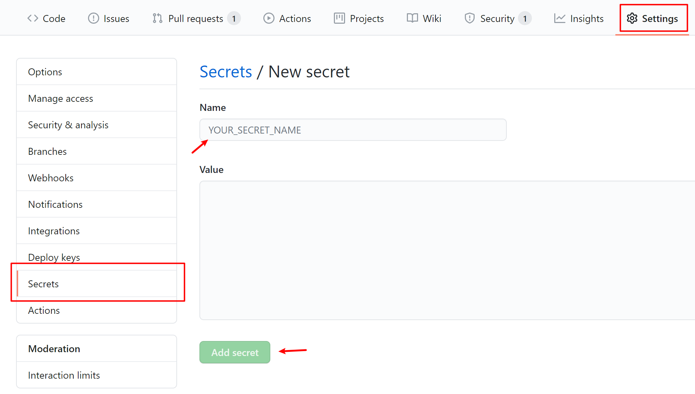
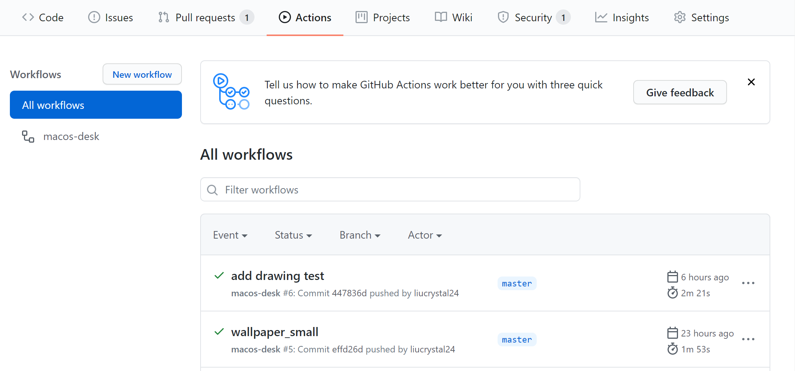

# Github 自动化部署

## 1.Github actions 初步了解

[Github actions](https://github.com/features/actions) 是 GitHub 推出的自动化构建平台，官方称之为 “Automate your workflow from idea to production“。可查看 [官方文档](https://docs.github.com/cn/actions)了解详情。

## 2. 设置项目密钥

- 设置位置： **项目 repository** -- **Settings** -- **Secrets**

- 新建 **Scrects**，并记下 **`Name`**，如 **`CHRIS_SECRET`**



## 3. 项目配置

### 1. homepage

- 配置位置：`package.json` 中添加 `homepage`

- 格式：`https://{yourGithubName}.github.io/{yourRepositoryName}`

```json
"homepage": "https://liucrystal24.github.io/react-demo",
```

### 2. ci.yml

- 根目录新建文件 `.github/workflows/ci.yml`

- 编辑内容 ( [参考模板](https://github.com/marketplace/actions/deploy-to-github-pages) )

  ```yaml
  name: react-demo
  on:
    push:
      branches:
        - master
  jobs:
    build-and-deploy:
      runs-on: ubuntu-latest
      steps:
        - name: Checkout
          uses: actions/checkout@master

        - name: Build and Deploy
          uses: JamesIves/github-pages-deploy-action@master
          env:
            ACCESS_TOKEN: $CHRIS_SECRET
            BRANCH: gh-pages
            FOLDER: build
            BUILD_SCRIPT: npm install && npm run build
  ```

- 修改内容
  1. `name` : { `yourRepositoryName` }
  2. `ACCESS_TOKEN` : \${ `yourSecretyName` }

## 4. 提交并查看发布日志

- 项目 `push` 以后，在 **github** -- **Actions** 中，可以查看 `workflows`



- 登录之前设置的 `homepage` 地址即可访问
