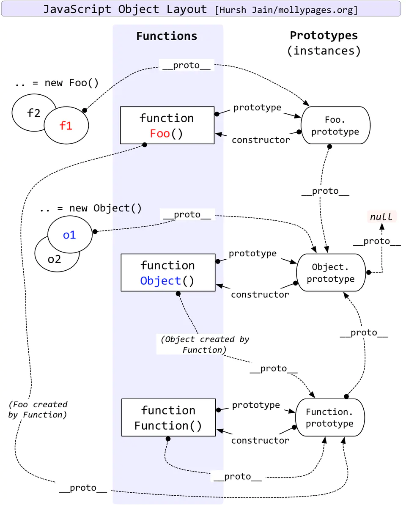
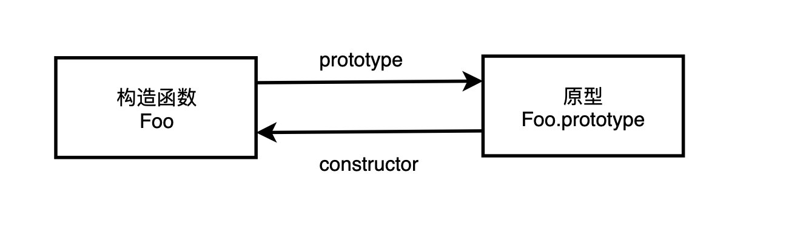
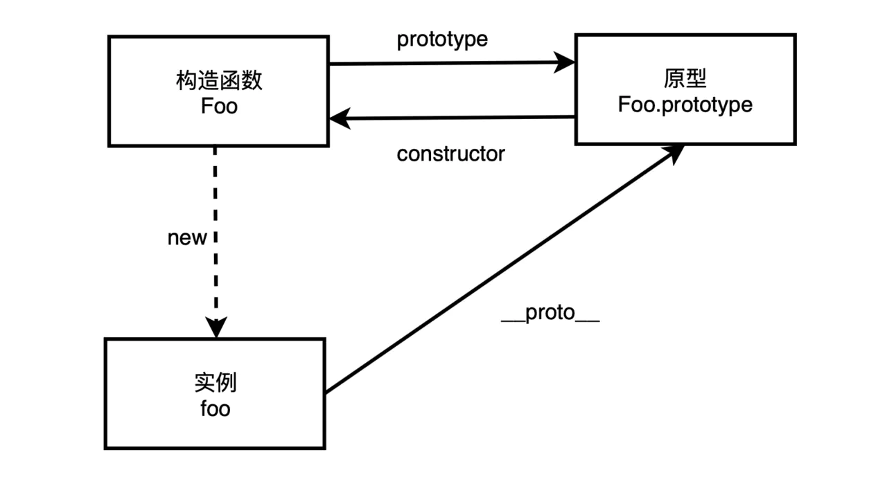
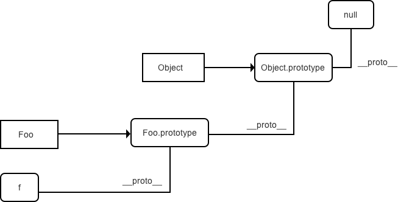

# 原型 & 原型链

## 1. 原型 :sparkles::sparkles::sparkles:



### 1.1 prototype

:star: 所有**函数**都有一个 `prototype` （显式原型）属性，属性值也是一个普通的对象。对象以其原型为模板，从原型继承方法和属性，这些属性和方法定义在对象的构造器函数的 `prototype` 属性上，而非对象实例本身。

```js
function Foo() {}
console.log(Foo.prototype);

// 打印结果:
{
  // constructor 指向 Foo
  constructor: ƒ Foo(),
  __proto__: {
    constructor: ƒ Object(),
    hasOwnProperty: ƒ hasOwnProperty(),
    isPrototypeOf: ƒ isPrototypeOf(),
    propertyIsEnumerable: ƒ propertyIsEnumerable(),
    toLocaleString: ƒ toLocaleString(),
    toString: ƒ toString(),
    valueOf: ƒ valueOf()
  }
}
```

:point_right: `Foo.prototype` 上有 `constructor` 和 `__proto__` ( [已弃用](https://developer.mozilla.org/en-US/docs/Web/JavaScript/Reference/Global_Objects/Object/proto) )。

:point_right: `Foo.prototype` 上 `constructor` 指向 Foo 本身：

```js
Foo.prototype.constructor === Foo; // true
```



### 1.2 \_\_proto\_\_

:star: 每个**实例对象**都有一个 `__proto__` ( 隐式原型属性 ) 指向了创建该对象的构造函数的原型。也就时指向了函数的 prototype 属性。

```js
function Foo() {}
let foo = new Foo();
// 推荐写法
Object.getPrototypeOf(foo) === Foo.prototype; // true
// 不推荐写法
foo.__proto__ === Foo.prototype; // true
```



:warning: **`.prototype`** 和 **`__proto__`** 区别

**`.prototype`** : **构造函数**的**属性**,构造函数的 prototype 属性
**`__proto__`** : **对象**的**原型对象**,每个实例对象上都有的属性

:books: 关于 `__proto__` : 其实更像一个 `getter` / `setter`:

```js
Object.defineProperty(Object.prototype, "__proto__", {
  get: function () {
    return Object.getPrototypeOf(this);
  },
  set: function (o) {
    Object.setPrototypeOf(this, o);
    return o;
  },
});
```

:point_right: `Object.defineProperty` : 在一个对象上定义一个新属性，或者修改一个对象的现有属性，并返回此对象。

### 1.3 [[Prototype]]

`[[Prototype]]` 是对象的一个内部属性，外部代码无法直接访问。

## 2. 原型链

:star:每个对象拥有一个原型对象，通过 `__proto__` 指针指向上一个原型 ，并从中**继承方法和属性**，同时原型对象也可能拥有原型，这样一层一层，最终指向 `null`，这种关系被称为**原型链**。根据定义，`null` 没有原型，并作为这个原型链中的最后一个环节。



:books: 查看 Foo 和 foo 的一些属性来理解:

```js
function Foo() {}
Foo.prototype.prop1 = "bar";
var foo = new Foo();
foo.prop2 = "new value";
console.log(foo.prop2); // new value
console.log(foo.prop1); // bar
console.log(Foo.prop2); // undefined
console.log(Foo.prop1); // undefined
console.log(Foo.prototype.prop2); // undefined
console.log(Foo.prototype.prop1); // bar
```

:books: 一道题目辅助理解:

```js
function Foo() {
  getName = function () {
    console.log(1);
  };
  return this;
}

Foo.getName = function () {
  console.log(2);
};

Foo.prototype.getName = function () {
  console.log(3);
};

var getName = function () {
  console.log(4);
};

function getName() {
  console.log(5);
}

Foo.getName(); // 2
getName(); // 4, 函数声明会提升，函数表达式不会提升 => 所以 函数声明 在后,输出4
Foo().getName(); // 1, Foo() 中 this 指向 window , Foo 中 重新定义 全局中的 getName, 输出 1
getName(); // 同上, 1
new Foo.getName(); // 2, Foo 对象上有getName, 直接输出2
new Foo().getName(); // 3, 原型链继承, 输出3
new new Foo().getName(); // 3
```

:star: 当试图得到一个对象的某个属性时，如果这个对象本身没有这个属性，那么会去它的 `__proto__` （即它的构造函数的 `prototype` ）中寻找 ，如寻找 `foo.a`,就会循着 **原型链**查找，直到最后一环 `null`。

:point_right: 1. foo

:point_right: 2. foo.\_\_proto\_\_( Foo.prototype )

:point_right: 3. foo.\_\_proto\_\_.\_\_proto\_\_( window.Object.prototype )

:point_right: 4. foo.\_\_proto\_\_.\_\_proto\_\_.\_\_proto\_\_( null )

:warning: 在传统的 OOP 中，首先定义“类”，此后创建对象实例时，类中定义的所有属性和方法都被复制到实例中。在 JavaScript 中并不如此复制——而是在对象实例和它的构造器之间建立一个**链接**，之后通过上溯原型链，在构造器中找到这些属性和方法。

## 3. 原型常用操作

### 3.1 Object.create( )

:star: 创建一个新对象，同时继承另一个对象的 `[[Prototype]]` 。

```js
function Foo() {}
var foo = new Foo();
var bar = Object.create(foo);
```

:point_right: `bar` 是一个新的空对象，`bar.__proto__` 指向 `foo`

```js
function Foo(name) {
  this.name = name;
}
Foo.prototype.myName = function () {
  return this.name;
};
function Bar(name, label) {
  Foo.call(this, name);
  this.label = label;
}
// 创建一个新的 Bar.prototype 对象并关联到 Foo.prototype
Bar.prototype = Object.create(Foo.prototype);

Bar.prototype.myLabel = function () {
  return this.label;
};

var a = new Bar("a", "obj a");
console.log(a.myName()); // "a"
console.log(a.myLabel()); // "obj a"
```

### 3.2 .isPrototypeOf( )

:star: 判断两个对象之间是否通过 [[ Prototype ]] 链关联

```js
function Foo() {}
Foo.prototype.blah = 123;
var a = new Foo();

a instanceof Foo; // true;
Foo.prototype.isPrototypeOf(a); // true;
```

:warning: `instanceof` 和 `isPrototypeOf` 区别：

:point_right: `object instanceof AFunction` ：`object` 的原型链是针对 `AFunction.prototype` 进行检查的。

:point_right: `prototypeObj.isPrototypeOf(object)` ： `object` 的原型链是针对 `prototypeObj` 本身，`prototypeObj`是否出现在 `object` 的原型链上。
