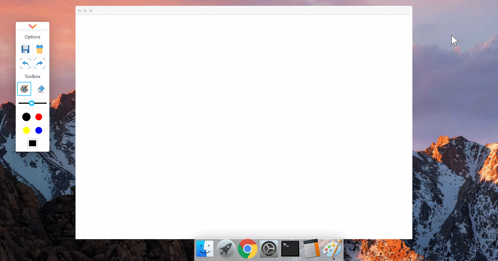
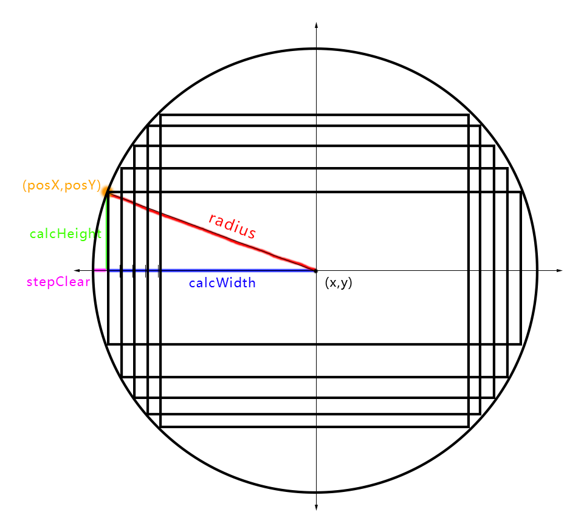

# 画板（一）：绘画和圆形橡皮擦除

:dart: [项目地址](https://liucrystal24.github.io/macos-desk)，欢迎 watch :eyes: 和 star :star:
:book: [项目预览](https://liucrystal24.github.io/macos-desk)，点击即可查看

- ### 效果图

  

- ### 画板初始化

  ```tsx
  export const UseCanvas = () => {
    interface CanvasProps {
      width: number;
      height: number;
    }
    const canvasRef = useRef<HTMLCanvasElement>(null);
    const Canvas = ({ width, height }: CanvasProps) => {
      // ... 添加各种功能
      return (
        <>
          <canvas ref={canvasRef} height={height} width={width} />
        </>
      );
    };
    Canvas.defaultProps = {
      width: window.innerWidth,
      height: window.innerHeight,
    };
    return { Canvas };
  };
  ```

- ### 画板工具栏状态管理

  - 添加 **`是否在画`**，**`是否擦除`**，**`鼠标位置`** 的状态。

  ```tsx
  // 是否在画
  const [isPainting, setIsPainting] = useState(false);
  // 是否擦除
  const [eraserEnabled, setEraserEnabled] = useState(false);

  // 鼠标位置
  type Coordinate = {
    x: number;
    y: number;
  };
  const [mousePosition, setMousePosition] = useState<Coordinate | undefined>(
    undefined
  );

  // tools 画笔/橡皮 选择
  const [toolsMap] = useState<string[]>(["pen", "eraser"]);

  <div className="tools">
    {toolsMap.map((tool, index) => {
      return (
        <Iconfont
          key={index + tool}
          className={
            tool === "eraser"
              ? eraserEnabled
                ? "active"
                : ""
              : !eraserEnabled
              ? "active"
              : ""
          }
          type={"icon-" + tool}
          style={{ fontSize: 50 }}
          clickEvent={(e) => onToolsClick([e, tool])}
        />
      );
    })}
  </div>;
  ```

- ### 鼠标事件逻辑

  ```tsx
  useEffect(() => {
    if (!canvasRef.current) {
      return;
    }
    const canvas: HTMLCanvasElement = canvasRef.current;
    // 按下鼠标，修改状态，开始作画
    canvas.addEventListener("mousedown", startPaint);
    // 鼠标移动，跟踪轨迹
    canvas.addEventListener("mousemove", paint);
    // 鼠标松开，停止作画(有保存状态)
    canvas.addEventListener("mouseup", exitPaint);
    // 鼠标离开，停止作画(无保存状态)
    canvas.addEventListener("mouseleave", leaveCanvas);
    return () => {
      canvas.removeEventListener("mousedown", startPaint);
      canvas.removeEventListener("mousemove", paint);
      canvas.removeEventListener("mouseup", exitPaint);
      canvas.removeEventListener("mouseleave", leaveCanvas);
    };
  }, [startPaint, paint, exitPaint, leaveCanvas]);
  ```

- ### 鼠标事件定义

  - 获取鼠标位置

  ```tsx
  // 获取当前鼠标的坐标
  const getCoordinates = useCallback(
    (event: MouseEvent): Coordinate | undefined => {
      if (!canvasRef.current) {
        return;
      }
      const canvas: HTMLCanvasElement = canvasRef.current;
      // getOffset(el,dir) : 获取 el 距离 body 在 dir 方向上的距离，见第一章 masOS-dock
      const x = event.pageX - getOffset(canvas, "left");
      const y = event.pageY - getOffset(canvas, "top");
      return { x, y };
    },
    [getOffset]
  );
  ```

  - startPaint

  ```tsx
  // 修改状态，开始作画
  const startPaint = useCallback((event: MouseEvent) => {
    const coordinates = getCoordinates(event);
    if (coordinates) {
      setIsPainting(true);
      setMousePosition(coordinates);
    }
  }, []);
  ```

  - paint

  ```tsx
  // 作画，并保存 新位置
  const paint = useCallback(
    (event: MouseEvent) => {
      if (isPainting) {
        const newMousePosition = getCoordinates(event);
        if (mousePosition && newMousePosition) {
          // 橡皮状态的判断和清除,clearArc 方法见下方单独说明
          if (eraserEnabled) {
            const newr = Number(lineWidth / 2);
            clearArcFun({
              x: newMousePosition.x,
              y: newMousePosition.y,
              r: newr,
            });
          } else {
            drawLine(mousePosition, newMousePosition);
            setMousePosition(newMousePosition);
          }
        }
      }
    },
    [isPainting, mousePosition, drawLine]
  );

  // 鼠标移动，画线函数
  const drawLine = (
    originalMousePosition: Coordinate,
    newMousePosition: Coordinate
  ) => {
    if (!canvasRef.current) {
      return;
    }
    const canvas: HTMLCanvasElement = canvasRef.current;
    const context = canvas.getContext("2d");
    if (context) {
      context.strokeStyle = strokeStyle;
      context.lineJoin = "round";
      context.lineWidth = lineWidth;

      context.beginPath();
      context.moveTo(originalMousePosition.x, originalMousePosition.y);
      context.lineTo(newMousePosition.x, newMousePosition.y);
      context.closePath();

      context.stroke();
    }
  };
  ```

  - exitPaint
    :link: [saveFragment 说明](https://github.com/liucrystal24/Notebook/issues/17)

  ```tsx
  // 修改作画状态
  const exitPaint = useCallback(() => {
    setIsPainting(false);
    setMousePosition(undefined);
    // 保存当前画板的状态，在《 画板（三）：画板历史存储：撤销和前进 》中说明
    saveFragment();
  }, [saveFragment]);
  ```

  - leaveCanvas

  ```tsx
  const leaveCanvas = useCallback(() => {
    setIsPainting(false);
    setMousePosition(undefined);
  }, []);
  ```

- ### 圆形橡皮清除

  由于画笔路径为圆形，并且 Windows 和 macOS 自带的作图，橡皮擦除都是圆形擦除，所以想实现橡皮圆形擦除。

  - 实现原理

    

    将圆形分割成若干个矩形，用 Canvas 自带的清除路径 api（矩形清除）递归清除。
    **`（ x,y ）`** : 鼠标点击坐标
    **`radius`** : 圆形半径：画笔宽度 **lineWidth / 2**
    **`stepClear`** : 分割成的若干矩形长度的递减阶梯
    **`calcWidth`** : 若干矩形的一半长度 ：**radius** - **stepClear**
    **`calcHeight`** : 若干矩形的一半宽度：**radius²** - **calcWidth²**
    **`posX`** ：清除矩形的起始横坐标：**x** - **calcWidth**
    **`posY`** ：清除矩形的起始纵坐标：**y** - **calcHeight**

  - 实现代码

    ```tsx
    const clearArcFun = useCallback(
      ({ x, y, r }: ClearArcOptions) => {
        if (!canvasRef.current) {
          return;
        }
        const canvas: HTMLCanvasElement = canvasRef.current;
        const context = canvas.getContext("2d");
        if (context) {
          var stepClear = 1;
          clearArc(x, y, r, context, stepClear);
        }
      },
      [clearArc]
    );

    const clearArc = useCallback((x, y, radius, ctx, stepClear) => {
      var calcWidth = radius - stepClear;
      var calcHeight = Math.sqrt(radius * radius - calcWidth * calcWidth);

      var posX = x - calcWidth;
      var posY = y - calcHeight;

      var widthX = 2 * calcWidth;
      var heightY = 2 * calcHeight;

      if (stepClear <= radius) {
        ctx.clearRect(posX, posY, widthX, heightY);
        stepClear += 1;
        clearArc(x, y, radius, ctx, stepClear);
      }
    }, []);
    ```
