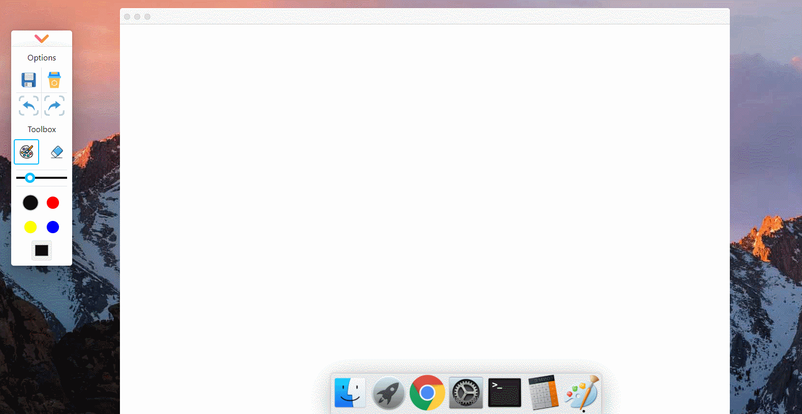

# 画板（二）：画笔宽度和调色盘

:dart: [项目地址](https://liucrystal24.github.io/macos-desk)，欢迎 watch :eyes: 和 star :star:
:book: [项目预览](https://liucrystal24.github.io/macos-desk)，点击即可查看

- ### 效果图

  

- ### 画笔宽度

  - 工具栏宽度状态管理

  ```tsx
  const [lineWidth, setLineWidth] = useState(5);
  const onSizesChange = useCallback((e) => {
    setLineWidth(e.target.value);
  }, []);

  <div className="sizes" /* 画笔粗细*/>
    <input
      style={
        {
          backgroundColor: eraserEnabled ? "#ebeff4" : strokeStyle,
        } as CSSProperties
      }
      type="range"
      id="range"
      name="range"
      min="1"
      max="20"
      value={lineWidth}
      onChange={onSizesChange}
    />
  </div>;
  ```

  - 绘画
    只需要改变宽度的状态管理，绘画原理和第一章一样。(:link: [画板（一）：绘画和圆形橡皮擦除](https://github.com/liucrystal24/Notebook/issues/15))

- ### 画笔颜色

  - 工具栏颜色状态管理

  ```tsx
  // 画笔 颜色
  const [strokeStyle, setStrokeStyle] = useState("black");
  const [colorMap] = useState<string[]>(["black", "red", "yellow", "blue"]);

  // 常见颜色选择
  const onColorsClick = useCallback((e, selector, color) => {
    setStrokeStyle(color);
  }, []);

  // 调色盘
  const onColorsChange = useCallback((e) => {
    setStrokeStyle(e.target.value);
  }, []);

  <ol className="colors" /* 常用颜色选择 */>
    {colorMap.map((color, index) => {
      return (
        <li
          key={index + color}
          className={color === strokeStyle ? color + " active" : color}
          onClick={(e) => onColorsClick(e, "li", color)}
        ></li>
      );
    })}
    <input
      type="color" // 调色盘
      value={strokeStyle}
      onChange={onColorsChange}
      id="currentColor"
    />
  </ol>;
  ```

  - 绘画
    只需要改变颜色的状态管理，绘画原理和第一章一样。(:link: [画板（一）：绘画和圆形橡皮擦除](https://github.com/liucrystal24/Notebook/issues/15))
