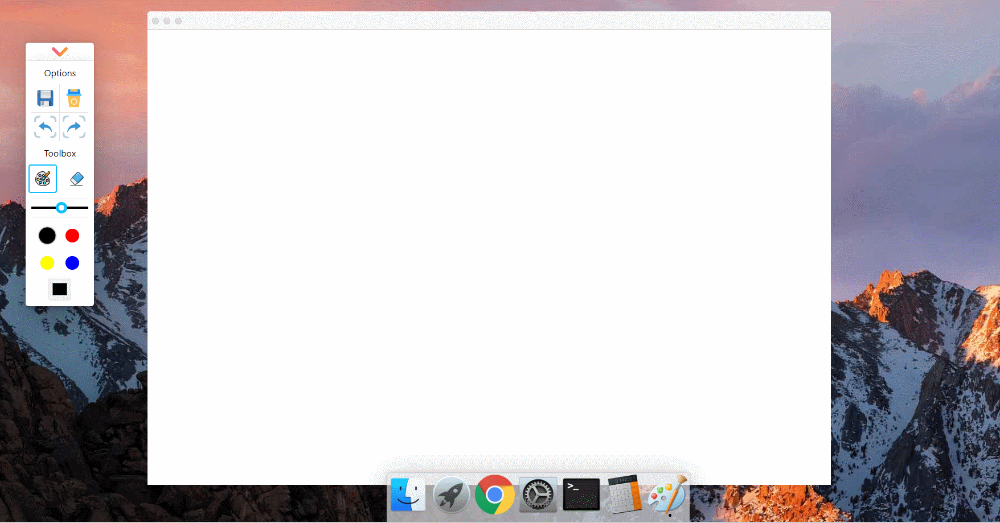
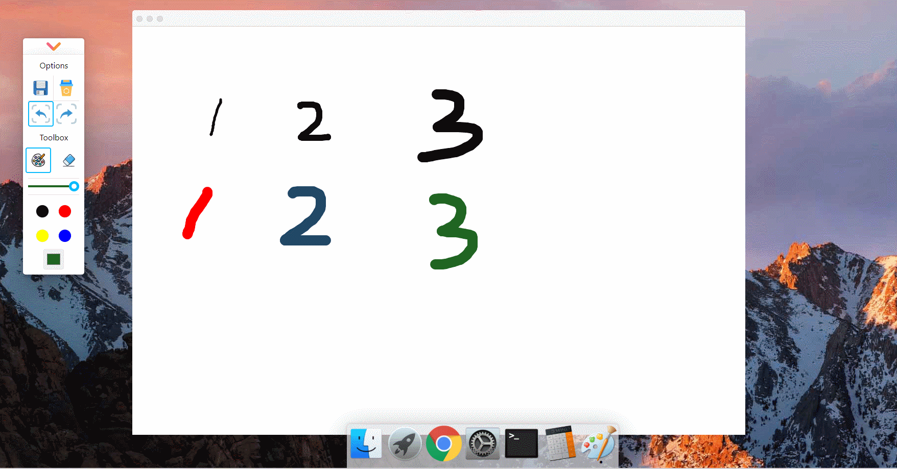

# 画板（三）：撤销和前进/清空和保存

:dart: [项目地址](https://liucrystal24.github.io/macos-desk)，欢迎 watch :eyes: 和 star :star:
:book: [项目预览](https://liucrystal24.github.io/macos-desk)，点击即可查看

- ### 效果图

  - #### 撤销和前进

  

  - #### 清空和保存

  

- ### 撤销/前进 原理

  每当画笔移动并抬起（每画一笔）:

  1. 计步数+1 （**`setStep(step + 1);`**）

  2. 保存当前的画布内容（**`canvas.toDataURL()`**）

  3. 存储在历史数组中（**`canvasHistory.push(canvas.toDataURL());`**）

  4. 判断是否符合 撤销/前进 的条件（**step** 是否溢出 **canvasHistory**），如果符合，将当前步数进行移动 **`currentStep = step + 1 /step - 1`**

  5. 重绘 Canvas **`canvasPic.src = canvasHistory[currentStep];`**

- ### 清空/保存 原理

  - 保存:

    1. 保存当前的画布内容（**`const imageData = canvas.toDataURL("image/png");`**）

    2. 将数据从已有的 ImageData 对象绘制到位图（**`context.putImageData(context.getImageData(0, 0, width, height), 0, 0);`**）

    3. 模拟点击下载 **`a.href = imageData;a.click();`**

  - 清空:

    1. 清空画布 **`clearRect({ x: 0, y: 0, width, height });`**

    2. 清空历史数组 **`setCanvasHistory([]);`**

    3. 初始化步数 **`setStep(-1);`**

- ### 工具栏

  ```tsx
  // 保存，删除，前进，后退
  const optionsMap = ["save", "delete", "turn_back", "turn_next"];

  // back,next
  const backRef = useRef<SVGSVGElement>(null);
  const nextRef = useRef<SVGSVGElement>(null);

  <div className="options">
    {optionsMap.map((option, index) => {
      return (
        <Iconfont
          svgRef={
            option === "turn_back"
              ? backRef
              : option === "turn_next"
              ? nextRef
              : undefined
          }
          key={index + option}
          type={"icon-" + option}
          className={option}
          style={{ fontSize: 50 }}
          clickEvent={(el) => onOptionsClick(el, option)}
        />
      );
    })}
  </div>;
  ```

- ### 撤销 / 前进

  ```tsx
  // 保存 canvasHistory
  const saveFragment = useCallback(() => {
    setStep(step + 1);
    if (!canvasRef.current) {
      return;
    }
    const canvas: HTMLCanvasElement = canvasRef.current;
    canvasHistory.push(canvas.toDataURL());
    setCanvasHistory(canvasHistory);

    if (!backRef.current || !nextRef.current) {
      return;
    }
    const back: SVGSVGElement = backRef.current;
    const next: SVGSVGElement = nextRef.current;
    back.classList.add("active");
    next.classList.remove("active");
  }, [step, canvasHistory]);

  // 撤销 / 前进
  const changeCanvas = useCallback(
    (type) => {
      if (!canvasRef.current || !backRef.current || !nextRef.current) {
        return;
      }
      const canvas: HTMLCanvasElement = canvasRef.current;
      const context = canvas.getContext("2d");
      const back: SVGSVGElement = backRef.current;
      const next: SVGSVGElement = nextRef.current;
      if (context) {
        let currentStep = -1;
        if (type === "back" && step >= 0) {
          currentStep = step - 1;
          next.classList.add("active");
          if (currentStep < 0) {
            back.classList.remove("active");
          }
        } else if (type === "next" && step < canvasHistory.length - 1) {
          currentStep = step + 1;
          back.classList.add("active");
          if (currentStep === canvasHistory.length - 1) {
            next.classList.remove("active");
          }
        } else {
          return;
        }
        context.clearRect(0, 0, width, height);
        const canvasPic = new Image();
        canvasPic.src = canvasHistory[currentStep];
        canvasPic.addEventListener("load", () => {
          context.drawImage(canvasPic, 0, 0);
        });
        setStep(currentStep);
      }
    },
    [height, width, step, canvasHistory]
  );
  ```

- ### 保存 / 清空

  - 保存

  ```tsx
  // 保存 canvas
  const saveCanvas = useCallback(() => {
    if (!canvasRef.current) {
      return;
    }
    const canvas: HTMLCanvasElement = canvasRef.current;
    const context = canvas.getContext("2d");
    if (context) {
      // 用于记录当前 context.globalCompositeOperation ——（合成或混合模式）
      const compositeOperation = context.globalCompositeOperation;
      // 设置为 “在现有的画布内容后面绘制新的图形”
      context.globalCompositeOperation = "destination-over";
      context.fillStyle = "#fff";
      context.fillRect(0, 0, width, height);
      const imageData = canvas.toDataURL("image/png");
      // 将数据从已有的 ImageData 对象绘制到位图
      context.putImageData(context.getImageData(0, 0, width, height), 0, 0);
      // 复原 context.globalCompositeOperation
      context.globalCompositeOperation = compositeOperation;
      // 下载
      const a = document.createElement("a");
      document.body.appendChild(a);
      a.href = imageData;
      const dateNow = moment().format("YYYY-MM-DD HHmmss");
      a.download = "myPaint " + dateNow;
      a.target = "_blank";
      console.log("myPainting " + dateNow);
      a.click();
    }
  }, [width, height]);
  ```

  - 清空

  ```tsx
  // 清空画布
  const checkClearDialog = useCallback(
    (e) => {
      clearRect({
        x: 0,
        y: 0,
        width,
        height,
      });
      setCanvasHistory([]);
      setStep(-1);
      closeClearDialog();
      if (!backRef.current || !nextRef.current) {
        return;
      }
      const back: SVGSVGElement = backRef.current;
      const go: SVGSVGElement = nextRef.current;
      back.classList.remove("active");
      go.classList.remove("active");
    },
    [closeClearDialog, clearRect, width, height]
  );

  // 清除矩形区域
  const clearRect = useCallback(({ x, y, width, height }: ClearRectOptions) => {
    if (!canvasRef.current) {
      return;
    }
    const canvas: HTMLCanvasElement = canvasRef.current;
    const context = canvas.getContext("2d");
    if (context) {
      context.clearRect(x, y, width, height);
    }
  }, []);
  ```
