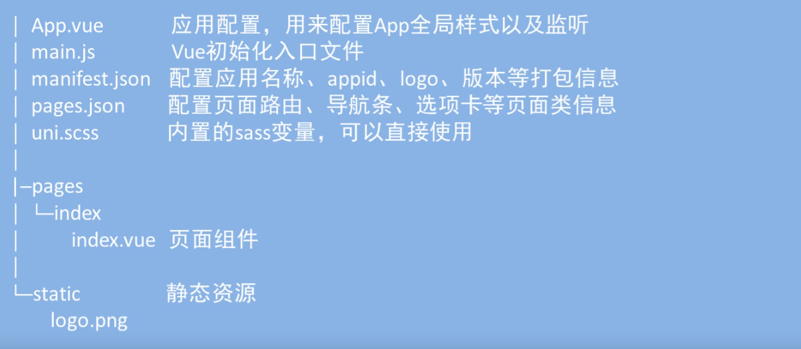

# 【ChrisWallpaper（一）】 项目初始化

## 一、创建项目

### 项目使用 **@vue/cli** 搭建

```bash
npm install -g @vue/cli

vue create -p dcloudio/uni-present-vue chriswallpaper

npm run dev:mp-weixin
```

### 使用微信小程序开发者工具倒入

目录： .\chriswallpaper\dist\dev\mp-weixin



### 安装 sass

```bash
npm install sass-loader node-sass
```

## 二、小程序基本知识

先简单说一些基本知识，方便之后的阅读

### 1、小程序部分钩子函数

- **onLaunch()**：应用启动
- **onShow()**：应用显示
- **onHide()**：应用隐藏
- **onLoad()**：页面初始化
- **mounted()**：组件挂载完毕
- **onReachBottom()**：全局页面触及底部

### 2、小程序单位换算

750rpx = 100vw = 屏幕宽度

100vh = 屏幕高度

### 3、全局共享数据

- Vue.prototype.xx
- vuex
- 小程序独有
  定义：**App.vue** 中 **`globalData 对象（ 命名 ）`**
  操作：getApp( ).globalData

### 4、标签自定义属性

格式 : **data-xxx**

**template：**

```html
<view data-index="test" @click="handleclick(1, $event)">传参</view>
```

**methods：**

```js
handleclick: function(num, event) {
  console.log(num); // 1
  // 拿到传递的 data-index
  console.log(event.currentTarget.dataset.index)
}
```
