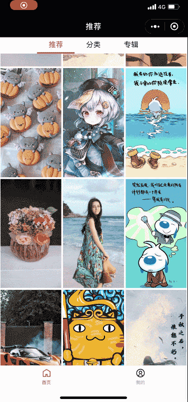

# 【ChrisWallpaper（四）】 图片处理 - 跳转、左右滑动、下载

## 一、图片跳转详情页



封装 `goDetail` 组件，传入参数 `list` : 当前图片数组，`index` ：当前图片的索引，为左右滑动切换图片做准备。

**goDetail.vue：**

```vue
<template>
  <view @click="handleCLick">
    <slot></slot>
  </view>
</template>
```

**script：**

```js
export default {
  props: {
    list: Array,
    index: Number,
  },
  methods: {
    handleCLick() {
      // 保存数组和索引
      getApp().globalData.imgList = this.list;
      getApp().globalData.imgIndex = this.index;
      // 跳转至图片详情
      uni.navigateTo({
        url: "/pages/imgDetail/index",
      });
    },
  },
};
```

## 二、左右滑动切换图片


### 原理：

监听 `touchstart` 和 `touchend` 事件，为了防止误触，判断开始和结束的触摸坐标，左右超过 10 个单位，上下不超过 10 个单位，且时长少于 3s 才判断为有效操作，进行图片切换。通过起始位置和结束位置的 x 坐标差，判断是移动方向，然后通过 `$emit('eventName',data)` 传递给父元素。

**template：**

```vue
<template>
  <view @touchstart="handleStart" @touchend="handleEnd">
    <slot></slot>
  </view>
</template>
```

**script：**

```js
export default {
  data() {
    return {
      // 触碰开始的坐标
      startX: "",
      startY: "",
      // 触碰结束的坐标
      endX: "",
      endY: "",
      // 开始和结束的时间
      startDate: "",
      endDate: "",
    };
  },
  methods: {
    handleStart(e) {
      // 点击时的横纵坐标
      this.startX = e.changedTouches[0].clientX;
      this.startY = e.changedTouches[0].clientY;
      this.startDate = Date.now();
    },
    handleEnd(e) {
      // 离开时的横纵坐标
      this.endX = e.changedTouches[0].clientX;
      this.endY = e.changedTouches[0].clientY;
      this.endDate = Date.now();
      let dateDis = this.endDate - this.startDate;
      // 手指左右移动超过 10 个单位,上下移动不超过 10 个单位 且 时间少于 3s 才开始判断
      if (
        Math.abs(this.endX - this.startX) > 10 &&
        Math.abs(this.endY - this.startY) < 10 &&
        dateDis < 3000
      ) {
        // indexChange 子传父 +1/-1
        let indexChange = this.endX - this.startX > 0 ? -1 : 1;
        this.$emit("touchResult", indexChange);
        return;
      }
      this.$emit("touchResult", 0);
    },
  },
};
```

## 三、图片下载


### 原理：

- 使用接口 `const [data,err] = uni.downloadFile({url:xx})` 下载图片，并将地址转换成微信需要的格式，保存在字段 `data.tempFilePath` 中
- 使用接口 `uni.saveImageToPhotosAlbum({ filePath: data.tempFilePath})`

**script：**

```js
export default {
  data() {
    return {};
  },
  methods: {
    async handleDownload() {
      uni.showLoading({
        title: "下载中",
      });

      //！！小程序上线时，接口必须采用 https 协议
      let picurl = "https://xxx.img";

      // 将可以保存的格式转换为微信需要的格式
      const [err, data] = await uni
        .downloadFile({
          url: picurl,
        })
        .catch((err) => {
          console.err(err);
        });
      // 下载
      const result = await uni.saveImageToPhotosAlbum({
        filePath: data.tempFilePath,
      });
      uni.hideLoading();
      if (result[0] === null) {
        uni.showToast({
          title: "下载成功",
        });
      } else {
        uni.showToast({
          title: "下载失败",
          icon: "none",
        });
      }
    },
  },
};
```

:warning: 小程序上线时，接口必须采用 https 协议
