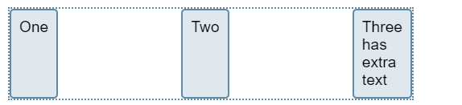

# CSS 弹性盒子布局 —— flex

### 1.基本案例 :



- html:

  ```html
  <div class="box">
    <div>One</div>
    <div>Two</div>
    <div>Three <br />has <br />extra <br />text</div>
  </div>
  ```

- css:
  ```css
  .box {
    display: flex;
    justify-content: space-between;
  }
  ```

1. 容器属性为 `display: flex` , 子元素为弹性项。

2. `justify-content`: `space-between` , 主轴上均匀地分隔项目。在每个项目之间放置等量的空间，左侧和右侧项目与 Flex 容器的边缘齐平。

3. 前两个子元素的高度拉伸，因为 `align-items` 的默认值为 `stretch`。这些项目伸展到 `Flex` 容器的高度，使它们看起来都像最高的项目一样高。

### 2. CSS 属性:

1. `flex`
2. `flex-flow`
3. `flex-wrap`
4. `flex-basis`
5. `flex-grow`
6. `order`
7. `flex-direction`
8. `flex-shrink`

### 3. 对齐属性:

1. `align-content`
2. `justify-content`
3. `column-gap`
4. `align-items`
5. `place-content`
6. `gap`
7. `align-self`
8. `row-gap`
