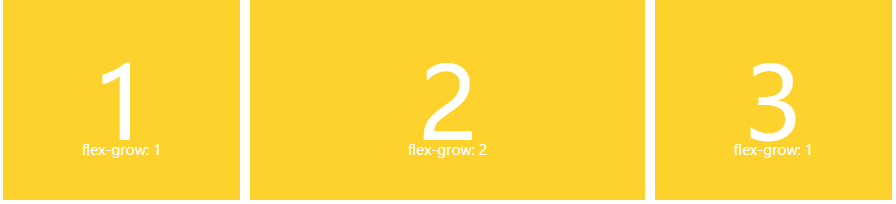

# CSS 弹性盒子布局 —— flex

### 1.基本案例 :


- html:

  ```html
  <div class="box">
    <div>One</div>
    <div>Two</div>
    <div>Three <br />has <br />extra <br />text</div>
  </div>
  ```

- css:
  ```css
  .box {
    display: flex;
    justify-content: space-between;
  }
  ```

1. 容器属性为 `display: flex` , 子元素为弹性项。

2. `justify-content`: `space-between` , 主轴上均匀地分隔项目。在每个项目之间放置等量的空间，左侧和右侧项目与 Flex 容器的边缘齐平。

3. 前两个子元素的高度拉伸，因为 `align-items` 的默认值为 `stretch`。这些项目伸展到 `Flex` 容器的高度，使它们看起来都像最高的项目一样高。

### 2. CSS 属性:

1. `flex-grow`
   
   :books:  .item { flex-grow: < number >; /* default 0 */ }

   :star:  定义项目的放大比例，默认为0，即如果存在剩余空间，也不放大。

   :dart:  兄弟项目中,如果 A { flex-grow:2 },B { flex-grow:1 },则A的长度是B的两倍。

   


2. `flex-shrink`
   
   :books:  .item { flex-shrink: < number >; /* default 1 */ }

   :star:  定义了项目的缩小比例，默认为1，即如果空间不足，该项目将缩小。

   :dart:  如果所有项目的flex-shrink属性都为1，当空间不足时，都将等比例缩小。如果一个项目的flex-shrink属性为0，其他项目都为1，则空间不足时，前者不缩小。

   


3. `flex-basis`
   
   :books:  .item { flex-basis: < length >; | auto; /* default auto */ }

   :star:  定义了在分配多余空间之前，项目占据的主轴空间（main size）。

   :dart:  浏览器根据这个属性，计算主轴是否有多余空间。它的默认值为auto，即项目的本来大小。

   

4. `flex`
   
   :books:  .item { flex: none | [ <'flex-grow'> <'flex-shrink'>? || <'flex-basis'> ] }

   :star:  flex属性是flex-grow, flex-shrink 和 flex-basis的简写，默认值为 0 1 auto。后两个属性可选。

   :dart:  单值 / 双值 / 三值
   - 单值：无单位数（ 1,2 : 被当成 `<flow-grow>` ）/ 有效宽度（ 20px,20em : 被当成 `<flow-basis>` ）
   - 双值：`<flow-grow>` + 无单位（ `flow-shrink` ）/ 有效宽度 （ `flow-basis` ）
   - 三值：`<flow-grow>`  +  `flow-shrink`  +  `<flow-basis>`

   


5. `flex-flow`
6. `order`
7. `flex-direction`
8. `flex-wrap`
9.  `order`

    :books: .item { order: <integer>; }

    :star: 定义项目的排列顺序。数值越小，排列越靠前，默认为0。

    


### 3. 对齐属性:

1. `align-content`
2. `justify-content`
3. `column-gap`
4. `align-items`
5. `place-content`
6. `gap`
7. `align-self`
8. `row-gap`
