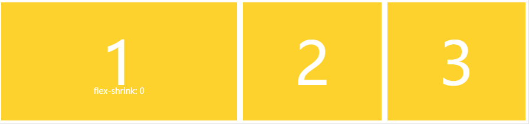

# CSS 弹性盒子布局 —— flex

### 1.案例引入 :


- html:

  ```html
  <div class="box">
    <div>One</div>
    <div>Two</div>
    <div>Three <br />has <br />extra <br />text</div>
  </div>
  ```

- css:
  ```css
  .box {
    display: flex;
    justify-content: space-between;
  }
  ```

1. 容器属性为 `display: flex` , 子元素为弹性项。

2. `justify-content`: `space-between` , 主轴上均匀地分隔项目。在每个项目之间放置等量的空间，左侧和右侧项目与 Flex 容器的边缘齐平。

3. 前两个子元素的高度拉伸，因为 `align-items` 的默认值为 `stretch`。这些项目伸展到 `Flex` 容器的高度，使它们看起来都像最高的项目一样高。

### 2. 项目属性( 子元素 item ):

1. #### `flex-grow`

   :books: .item { flex-grow: < number >; /_ default 0 _/ }

   :star: 定义项目的放大比例，默认为 0，即如果存在剩余空间，也不放大。

   :dart: 兄弟项目中,如果 A { flex-grow:2 },B { flex-grow:1 },则 A 的长度是 B 的两倍。

   

2. #### `flex-shrink`

   :books: .item { flex-shrink: < number >; /_ default 1 _/ }

   :star: 定义了项目的缩小比例，默认为 1，即如果空间不足，该项目将缩小。

   :dart: 如果所有项目的 flex-shrink 属性都为 1，当空间不足时，都将等比例缩小。如果一个项目的 flex-shrink 属性为 0，其他项目都为 1，则空间不足时，前者不缩小。

   

3. #### `flex-basis`

   :books: .item { flex-basis: < length >; | auto; /_ default auto _/ }

   :star: 定义了在分配多余空间之前，项目占据的主轴空间（main size）。

   :dart: 浏览器根据这个属性，计算主轴是否有多余空间。它的默认值为 auto，即项目的本来大小。

   

4. #### `flex`

   :books: .item { flex: none | [ <'flex-grow'> <'flex-shrink'>? || <'flex-basis'> ] }

   :star: flex 属性是 flex-grow, flex-shrink 和 flex-basis 的简写，默认值为 0 1 auto。后两个属性可选。

   :dart: 单值 / 双值 / 三值

   - 单值：无单位数（ 1,2 : 被当成 `<flow-grow>` ）/ 有效宽度（ 20px,20em : 被当成 `<flow-basis>` ）
   - 双值：`<flow-grow>` + 无单位数（ `flow-shrink` ）/ 有效宽度 （ `flow-basis` ）
   - 三值：`<flow-grow>` + `flow-shrink` + `<flow-basis>`

5. #### `order`

   :books: .item { order: < integer >; }

   :star: 定义项目的排列顺序。数值越小，排列越靠前，默认为 0。

   

6. #### `align-self`

   :books: .item { align-self: `auto` | `flex-start` | `flex-end` | `center` | `baseline` | `stretch`; }

   :star: 允许单个项目有与其他项目不一样的对齐方式，可覆盖 align-items 属性。

   :dart: 默认值为 `auto`，表示继承父元素的 `align-items` 属性，如果没有父元素，则等同于 `stretch`。

   

### 3. 容器属性( 父元素 box ):

1. #### `justify-content`

   :books: .box { justify-content: `flex-start` | `flex-end` | `center` | `space-between` | `space-around`; }

   :star: 定义了项目在主轴上的对齐方式。

   :dart: 默认值 `flex-start` ( 左对齐 )。常用值为 `center` ( 居中对齐 )。

   

2. #### `align-items`

   :books: .box { align-items: `flex-start` | `flex-end` | `center` | `baseline` | `stretch`; }

   :star: 定义项目在交叉轴上如何对齐。

   :dart: 默认值 `stretch` ( 如果项目未设置高度或设为 auto，将占满整个容器的高度 )。常用值为 `center` ( 居中对齐 )。

   

3. #### `align-content`

   :books: .box { align-content: `stretch` | `flex-start` | `flex-end` | `center` | `space-between` | `space-around`; }

   :star: 定义了多根轴线（多行）的对齐方式。如果项目只有一根轴线，该属性不起作用。

   :dart: 一般当 `flow-wrap : wrap` 时有效，默认值 `stretch` ( 换行时,中间留有间隙 )。

   

   

   

4. #### `flex-direction`

   :books: .box { flex-direction: `row` | `row-reverse` | `column` | `column-reverse`; }

   :star: 决定主轴的方向（即项目的排列方向）。

    
    

5. ### `flex-wrap`

   :books: .box{ flex-wrap: nowrap | wrap | wrap-reverse; }
   :star: nowrap( 默认值 )。flex-wrap 属性定义，如果一条轴线排不下，如何换行。

   
   
   

6. #### `flex-flow`

   :books: .box { flex-flow: `< flex-directio >` || `< flex-wrap >`; }
   :star: flex-flow 属性是 `flex-direction` 属性和 `flex-wrap` 属性的简写形式，默认值为 `row nowrap`。
