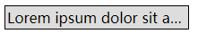
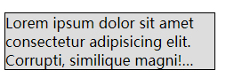

# CSS 文档流末尾省略处理 —— `text-overflow` / `-webkitbox-`

## 1.单行

#### `html` :

```html
  <div class="content">
    Lorem ipsum dolor sit amet consectetur adipisicing elit. Minima quidem sunt aliquid quia velit maxime enim nisi, expedita dolore tenetur mollitia odio. Cupiditate nihil laboriosam deleniti sint veniam dolor molestias?
  </div>
```

#### `css` :

```css
  .content {
    width: 200px;
    border: 1px solid;
    background-color: #ddd;

    /* 关键代码 */
    text-overflow: ellipsis;   /* 以 '...'结尾 */
    overflow: hidden;
    white-space: nowrap;    /* 不换行 */
  }
```
#### 效果 :

 

## 2.多行

#### `html` :

```html
  <div class="content">
    Lorem ipsum dolor sit amet consectetur adipisicing elit. Minima quidem sunt aliquid quia velit maxime enim nisi, expedita dolore tenetur mollitia odio. Cupiditate nihil laboriosam deleniti sint veniam dolor molestias?
  </div>
```

#### `css` :

```css
  .content {
    width: 235px;
    border: 1px solid;
    background-color: #ddd;

    /* 关键代码 */
    display: -webkit-box;
    -webkit-box-orient: vertical;
    /* 把块容器中的内容限制为指定的行数 */
    -webkit-line-clamp: 3;
    overflow: hidden;
  }
```
:warning: `-webkit-line-clamp` 属性 必须配合 `display : -webkit-box` 和 `webkit-box-orient : vertical` 使用。大部分时候还需配合 `overflow : hidden`

#### 效果 :

 