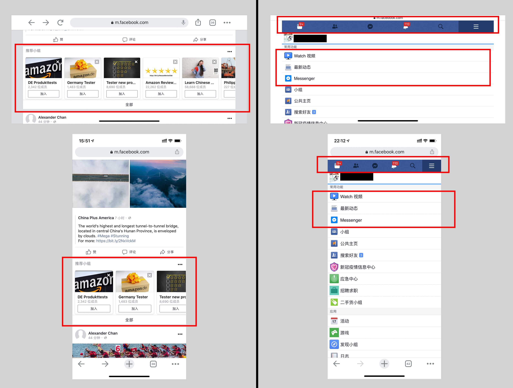
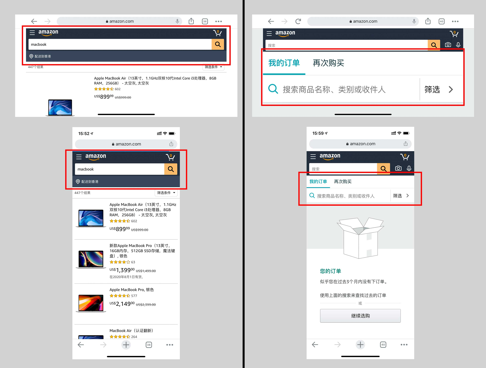
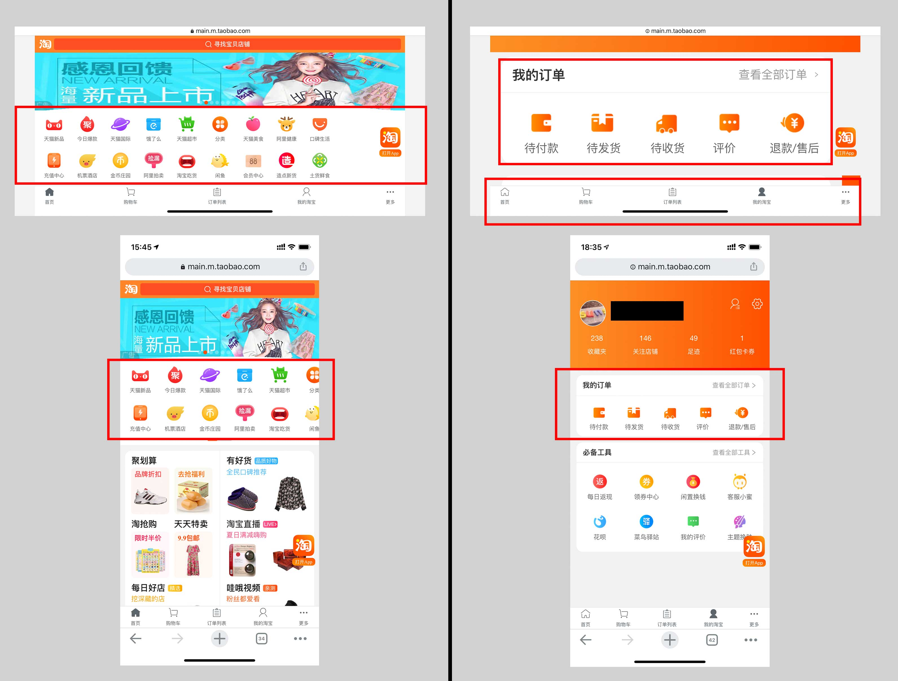
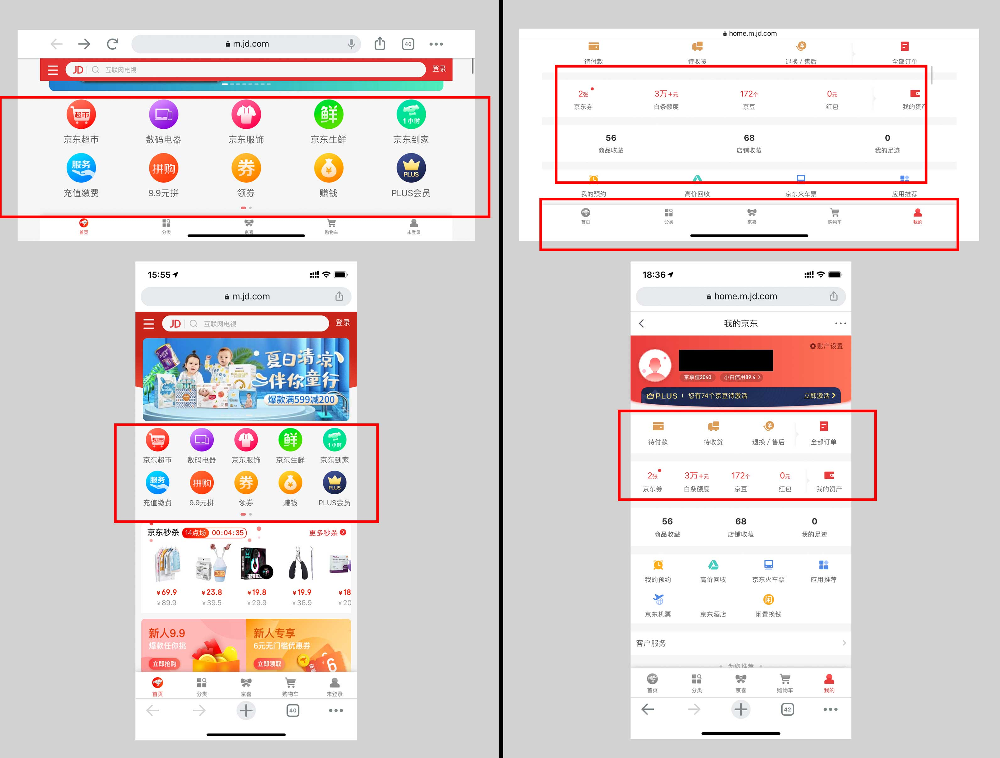
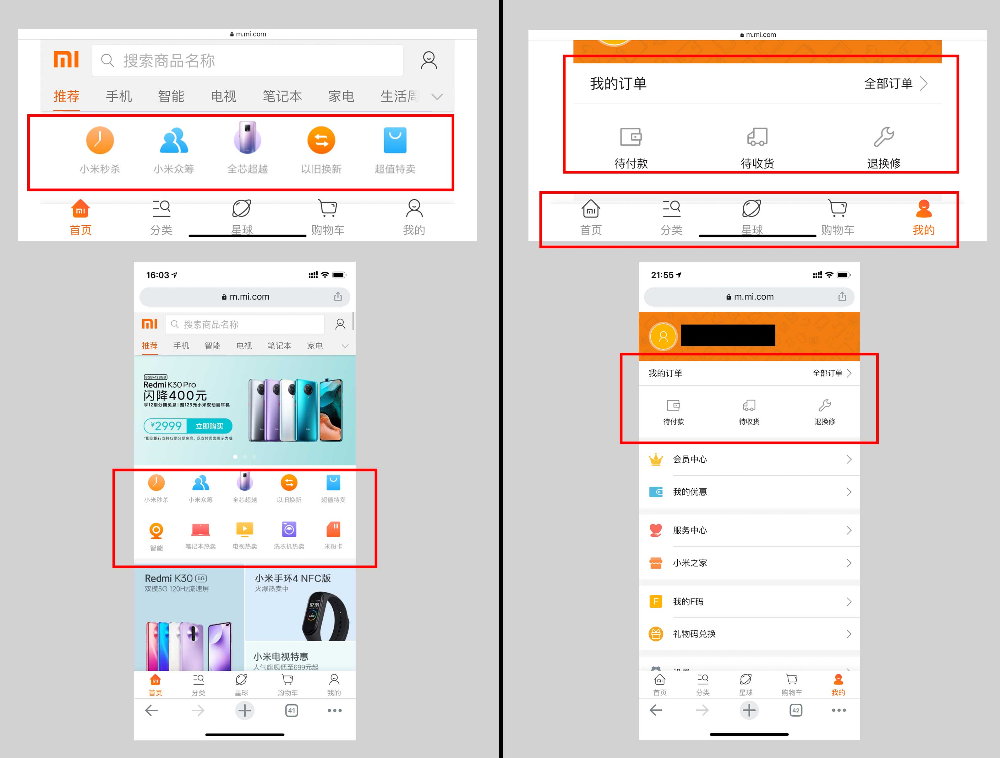

# CSS —— 页面适配问题解决方案

## 1. 痛点

&#160; &#160; &#160; &#160;工作中，客户需要一款产品，适配 **`PC`** / **`手机`** / **`平板`** 中的一样，或者多样，前端开发在布局上如何做到页面适配，2020 年了，应该采取什么解决方案。

## 2. 解决方案

先给出解决方案，然后再具体补充说明。

1. 在 head 设置 width=device-width 的 viewport

```html
<meta
  name="viewport"
  content="width=device-width，initial-scale=1，minimum-scale=1，maximum-scale=1，user-scalable=no，viewport-fit=cover"
/>
```

2. 在 css 中使用 `px`

3. 在适当的场景使用 [flex 布局](https://github.com/liucrystal24/Notebook/issues/11)，或者配合 `vw` 进行自适应

4. 在跨设备类型的时候（pc <-> 手机 <-> 平板）使用 **媒体查询**

5. 在跨设备类型如果交互差异太大的情况，考虑 **分开项目开发**

## 3. 补充说明

#### 1. css 单位选择

- ##### css 常用单位 (图片来源 :[知乎@大漠](https://www.zhihu.com/people/w3cplus))

  

* ##### 为什么不推荐 `rem` ?

  flexible 官方已经弃坑，不再维护( [github 链接](https://github.com/amfe/lib-flexible/tree/2.0) )

  > 由于 viewport 单位得到众多浏览器的兼容，lib-flexible 这个过渡方案已经可以放弃使用，不管是现在的版本还是以前的版本，都存有一定的问题。建议大家开始使用 viewport 来替代此方。

- ##### 建议移动端使用 `vw`、`vh` 进行自适应

  - 换算方便
    1`vw` = 屏幕 1% 的宽度
    1`vh` = 屏幕 1% 的高度

  - 兼容性好
    无论是在网页还是在小程序，只要支持 css 就能完美兼容。

- ##### 建议固定高度使用 `px`

  1. 框或者分隔线等“固定”高度的，应该使用 px。
  2. 组件设计建议使用 `px`，标准化，比如 `NavigationBar` 组件，按照 iOS 的设计指南应当是 `44px` 高，而 `TabBar` 组件通常应该是 `49px` 高。

#### 2. 跨设备类型，交互差异不大

- ##### 痛点

  &#160; &#160; &#160; &#160;如果开发的 app 只考虑 **竖屏** ( 正常握持场景 )，适配一般不会有什么问题，因为屏幕大小不会相差很多。但是考虑 **横屏** 模式就会有问题，如果计量单位使用的是相对长度， 各个元素都会变大，导致不美观。

- ##### 解决方案

  &#160; &#160; &#160; &#160;使用栅格化布局。例如在竖屏时采取两列布局，在横屏时采取三列布局。 另外还要用 @media 根据分辨率来调整元素的大小、字体的大小等等。

#### 3. 跨设备类型，交互差异太大的抉择

- ##### 产品设计理念

  &#160; &#160; &#160; &#160;个人认为，同样观看距离情况下，大屏看的 **`更多`** 而不是大屏看的更大，是更好的设计理念，比如 facebook、taobao 的首页是这样的设计理念。( 2020/06/27 )

- ##### 其他选择
  &#160; &#160; &#160; &#160;产品的设计大概率不由前端来决定，如果一个 app 要应用在手机和平板上 ( 手机的竖屏和平板的横屏宽度差距较大 ) ，如果设计师只设计一套 UI，或者甲方要求一套 UI，那么就使用等比缩放方案。实际上很多大厂的移动端页面也是用这个逻辑设计的，比如 amazon、mi、taobao 的个人中心界面就是这样的逻辑。( 2020/06/27 )

#### 4. 大厂官网移动端(横、竖屏)对比

1. facebook

   

   1. ##### 图片展示页面

      当元素横排列时，如果屏幕宽度不够，则按照左右滑动逻辑，不改变单个元素框的大小，遵循 “大屏但更多”的逻辑 。

   2. ##### 个人中心页面

      个人中心元素尽量竖列排列，避免横屏宽度不够时，处理自适应的问题。字体和元素块在横竖屏时，大小几乎相同，体验较为统一。

2. amazon

   

   1. ##### 图片展示页面

      字体和元素块在横竖屏时，大小几乎相同，不做特出处理。

   2. ##### 个人中心页面

      横屏时，“ 订单 ” 模块的字体根据屏幕变宽而变大，元素 **`高度`** 变大。

3. taobao

   

   1. ##### 图片展示页面

      当元素横排列时，如果屏幕宽度不够，则按照左右滑动逻辑，不改变单个元素框的大小，遵循 “大屏但更多”的逻辑 。

   2. ##### 个人中心页面

      横屏时，“ 订单 ” 模块的字体和图标根据屏幕变宽而变大，元素 **`高度`** 变大。

4. jd

   

   1. ##### 图片展示页面

      横屏时，图标和字体大小不变，元素的 **`高度`** 不变，内边距变大，撑起元素。

   2. ##### 个人中心页面

      横屏时，图标和字体大小不变，元素的 **`高度`** 不变，内边距变大，撑起元素。

5. mi

   

   1. ##### 图片展示页面

      横屏时，图标和字体大小等比缩放，元素的 **`高度`** 变大。

   2. ##### 个人中心页面

      横屏时，“ 订单 ” 模块的字体和图标根据屏幕变宽而变大，元素 **`高度`** 变大。
