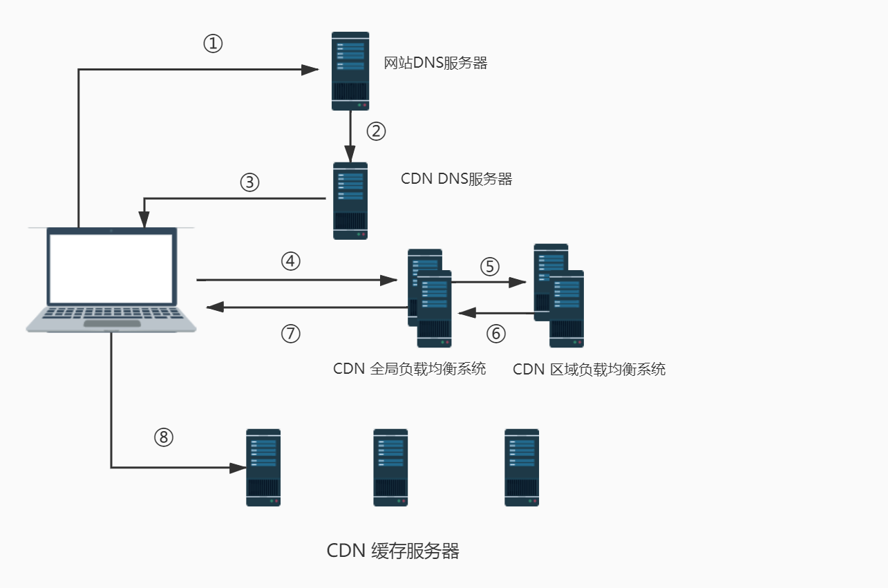

# CDN （Content Delivery Network）：内容分发网络

- ## 目的

  解决因分布、带宽、服务器性能带来的访问延迟问题，适用于站点加速、点播、直播等场景。使用户可就近取得所需内容，解决 Internet 网络拥挤的状况，提高用户访问网站的响应速度和成功率。

  控制时延无疑是现代信息科技的重要指标，CDN 的意图就是尽可能的减少资源在转发、传输、链路抖动等情况下顺利保障信息的连贯性。

- ## 基础架构

  :book: 最简单的 CDN 网络由一个 DNS 服务器和几台缓存服务器组成。

  1. 用户点击 URL， **本地 DNS 服务器** 进行解析。
  2. **DNS 服务器** 解析以后，DNS 系统将域名的解析权交给 CNAME 指向的 **CDN DNS 服务器**。
  3. **CDN DNS 服务器** 将 **CDN 全局负载均衡设备**的 IP 地址 返回给用户。
  4. 用户向 **CDN 全局负载均衡设备** 发起请求。
  5. **CDN 全局负载均衡设备** 根据用户的 IP 地址，选择一台用户所属区域的 **区域负载均衡设备**，告诉用户向这台设备发起请求。
  6. **CDN 区域负载均衡设备** 根据用户 IP 地址，选择一台距离用户近的服务器；根据 URL 内容，选择一台有用户所需内容的服务器；根据各个服务器当前的负载均衡，判断一台有能力的服务器，根据以上条件，返回一台合适的**缓存服务器** IP 地址。
  7. **全局负载均衡设备** 将 IP 地址返回给用户。
  8. 用户向 **缓存服务器** 发起请求，服务器响应请求，并返回用户所需内容到终端。

- ## 服务模式

  简单地说，CDN 是一个经策略性部署的整体系统，包括**分布式存储**、**负载均衡**、**网络请求的重定向** 和 **内容管理** 4 个要件，而内容管理和全局的网络流量管理(Traffic Management)是 CDN 的核心所在。

  通过用户就近性和服务器负载的判断，CDN 确保内容以一种极为高效的方式为用户的请求提供服务。
