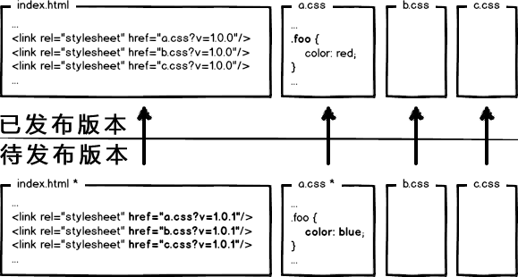

# 前段代码部署

## 原始时代

**index.html** 页面和样式文件 **a.css** ，无需编译，本地预览，放至服务器。

访问时，查看网络请求，200，完成。

当访问量和性能指标有所要求时，需要进行资源优化，比如 **a.css** ，如果用户每次访问都要重新加载，是影响性能，浪费带宽的，所以我们可以利用304，让浏览器使用本地缓存：

304叫协商缓存，还是要和服务器通信一次，于是我们可以强制浏览器使用本地缓存（ **cache-control/expires** ），不要和服务器通信：

如果不让浏览器发资源请求，那么缓存如何更新呢？可以通过更新页面中引用的资源路径，让浏览器主动放弃缓存，加载新资源，下次上线时，将链接地址改成新的版本，就会重新向服务器发出请求：

如果同一页面，引用了3个 **css**，某次上线只改了其中的 **a.css**，但是另外两个 **css** 的版本同时更名，那么就会导致另外两个 **css** 缓存失效：

我们可以让 **url** 的修改与文件内容关联，即只有文件内容变化，**url** 才会相应变化，实现**文件级别**的精确缓存控制。我们可以利用
[消息摘要算法](https://baike.baidu.com/item/%E6%B6%88%E6%81%AF%E6%91%98%E8%A6%81%E7%AE%97%E6%B3%95)将摘要信息和文件一一对应。这样可以做到对**单个文件粒度**的缓存控制:

