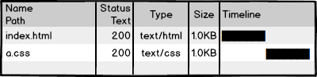
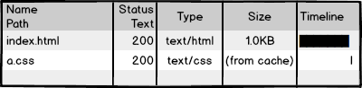
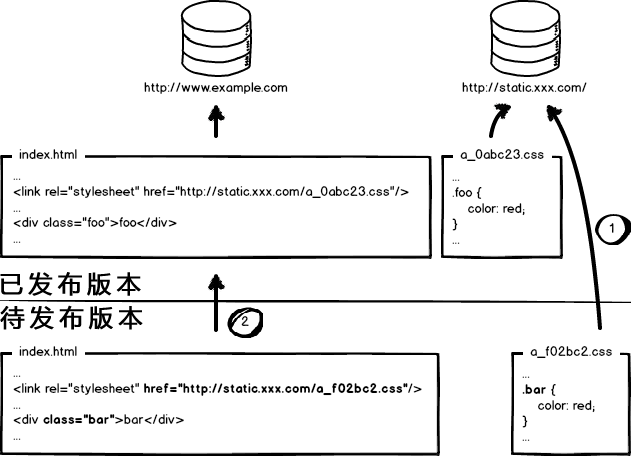

# 前段代码开发和部署

### 原理探索

**index.html** 页面和样式文件 **a.css** ，无需编译，本地预览，放至服务器。

访问时，查看网络请求:200，完成。

当访问量和性能指标有所要求时，需要进行资源优化，比如 **a.css** ，如果用户每次访问都要重新加载，是影响性能，浪费带宽的，所以我们可以利用 304，让浏览器使用本地缓存：

304 叫协商缓存，还是要和服务器通信一次，于是我们可以强制浏览器使用本地缓存（ **cache-control/expires** ），不要和服务器通信：

如果不让浏览器发资源请求，那么缓存如何更新呢？可以通过更新页面中引用的资源路径，让浏览器主动放弃缓存，加载新资源，下次上线时，将链接地址改成新的版本，就会重新向服务器发出请求：

如果同一页面，引用了 3 个 **css**，某次上线只改了其中的 **a.css**，但是另外两个 **css** 的版本同时更名，那么就会导致另外两个 **css** 缓存失效：

我们可以让 **url** 的修改与文件内容关联，即只有文件内容变化，**url** 才会相应变化，实现**文件级别**的精确缓存控制。我们可以利用[消息摘要算法](https://baike.baidu.com/item/%E6%B6%88%E6%81%AF%E6%91%98%E8%A6%81%E7%AE%97%E6%B3%95)将摘要信息和文件一一对应。这样可以做到对**单个文件粒度**的缓存控制:

为了进一步提升网站性能，会将静态资源和动态网页**分集群部署**，静态资源会被部署到 CDN 节点上，网页中引用的资源也会变成对应的部署路径：

当我们要更新静态资源时，同时要更新 html 中的引用：

这次发布，同时改了页面结构和样式，也更新了静态资源对应的 url 地址，现在要发布代码上线，应该是先部署页面，还是先部署资源呢？如果是访问量不大的项目，可以在凌晨上线，先上静态资源，再部署页面，这样问题小一些。但是对于访问量很大的项目，为了稳定的服务，我们应采取非覆盖式发布：

如上图，用文件的摘要信息来对资源文件进行重命名，把摘要信息放到资源文件发布路径中，这样，内容有修改的资源就变成了一个新的文件发布到线上，不会覆盖已有的资源文件。上线过程中，先全量部署静态资源，再灰度部署页面，整个问题就比较完美的解决了。

### 总结

1. 配置超长时间的本地缓存 —— 节省带宽，提高性能
2. 采用内容摘要作为缓存更新依据 —— 精确的缓存控制
3. 静态资源 CDN 部署 —— 优化网络请求
4. 更资源发布路径实现非覆盖式发布 —— 平滑升级
