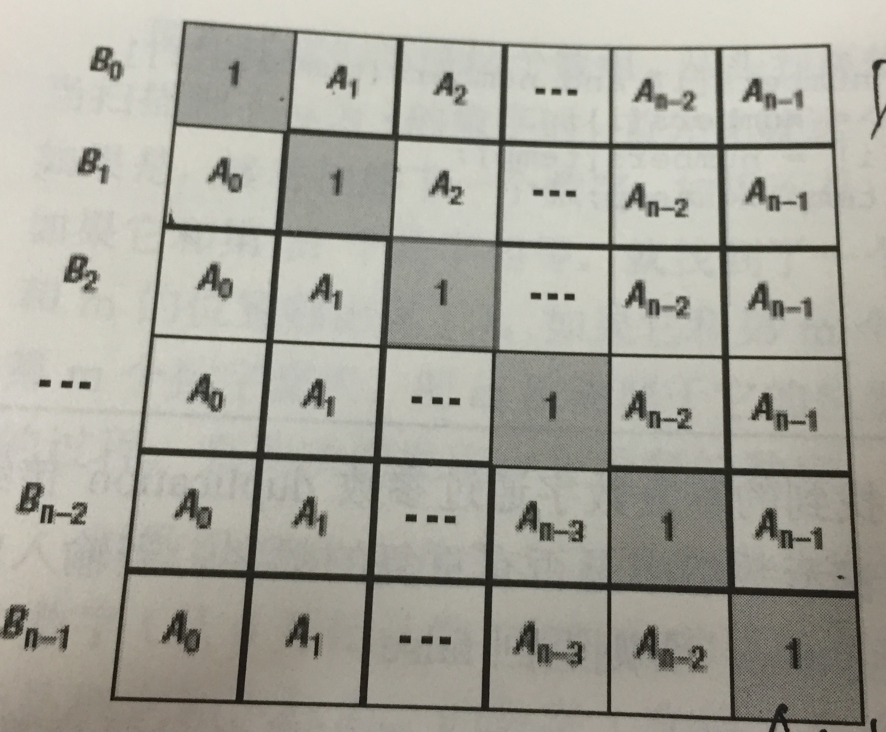

# 剑指Offer
## Easy :star:
### 1. 构建乘积数组

>给定一个数组A[0,1,...,n-1],请构建一个数组B[0,1,...,n-1]。  
>其中B中的元素B[i]=A[0] * A[1] * ... * A[i-1] * A[i+1] * ... * A[n-1]。不能使用除法。  
>（注意：规定B[0] = A[1] * A[2] * ... * A[n-1]，B[n-1] = A[0] * A[1] * ... * A[n-2];）  

- 思路1:

  

  **将B[ i ] 以 A[ i ] 为中间值，拆解为两边的乘积, B[ i ] = C[ i ] * D[ i ]**
  **:pushpin: C[ i ] :**
  C[ 0 ] = 1
  C[ 1 ] = A[ 0 ]
  C[ 2 ] = A[ 0 ] * A[ 1 ] = C[ 1 ] * A[ 1 ]
  C[ 3 ] = A[ 0 ] * ... * A[ 2 ] = C[ 2 ] * A[ 2 ]
  ……
  :point_right: C[ i ] = C [ i-1 ] * A[ i-1 ]

  **:pushpin: D[ i ] :**
  D[ n-1 ] = 1
  D[ n-2 ] = A[ n-1 ]
  D[ n-3 ] = A[ n-1 ] * A[ n-2 ] = D[ n-2 ] * A[ n-2 ]
  D[ n-4 ] = A[ n-1 ] * ... * A[ n-3 ] = D[ n-3 ] * A[ n-3 ]
  ……
  :point_right: D[ n-i ] = D[ n-i+1 ] * A [ n-i+1 ]
  
  ```js
  function multiply(array) {
  // 计算 C[i] -> res
  let res = [];
  res[0] = 1;
  for (let i = 1; i < array.length; i++) {
    res[i] = res[i - 1] * array[i - 1];
  }
  // 计算 D[i] -> temp
  let temp = 1;
  for (let j = array.length - 2; j >= 0; j--) {
    temp *= array[j + 1];
    res[j] *= temp;
  }
  return res;
  }
  ```
- 思路2:

  **B[ i ]是除了 A[ i ]的A数组其他元素乘积，隐私筛选出 A[ i ]**

  ```js
  function multiply(array) {
    let res = [];
    for (let i = 0; i < array.length; i++) {
      let temArr = array.filter((val, index) => index !== i);
      let temp = 1;
      temArr.map((val) => (temp *= val));
      res.push(temp);
    }
    return res;
  }
  ```