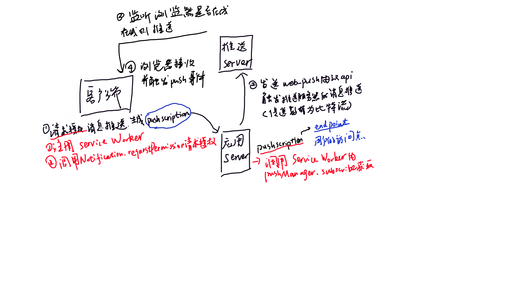
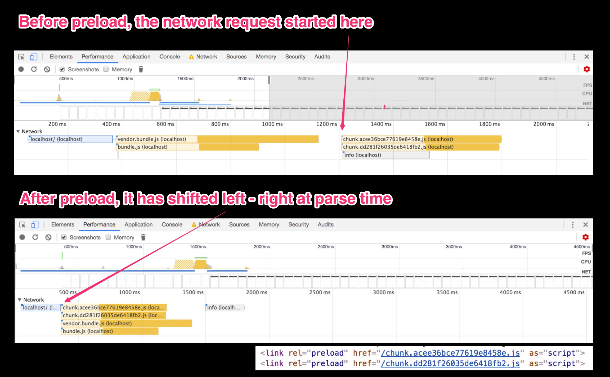
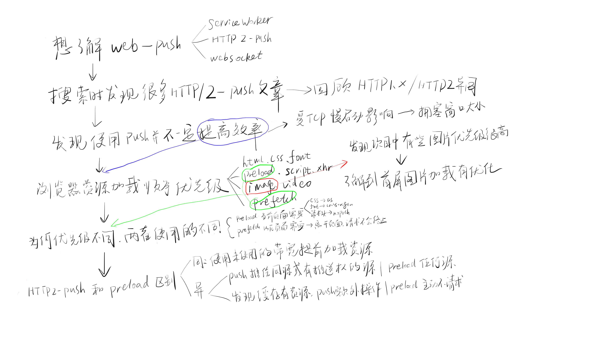

# 冲刺字节

## 一、web-push



### 与其他方式的区别

- ajax 轮询：客户端不断向服务端发送 http 请求，若有新信息则取回，比较占用服务器资源
- http 长连接：客户端向服务端发送请求后，如果服务端没有新数据，则不返回，一旦有新数据，返回 response，客户端就立刻再发送一个 request
- websocket：H5 新协议，客户端发送请求时在请求头加入额外的字段，服务器根据这个请求头，与客户建立 WebSocket 接连，服务器端有信息时，直接向客户端推送

## 二、websocket

http 协议缺陷：通信只能由客户端发起，不能服务器主动向客户端推送

### 特点

（1）建立在 TCP 协议之上，服务器端的实现比较容易。

（2）与 HTTP 协议有着良好的兼容性。默认端口也是 80 和 443，并且握手阶段采用 HTTP 协议，因此握手时不容易屏蔽，能通过各种 HTTP 代理服务器。

（3）数据格式比较轻量，性能开销小，通信高效。

（4）可以发送文本，也可以发送二进制数据。

（5）没有同源限制，客户端可以与任意服务器通信。

（6）协议标识符是 ws（如果加密，则为 wss），服务器网址就是 URL。

```js
var ws = new WebSocket("wss://echo.websocket.org");

ws.onopen = function (evt) {
  console.log("Connection open ...");
  ws.send("Hello WebSockets!");
};

ws.onmessage = function (evt) {
  console.log("Received Message: " + evt.data);
  ws.close();
};

ws.onclose = function (evt) {
  console.log("Connection closed.");
};
```

## 三、https & http / http1 & http2

### http 1.x

- 缺陷：线程阻塞，同一时间，同一域名的请求有一定数量限制

### http1.0

- 缺陷：浏览器和服务器只保持短暂连接，每次请求都需与服务器建立一个 TCP 连接（ 新建成本较高，因为需要客户端和服务器三次握手 ），服务器完成请求后立刻断开 TCP 连接。
- 解决：`Connection：keep-alive`

http1.1:

- 改进：

（1）持久连接。不用声明 keep-alive，（同一域名，允许同时建立 6 个持久连接）。
（2）管道机制。同一个 TCP 连接里，客户端可以同时发送多个请求。
（3）分块传输编码。服务端采用 “流模式” 取代 “缓冲模式”。
（4）新增请求方式。`PUT、DELETE、OPTIONS、TRACE、CONNECT`

- 缺点：同一个 TCP 连接里面，所有的数据通信是`按次序进行` 。如果前面的处理特别慢，就会导致堵塞。

- 避免方式：一是减少请求数，二是同时多开持久连接。

### http2.0

- 特点

（1）采用二进制格式。头信息和数据体都是二进制：头信息帧、数据帧
（2）多路复用，而非有序并阻塞。在一个连接里，客户端和浏览器可以同时发出多个请求，不用按顺序一一对应，避免 “队头阻塞”。
（3）报头压缩，降低开销。对于相同的头部每只需要发送一次。头信息使用 gzip 或者 compress 压缩后再发送。客户端和服务器同时维护一张头信息表，所有字段存入这个表，产生一个索引号，之后只需要发送索引号。
（4）服务器推送。可以主动向客户端发送资源。放至缓存中。

### https

在 HTTP 和 TCP 之间添加一个安全协议层（SSL 或 TSL）

- 作用

（1）对数据进行加密，并建立一个信息安全通道，保证传输过程中的信息安全。
（2）对网站服务器进行真实身份验证

- 和 http 区别

（1）加密传输协议 / 明文传输协议
（2）需要 SSL 证书 / 不需要
（3）利于 SEO
（4）标准端口 443 / 80
（4）基于传输层 / 基于应用层

- 和 http 工作过程区别

**http：**
1、浏览器打开 TCP 连接
2、浏览器发送 HTTP 请求
3、服务器发送回应信息到浏览器
4、TCP 连接关闭

**SSL：**
1、验证服务器端
2、客户端和服务器端选择加密算法和密码，确保双方都支持
3、验证客户端
4、使用公钥加密技术生成共享加密数据
5、创建一个 SSL 连接
6、基于该 SSL 连接传递 HTTP 请求

**https 加密方式：**

- 对称加密：加密和解密使用同一秘钥
- 非对称加密：

（1）加密：公钥；解密：私钥
（2）公钥算法公开，私钥保密

**过程：**
（1）服务器端生成配对的公钥和私钥
（2）私钥保存在服务端，公钥发送给客户端
（3）客户端使用公钥加密明文发送给服务端
（4）服务端使用私解密得到明文

## 四、TCP 慢启动

为了防止网络拥塞，TCP 将放弃超出拥塞窗口大小的数据。只有当拥塞串口大小的数据传输完成，这个窗口大小将乘以 2。如此，能够传输的数据以 2 的倍数增长。假设拥塞窗口大小为 14kB，下图展示了某些情况下，推送比不推送的效率没有提升。


## 五、浏览器资源加载的优先级

### 默认加载顺序

- html 、 css 、 font；
- preload 资源（通过 < link rel=“preload" > 标签预加载）、 script 、 xhr 请求；
- 图片、语音、视频；
- prefetch 预读取的资源；

### 资源优先级提升

- 将同步 XHR 请求的优先级调整为最高。
- 根据图片是否在可见视图（ 首屏 ）之内来改变优先级。如果在首屏，则图片优先级 Low -> High。
- 浏览器会将根据脚本所处的位置和属性标签分为三类，分别设置优先级。
  - 对于添加 `defer / async` 属性标签的脚本的优先级会全部降为 Low 。
  - 对于没有添加该属性的脚本，根据该脚本在文档中的位置是在浏览器展示的第一张图片之前还是之后，分为两类。之前的 ( 标记 `early**` )，它会被定为 High 优先级，之后的 ( 标记 `late**` ) 会被设置为 Medium 优先级。

## 六、preload 和 prefetch

- `preload` 是一个声明式 fetch，可以强制浏览器在不阻塞 document 的 onload 事件（一般 3s）的情况下请求资源。

- `prefetch` 告诉浏览器这个资源将来可能需要，但是什么时间加载这个资源是由浏览器来决定的。



### 何时使用

- `preload` 告诉浏览器预先请求当**前页需要**的资源，如 `关键的脚本、字体、css`。

- `prefetch` 一般是其他页面可能用到的资源

### 缓存行为

当资源被 preload 或者 prefetch 后，会从网络堆栈传输到 **HTTP 缓存** 并进入渲染器的 **内存缓存** 。

- 如果可以被缓存（ 存在有效的 cache-control 和 max-age ），存入 http 缓存
- 如果不可以被缓存，存入内存缓存

### 使用事项

**preload:**

- 一定要使用 `as`，否则不产生收益（因为最终要请求两次）
- 使用字体时，需要设置 `crossorigin`

```html
<link rel="preload" href="xxx.js" as="script" />
```

**prefetch:**

- 在 Chrome 中，如果用户导航离开一个页面，而对其他页面的预取请求仍在进行中，这些请求将不会被终止。
- 无论资源的可缓存性如何，prefetch 请求在未指定的网络堆栈缓存中至少保存 5 分钟。

```html
<link rel="prefetch" href="https://fonts.googleapis.com/css?family=Roboto" />
```

### preload 请求头和 preload 标签

许多服务器在遇到 http 头的 preload 链接会触发 http2 服务器推送，为了确保不发起不必要的推送，可以是用 preload 标签，或者在 HTTP 头上加上一个 nopush 属性。

### preload 和 HTTP2-push 对比

原理：都是使用客户端未使用的带宽预先下载之后需要的资源

**不同**

- push 只能给同源或者有推送权的源推送资源。| 可以从任何源里 preload 资源。
- 如果缓存里已经有要推送的资源，需要客户端发送 `RST_STREAM` 帧给服务器，终止推流 | 如果发现资源已经在 HTTP 缓存里，preload 不会再发送网络请求
- push 一般推送内联资源（小图片，css，js）| preload 一般预加载 css 文件引用的字体，外部 css 通过 background-url 加载的图片，其他 css

### 结论


### 整体学习思路



## 八大排序-快速排序

- O(nlongn)

（1）挑出一个数，作为基准
（2）小于基准放左，大于放右（分区操作）
（3）针对左右两组元素，重复操作（分区长度小于 2，返回）

```js
function quickSort(arr) {
  // 长度小于2，返回
  if (arr.length <= 1) {
    return arr;
  }
  // 取第一个，作为基准
  let baseValue = arr.shift();
  let lessArr = [];
  let moreArr = [];
  for (let v of arr) {
    if (v <= baseValue) {
      lessArr.push(v);
    } else {
      moreArr.push(v);
    }
  }
  return quickSort(lessArr).concat(baseValue, quickSort(moreArr));
}
```

## 八大排序-冒泡排序

- O(n2)

（1）比较相邻元素，前大后小交换
（2）第一步结束，最大数到队尾
（3）重复执行，直到没有数进行比较

```js
function bubbleSort(arr) {
  for (let i = 0; i < arr.length; i++) {
    for (let j = 0; j < arr.length - 1 - i; i++) {
      // 每次比较后，都有最大数到队尾，不用比较，所有需要 - i
      if (arr[j] > arr[j + 1]) {
        [arr[j], arr[j + 1]] = [arr[j + 1], arr[j]];
      }
    }
  }
  return arr;
}
```

## React Hook 和 class 比较

### 区别

- 可以不编写 class 的情况下使用 state 以及其他的 React 特性（比如生命周期）。

### class 优势

- class 组件内部可以定义自己的 state，用来保存组件自己内部的状态；函数式组件不可以，因为函数每次调用都会产生新的临时变量。
- 
class 组件有自己的生命周期，可以在对应的生命周期中完成自己的逻辑；比如在 componentDidMount 中发送网络请求，并且该生命周期函数只会执行一次；函数式组件在学习 hooks 之前，如果在函数中发送网络请求，意味着每次重新渲染都会重新发送一次网络请求。
class 组件可以在状态改变时只重新执行 render 函数以及我们希望重新调用的生命周期函数 componentDidUpdate 等；函数式组件在重新渲染时，整个函数都会被执行，似乎没有什么地方可以只让它们调用一次；
在 Hook 之前，以上情况通常都用 class。
Class 组件存在的问题：
复杂组件变得难以理解：
最初编写 class 组件时，往往逻辑比较简单，但是业务增多，class 组件就会越来越复杂；
比如 componentDidMount 中，可能就会有大量逻辑代码，包括网络请求，一些事件的监听（还需要在 componentWillUnmount 中移除）；
而对于这样的 class 实际上很难拆分，因为这些逻辑往往混在一起，强行拆分反而会造成过度设计，增加代码的复杂度。

难以理解的 class：
ES6 中 class 相当于 React 的一个障碍；
在 class 中，我们必须搞清楚 this 的指向到底是谁，所以需要花很多的精力去学习 this；
虽然掌握 this 是必要，但是处理起来依然很麻烦

组件复用状态很难：
在之前为了一些状态的复用，我们需要通过高阶组件或 render props；
像 redux 中 connect 或者 react-route 中的 withRouter，这些高阶组件设计的目的就是为了状态的复用。
或者类似于 Provider，Consumer 来共享一些状态，但是多次使用 Consumer 时，就会有很多嵌套；

### 优点

Hook 只能在函数组件中使用，不能在类组件，或者函数组件之外的地方使用
