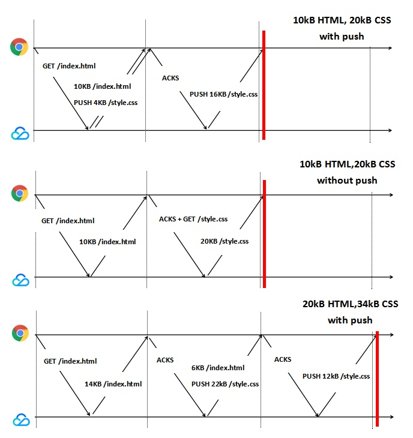

# 冲刺字节

## 一、web-push


### 与其他方式的区别

- ajax 轮询：客户端不断向服务端发送 http 请求，若有新信息则取回，比较占用服务器资源
- http 长连接：客户端向服务端发送请求后，如果服务端没有新数据，则不返回，一旦有新数据，返回 response，客户端就立刻再发送一个 request
- websocket：H5 新协议，客户端发送请求时在请求头加入额外的字段，服务器根据这个请求头，与客户建立 WebSocket 接连，服务器端有信息时，直接向客户端推送

## 二、websocket

http 协议缺陷：通信只能由客户端发起，不能服务器主动向客户端推送

### 特点

（1）建立在 TCP 协议之上，服务器端的实现比较容易。

（2）与 HTTP 协议有着良好的兼容性。默认端口也是 80 和 443，并且握手阶段采用 HTTP 协议，因此握手时不容易屏蔽，能通过各种 HTTP 代理服务器。

（3）数据格式比较轻量，性能开销小，通信高效。

（4）可以发送文本，也可以发送二进制数据。

（5）没有同源限制，客户端可以与任意服务器通信。

（6）协议标识符是 ws（如果加密，则为 wss），服务器网址就是 URL。

```js
var ws = new WebSocket("wss://echo.websocket.org");

ws.onopen = function (evt) {
  console.log("Connection open ...");
  ws.send("Hello WebSockets!");
};

ws.onmessage = function (evt) {
  console.log("Received Message: " + evt.data);
  ws.close();
};

ws.onclose = function (evt) {
  console.log("Connection closed.");
};
```

## 三、https & http / http1 & http2

### http 1.x

- 缺陷：线程阻塞，同一时间，同一域名的请求有一定数量限制

### http1.0

- 缺陷：浏览器和服务器只保持短暂连接，每次请求都需与服务器建立一个 TCP 连接（ 新建成本较高，因为需要客户端和服务器三次握手 ），服务器完成请求后立刻断开 TCP 连接。
- 解决：`Connection：keep-alive`

http1.1:

- 改进：

（1）持久连接。不用声明 keep-alive，（同一域名，允许同时建立 6 个持久连接）。
（2）管道机制。同一个 TCP 连接里，客户端可以同时发送多个请求。
（3）分块传输编码。服务端采用 “流模式” 取代 “缓冲模式”。
（4）新增请求方式。`PUT、DELETE、OPTIONS、TRACE、CONNECT`

- 缺点：同一个 TCP 连接里面，所有的数据通信是`按次序进行` 。如果前面的处理特别慢，就会导致堵塞。

- 避免方式：一是减少请求数，二是同时多开持久连接。

### http2.0

- 特点

（1）采用二进制格式。头信息和数据体都是二进制：头信息帧、数据帧
（2）多路复用，而非有序并阻塞。在一个连接里，客户端和浏览器可以同时发出多个请求，不用按顺序一一对应，避免 “队头阻塞”。
（3）报头压缩，降低开销。对于相同的头部每只需要发送一次。头信息使用 gzip 或者 compress 压缩后再发送。客户端和服务器同时维护一张头信息表，所有字段存入这个表，产生一个索引号，之后只需要发送索引号。
（4）服务器推送。可以主动向客户端发送资源。放至缓存中。

### https

在 HTTP 和 TCP 之间添加一个安全协议层（SSL 或 TSL）

- 作用

（1）对数据进行加密，并建立一个信息安全通道，保证传输过程中的信息安全。
（2）对网站服务器进行真实身份验证

- 和 http 区别

（1）加密传输协议 / 明文传输协议
（2）需要 SSL 证书 / 不需要
（3）利于 SEO
（4）标准端口 443 / 80
（4）基于传输层 / 基于应用层

- 和 http 工作过程区别

**http：**
1、浏览器打开 TCP 连接
2、浏览器发送 HTTP 请求
3、服务器发送回应信息到浏览器
4、TCP 连接关闭

**SSL：**
1、验证服务器端
2、客户端和服务器端选择加密算法和密码，确保双方都支持
3、验证客户端
4、使用公钥加密技术生成共享加密数据
5、创建一个 SSL 连接
6、基于该 SSL 连接传递 HTTP 请求

**https 加密方式：**

- 对称加密：加密和解密使用同一秘钥
- 非对称加密：

（1）加密：公钥；解密：私钥
（2）公钥算法公开，私钥保密

**过程：**
（1）服务器端生成配对的公钥和私钥
（2）私钥保存在服务端，公钥发送给客户端
（3）客户端使用公钥加密明文发送给服务端
（4）服务端使用私解密得到明文

## TCP 慢启动

为了防止网络拥塞，TCP 将放弃超出拥塞窗口大小的数据。只有当拥塞串口大小的数据传输完成，这个窗口大小将乘以 2。如此，能够传输的数据以 2 的倍数增长。假设拥塞窗口大小为 14kB，下图展示了某些情况下，推送比不推送的效率没有提升。



## 浏览器资源加载的优先级

### 默认加载顺序

- html 、 css 、 font；
- preload 资源（通过 < link rel=“preload" > 标签预加载）、 script 、 xhr 请求；
- 图片、语音、视频；
- prefetch 预读取的资源；

### 资源优先级提升

- 将同步 XHR 请求的优先级调整为最高。
- 根据图片是否在可见视图（ 首屏 ）之内来改变优先级。如果在首屏，则图片优先级 Low -> High。
- 浏览器会将根据脚本所处的位置和属性标签分为三类，分别设置优先级。
  - 对于添加 `defer / async` 属性标签的脚本的优先级会全部降为 Low 。
  - 对于没有添加该属性的脚本，根据该脚本在文档中的位置是在浏览器展示的第一张图片之前还是之后，分为两类。之前的 ( 标记 `early**` )，它会被定为 High 优先级，之后的 ( 标记 `late**` ) 会被设置为 Medium 优先级。

## preload 和 prefetch

<link rel="dns-prefetch" href="https://fonts.googleapis.com/">
