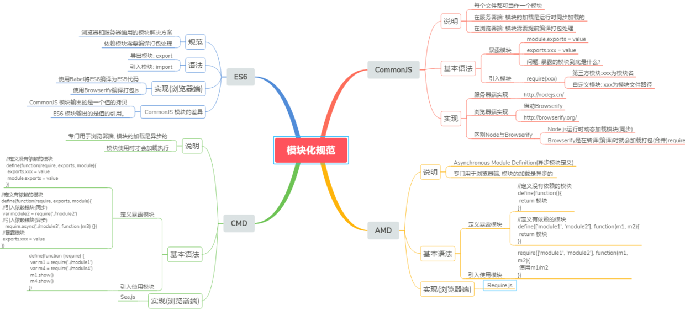

# 冲刺阿里

## 一、简单介绍前端模块化，amd，cmd，commonjs，es6 的 module



**代码模块化抽象成三个部分**：输入（import），计算（业务代码），输出（export）

**优势**：可扩展、可替换、代码重复用，多人并行开发

### ES6 moudule

```js
import a from "b";
// ...
export default c;
```

**规范：**

- 浏览器和服务器通用的模块解决方案
- 需要编译打包处理

**实现（浏览器端）：**

- 使用 babel 将 ES6 转化成 ES5
- 使用 Browserify 编译打包 js

**与 CommonJS 区别：**

- CommonJS 模块输出是值的拷贝，ES6 Moudule 模块输出是值的引用
- CommonJS 在运行时加载，ES6 Moudule 在编译时输出接口

### CommonJS

```js
const a = require("b");
// ...
module.exports = c;
```

**规范：**

- 服务器端：模块的加载时运行时同步加载
- 浏览器端：模块需要提前编译打包处理

**实现**

- 服务器端：node.js
- 浏览器端：借助 browserify

### AMD

```js
// 定义有依赖的模块
define(["md1", "md2"], function (m1, m2) {
  // ...
  return c;
});

// 引入使用模块
require(["md1", "md2"], function (m1, m1) {
  // 使用 m1、m2
});
```

**规范：**

- 专供浏览器使用，模块是异步加载的，模块使用时才会加载

**实现（浏览器端）**

- Require.js

### CMD

```js
// 定义有依赖的模块
define(function (require, exports, module) {
  // 引入依赖模块(同步)
  var m2 = require("./m2");
  // 引入模块（异步）
  require.async("./m3", function (m3) {});
  // 暴露模块
  exports.xxx = value;
});
// 引用模块
define(function (require) {
  var m2 = require("./m2");
  var m3 = require("./m3");
  m2.show();
  m3.show();
});
```

**规范：**

- 专供浏览器使用，模块是异步加载的

**实现（浏览器端）**

- Sea.js

### 总结

1）ES6 服务器端和浏览器端都可以用，但都需要先编译打包所有用到的模块。支持 **webpack 插件异步加载**。
2）CommonJS 主要用于服务端 ，加载模块为同步，在浏览器中会造成阻塞。
3）AMD 和 CMD 都专供浏览器端，动态**异步**加载模块。

## async await 和 Promise 的用法以及实现原理

### promise.all 的 polyfill

## 对 ts 的理解

## ts 的泛型是什么作用

## 设计一个通过拖拽，然后交换位置的组件，给思路就可以。

- @dragtart 定义 this.dragging = item 绑定标记移动的 item
- @dragEnter
  - src = newItems.indexOf(this.dragging); 标记拖动的 item
  - dst = newItems.indexOf(item); 标记进入的 item
  - newItems.splice(dst, 0, ...newItems.splice(src, 1)); 修改原数组位置
  - this.items = newItems; 赋值给原数组
- @dragover.prevent(保证最后能拖动进去)
- @dragend this.dragging = null 清空

## 移动端遇到过什么坑，移动端页面适配解决方案，以及浏览器中几种长度单位（rem、em、px）的特点和区别（复习）

## React、Vue 之间的区别和实现原理，另外问了下 React 中 Fibber 是什么？

## JS 的 Event Loop （复习）

## 三次握手和四次挥手，get post 区别

## 数组去重 （复习）

## 函数柯里化

```js
function composeFunctions() {
  var args = Array.prototype.slice.apply(arguments);

  var _func = function () {
    if (arguments.length === 0) {
      return func.apply(this, args);
    }

    Array.prototype.push.apply(args, arguments);

    return _func;
  };

  return _func;
}
```

## htmL 文档流

## 前端工程化

## 输入 url 到页面显示的步骤

## 页面渲染过程，遇到 script 会怎么样

## 如何避免 js 阻塞渲染?

## img 加载会影响渲染吗

## 排序算法，冒泡、快排，复杂度

## 数组方法(filter map set)

## vue 响应式原理，双向数据流原理

## vue diff

## 如何优化 diff

## vue 使用过什么指令？自定义指令

## 前端部署方案

## 如何看待前端框架选型 ?

## eact virsualDOM 是什么? 如何实现? 说一下 diff 算法 ?

## 工作中最出色的点, 和你最头疼的问题 如何解决的 ?

## SSR 和 客户端渲染有什么区别 , vue 是如何实现绑定事件的 ?

## React Diff 算法 ?

## 浏览器事件有哪些过程? 为什么一般在冒泡阶段, 而不是在捕获阶段注册监听? addEventListener 参数分别是什么 ?

## webpack 的原理, loader 和 plugin 是干什么的? 有自己手写过么 ?

## http 报文头部有哪些字段? 有什么意义 ?

## 简述公司 node 架构中容灾的实现 ?

## 移动端如何优化首页白屏时间过长 ?

## js 浮点数运算不精确 如何解决?

## 静态文件的浏览器缓存如何实现？

## ES6 generator 函数简述，Generator 函数有哪些接口？Generator 函数是异步的，它跟 Promise 有什么区别？

## new String('a') 和 'a' 是一样的么?

## 移动端优化方式? 离线包是如何实现的?

## Class 是什么？Class 如何让它在低版本浏览器运行？

## 介绍一下 TypeScript，它和 js 有什么区别，为什么大型应用要用 typescript，怎么区分是否是大型应用，什么是静态类型（typescript 属于静态类型

## 了解 react 吗？了解 nodejs 吗？nodejs 中的 express 是什么？它跟 Nodejs 有什么关系？

## JS 执行过程中是如何保存上下文的

## JS 有几种基本类型，分别是什么，与对象的区别

## 微前端了解吗

## node 与其他语言有什么区别，其优劣势是什么

## csrf 的核心原理

## FCP/FMP/FP 分别是怎样定义，如何统计

## MySQL 题目，id 唯一，name 可以重复，求 name 有重复的所有数据

## 链路录屏的原理

## 链路录屏法务问题如何解决

## FMP 定义及统计，w3c 的草案你知道吗

## react hooks 用过吗，为什么要用

## h5 和小程序有什么区别

## https 加密原理，中间人攻击知道吗

## ng 负载均衡的方式有哪些

## CDN 有什么作用

## 垃圾回收中，内部函数返给上层的对象是如何管理的

## es 静态分析原理

## 有一个很大很大的文件，如何统计文件里面重复最多的行是哪行(参考 git 的记录存储)

## 原型链，对象，构造函数之间的一些联系

## DOM 事件的绑定的几种方式

## webpack 的入口文件怎么配置，多个入口怎么分割

## 200 和 304 的理解和区别

## DOM 事件中 target 和 currentTarget 的区别

## 怎么解决跨域的。以及后续 JSONP 的原理和实现以及 cors 怎么设置

## 深拷贝的实现原理

## babel 把 ES6 转成 ES5 或者 ES3 之类的原理是什么

## 什么是函数柯里化？以及说一下 JS 的 API 有哪些应用到了函数柯里化的实现

## getBoundingClientRect 获取的 top 和 offsetTop 获取的 top 区别

## 百度的一个服务不想让阿里使用，如果识别到是阿里的请求，然后跳转到 404 或者拒绝服务

## 二分查找的时间复杂度怎么求，是多少

## 线性顺序存储结构和链式存储结构有什么区别？以及优缺点。

## 分析一下移动端日历，PC 端日历以及桌面日历的一些不同和需要注意的地方

## 怎么实现草稿，多终端同步，以及冲突问题
