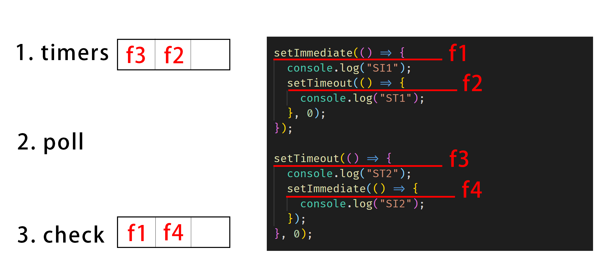
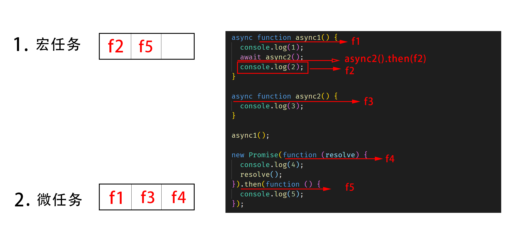

# Event loop ( 事件循环 )

Event Loop 即事件循环，是指浏览器或 Node 的一种解决 javaScript 单线程运行时不会阻塞的一种机制，也就是我们经常使用异步的原理。

## 环境

### node.js

- setTimeout -> timer

- setImmediate -> check

- proce.nextTick() -> 当前阶段( 某一任务 fn )最后

### 浏览器

- setTimeout -> 宏任务（ 一会儿 ）

- Promise.then() -> 微任务（ 马上 ）

  new Promise(fn).then(f1) -> fn 是立马执行的，不放入队列，f1 放入微任务队列

- await fn() -> 转换成 fn().then() 然后考虑

## 一、node.js

### 事件循环过程

1. :star: **timers** ( 处理 **setTimeout** 等 )
2. I/O callback
3. idle , prepare
4. :star: **poll** ( 停留事件，准备处理 )
5. :star: **check** ( 处理 **setImmediate** 等 )
6. close callback
7. （再回到 **timers** ）

### :star::star::star: 循环规则

- 我们主要需要专注 **`timers、poll、check`** 三个阶段，且一般解决问题都是 **从 `poll` 阶段开始等待处理**

- `poll` （ 起始 ）阶段有 `process.nextTick()`，依次放入 `check` 前的队列，执行完进入 `check`，其他阶段有 `process.nextTick()`，放入 **当前任务（ `fn` ）后** ，即在进入下一个任务 （ `fn` ）前执行

- 在执行某阶段时（`timers` 或 `check`），向当前阶段或者另一阶段队列添加任务时，都 **不在当下执行**，而 **在下个循环执行**

- :books: 如果在 `node` 环境下出现 `Promise.then（fn）`，如果 `fn` 内是同步任务，放在 **当前任务后**，有`process.nextTick()`，放在 `process.nextTick()` 后，如果是异步任务，则正常处理

### Eventloop 三个 API

### 1、setTimout() 和 setImmediate()

根据时事件循环过程，如下代码应该是什么输出顺序呢？

```js
setTimeout(() => {
  console.log("f1");
}, 0);
setImmediate(() => {
  console.log("f2");
});
```

#### 执行顺序

**一、poll 阶段：**

1、将 `setTimeout` 放入 `timers` 队列中，不执行

2、将 `setImmediate` 放入 `check` 队列中，不执行

3、发现 `check` 队列有任务需要执行，进入 `check` 阶段

**三、check 阶段：**

1、执行 `setImmediate` 为立刻执行，**打印 `"f2"`**

**四、timers 阶段：**

1、执行 `setTimeout`，**打印 `"f1"`**

#### 不定因素

实际在 `node.js` 中执行时，发现有时候先输出 `"f1"`，有时候先输出 `"f2"`。

由于 `node.js` 运行 `Event loop` 机制时的步骤：

1、 **开启 `Event loop`**

2、 **执行 js 代码**

如果 `Event loop` 开启的比较快，则按照如上的顺序执行，但是如果 `Event loop` 开启的比较慢，开启的时候，`"f1"` 已经提前放入队列了，则直接先输出 `"f1"`，然后在输出 `"f2"`。

所以为了确保执行顺序唯一，最好 **延迟执行所需要运行的 js 代码** ，确保 `Event loop` 启动完毕，则执行顺序唯一。

```js
setTimeout(() => {
  setTimeout(() => {
    console.log("f1");
  }, 0);
  setImmediate(() => {
    console.log("f2");
  });
}, 1000);
```

#### :warning: 以下所有案例的输出结果均为延迟执行的输出结果！

我们再看一个复杂一点的例子：

```js
setImmediate(() => {
  console.log("SI1");
  setTimeout(() => {
    console.log("ST1");
  }, 0);
});

setTimeout(() => {
  console.log("ST2");
  setImmediate(() => {
    console.log("SI2");
  });
}, 0);
```

遇到复杂的例子，我们应该根据执行顺序 **画图** 解决:



#### 执行顺序

**一、poll 阶段：**

1、 将 `f1` 放入 `check` 队列，不执行

2、 将 `f3` 放入 `timers` 队列，不执行

3、 发现 `check` 队列有任务需要执行，进入 `check` 阶段

`check` 队列 : [ `f1` ]
`timers` 队列 : [ `f3` ]

**二、check 阶段：**

1、 执行 `f1`，**打印 `"SI1"`**

2、 将 `f2` 放入 `timers` 队列，不执行

`check` 队列 : [ ~~`f1`~~ ]
`timers` 队列 : [ `f3` , `f2` ]

**三、timers 阶段：**

1、 先执行 `f3`，**打印 `"ST2"`**

2、 将 `f4` 放入 `check` 队列，不执行

3、 再执行 `f2`，**打印 `"ST1"`**

`check` 队列 : [ ~~`f1`~~ , `f4` ]
`timers` 队列 : [ ~~`f3`~~ , ~~`f2`~~ ]

**四、poll 阶段：**

1、发现 `check` 队列里有 `f4` 需要执行

**五、check 阶段：**

1、 执行 `f4`，**打印 `"SI2"`**

`check` 队列 : [ ~~`f1`~~ , ~~`f4`~~ ]
`timers` 队列 : [ ~~`f3`~~ , ~~`f2`~~ ]

#### 输出顺序

SI1,ST2,ST1,SI2

### 2、process.nextTick()

`process.nextTick()` 不属于 `Event loop` 的某一个阶段，在 **当前阶段（ 任务 fn ）离开之前** 运行。

```js
setTimeout(() => {
  console.log("f1");
  process.nextTick(() => {
    console.log("f2");
  });
}, 0);

setTimeout(() => {
  console.log("f11");
  process.nextTick(() => {
    console.log("f22");
  });
}, 0);

setImmediate(() => {
  console.log("f3");
});

process.nextTick(() => {
  console.log("f4");
});
```


#### 执行顺序

**一、poll 阶段：**

1、 将 `f1` 放入 `timers` 队列，不执行

2、 将 `f3` 放入 `check` 队列，不执行

3、 将 `f4` 放入 `poll` 队列最后，不执行（ 因为此时还未准备离开 `poll` 阶段 ）

4、 发现 `check` 队列有任务需要执行，准备进入 `check` 阶段，离开之前执行 `f4` ，**打印 `"f4"`**

`timers` 队列 : [ `f1` ]
`poll` 队列 : [ ~~`f4`~~ ]
`check` 队列 : [ `f3` ]

**二、check 阶段：**

1、 执行 `f3`，**打印 `"f3"`**

`timers` 队列 : [ `f1` ]
`poll` 队列 : [ ~~`f4`~~ ]
`check` 队列 : [ ~~`f3`~~ ]

**三、timers 阶段：**

1、 执行 `f1`，**打印 `"f1"`**

2、 将 `f2` 放入 `timers` 队列中 **`f1`任务的后面** ，不执行（ 因为此时还未准备离开 `timers` 阶段 ）

3、 准备离开 `timers` 阶段，离开之前执行 `f2` ，**打印 `"f2"`**

`timers` 队列 : [ ~~`f1`~~ , ~~`f2`~~ ]
`poll` 队列 : [ ~~`f4`~~ ]
`check` 队列 : [ ~~`f3`~~ ]

#### 输出顺序

f4,f3,f1,f2

## 二、浏览器

### 事件循环过程

1. 执行同步代码，将异步代码放入 **宏任务队列** 和 **微任务队列**

2. 执行微任务队列任务，**所有微任务执行完成后**，执行宏任务队列任务

### :star::star::star: 循环规则

- :star: 如果在执行微任务过程中，又产生微任务，则放至队列尾部，**在当前周期执行**

- :star: 如果在执行 **一个宏任务** 过程中，产生微任务，则将 **本个宏任务** 执行完后，去执行微任务队列中的任务

- :star: 一次只从 **宏任务队列** 中取 **一个任务** 执行

- :star: **promise().then( `fn1` ).then( `fn2` )**，先将 `fn1` 放入微队列，后面的 **同级函数** 如果有微任务则先将一级微任务放入队列，再将 `fn2` （ 此处算是 **下一级微任务，优先级不如上一级** ）

- setTimeout -> 宏任务（ 一会儿 ）

- Promise.then( ) -> 微任务（ 马上 ）

  new Promise(fn).then(f1) -> fn 是立马执行的，不放入队列，f1 放入微任务队列

- await fn( ) 是 Promise 的语法糖 -> 微任务，转换成 fn( ).then( ) 然后考虑

- await fn( ) 下方的代码 `fn2`，都属于 **fn( ).then(fn2)**，**放入微任务队列**

```js
async function async1() {
  console.log(1);
  await async2();
  console.log(2);
}

async function async2() {
  console.log(3);
}

async1();

new Promise(function (resolve) {
  console.log(4);
  resolve();
}).then(function () {
  console.log(5);
});
```

#### 画图



#### 执行顺序

1、运行 `async1()`，执行 `f1`，打印 **`1`**

2、将 `await async2()` 改写成 `async2().then(f2)` 考虑，先运行 `async2()`，即执行`f3`，打印 **`3`**，将 `f2` 放入微任务队列

:warning: `await async2()` 下方均为 `f2` ，此处只有 `console.log(2);`

3、执行 `f4`，打印 **`4`**，将 `f5` 放入微任务队列

4、顺序执行 `f2`，`f5`，打印 **`2`**，**`5`**

#### 输出

1 3 4 2 5

再一个复杂的例子：

```js
console.log(1);

setTimeout(() => {
  console.log(2);
  Promise.resolve().then(() => {
    console.log(3);
  });
});

new Promise((resolve, reject) => {
  console.log(4);
  resolve(5);
}).then((data) => {
  console.log(data);

  Promise.resolve()
    .then(() => {
      console.log(6);
    })
    .then(() => {
      console.log(7);

      setTimeout(() => {
        console.log(8);
      }, 0);
    });
});

setTimeout(() => {
  console.log(9);
});

console.log(10);
```

#### 画图


#### 执行顺序

**一、同步代码**

1、打印 **`1`**

2、将 `fn1` 放入宏任务队列

宏队列：[ `fn1` ]
微队列：[ ]

3、打印 **`4`**

4、将 `fn2` 放入微任务队列

宏队列：[ `fn1` ]
微队列：[ `fn2` ]

5、将 `fn3` 放入宏任务队列

宏队列：[ `fn1` ，`fn3` ]
微队列：[ `fn2` ]
6、打印 **`10`**

**二、异步代码**

7、执行微任务 `fn2`，打印 data **`5`**

8、将 `fn4` 放入微任务队列，执行 `fn4` ，打印 **`6`**，**`7`**

宏队列：[ `fn1` ， `fn3` ]
微队列：[ `fn2` ， `fn4` ]

9、将 `fn5` 放入宏任务队列

宏队列：[ `fn1` ，`fn3` ， `fn5`]
微队列：[ ~~`fn2`~~ ]

10、执行宏任务队列中 `fn1`，打印 **`2`**，将 `fn6` 放入微任务队列

宏队列：[ ~~`fn1`~~ ， `fn3` ， `fn5`]
微队列：[ ~~`fn2`~~ ， `fn6` ]

11、执行微任务队列中 `fn6`，打印 **`3`**

宏队列：[ ~~`fn1`~~ ， `fn3` ， `fn5`]
微队列：[ ~~`fn2`~~ ， ~~`fn6`~~ ]

12、执行宏任务队列中 `fn3`，打印 **`9`**

宏队列：[ ~~`fn1`~~ ， ~~`fn3`~~ ， `fn5`]
微队列：[ ~~`fn2`~~ ， ~~`fn6`~~ ]

13、执行宏任务队列中 `fn5`，打印 **`8`**

宏队列：[ ~~`fn1`~~ ， ~~`fn3`~~ ， ~~`fn5`~~ ]
微队列：[ ~~`fn2`~~ ， ~~`fn6`~~ ]

#### 输出

1 4 10 5 6 7 2 3 9 8
