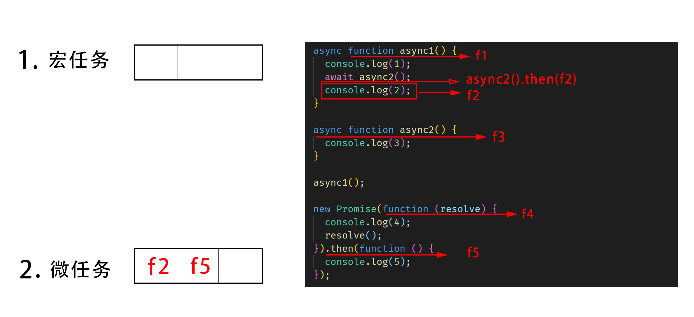

# Event loop ( 事件循环 )

Event Loop 即事件循环，是指浏览器或 Node 的一种解决 javaScript 单线程运行时不会阻塞的一种机制，也就是我们经常使用异步的原理。

## 环境

### node.js

- setTimeout -> timer

- setImmediate -> check

- proce.nextTick() -> 当前阶段最后（ 进入下一个阶段前 ）

### 浏览器

- setTimeout -> 宏任务（ 一会儿 ）

- Promise.then() -> 微任务（ 马上 ）

  new Promise(fn).then(f1) -> fn 是立马执行的，不放入队列，f1 放入微任务队列

- await fn() -> 转换成 fn().then() 然后考虑

## 一、node.js

### 事件循环过程

1. :star: **timers** ( 处理 **setTimeout** 等 )
2. I/O callback
3. idle , prepare
4. :star: **poll** ( 停留事件，准备处理 )
5. :star: **check** ( 处理 **setImmediate** 等 )
6. close callback
7. （再回到 **timers** ）

我们主要需要专注 **`timers、poll、check`** 三个阶段，且一般解决问题都是 **从 `poll` 阶段开始等待处理** 。

### Eventloop 三个 API

### 1、setTimout() 和 setImmediate()

根据时事件循环过程，如下代码应该是什么输出顺序呢？

```js
setTimeout(() => {
  console.log("f1");
}, 0);
setImmediate(() => {
  console.log("f2");
});
```

#### 执行顺序

**一、poll 阶段：**

1、将 `setTimeout` 放入 `timers` 队列中，不执行（ 因为在 `poll` 阶段 ）

2、将 `setImmediate` 放入 `check` 队列中，不执行（ 因为在 `poll` 阶段 ）

3、发现 `check` 队列有任务需要执行，进入 `check` 阶段

**三、check 阶段：**

1、执行 `setImmediate` 为立刻执行，**打印 `"f2"`**

**四、timers 阶段：**

1、执行 `setTimeout`，**打印 `"f1"`**

#### 不定因素

实际在 `node.js` 中执行时，发现有时候先输出 `"f1"`，有时候先输出 `"f2"`。

由于 `node.js` 运行 `Event loop` 机制时的步骤：

1、 **开启 `Event loop`**

2、 **执行 js 代码**

如果 `Event loop` 开启的比较快，则按照如上的顺序执行，但是如果 `Event loop` 开启的比较慢，开启的时候，`"f1"` 已经提前放入队列了，则直接先输出 `"f1"`，然后在输出 `"f2"`。

所以为了确保执行顺序唯一，最好 **延迟执行所需要运行的 js 代码** ，确保 `Event loop` 启动完毕，则执行顺序唯一。

#### :warning: 以下所有案例的输出结果均为延迟执行的输出结果！

```js
setTimeout(() => {
  setTimeout(() => {
    console.log("f1");
  }, 0);
  setImmediate(() => {
    console.log("f2");
  });
}, 1000);
```

我们再看一个复杂一点的例子：

```js
setImmediate(() => {
  console.log("SI1");
  setTimeout(() => {
    console.log("ST1");
  }, 0);
});

setTimeout(() => {
  console.log("ST2");
  setImmediate(() => {
    console.log("SI2");
  });
}, 0);
```

遇到复杂的例子，我们应该根据执行顺序 **画图** 解决:


#### 执行顺序

**一、poll 阶段：**

1、 将 `f1` 放入 `check` 队列，不执行（ 因为此时在 `poll` 阶段 ）

2、 将 `f3` 放入 `timers` 队列，不执行（ 因为此时在 `poll` 阶段 ）

3、 发现 `check` 队列有任务需要执行，进入 `check` 阶段

`check` 队列 : [ `f1` ]
`timers` 队列 : [ `f3` ]

**二、check 阶段：**

1、 执行 `f1`，**打印 `"SI1"`**

2、 将 `f2` 放入 `timers` 队列，不执行（ 因为此时在 `check` 阶段 ）

`check` 队列 : [ ~~`f1`~~ ]
`timers` 队列 : [ `f3` , `f2` ]

**三、timers 阶段：**

1、 先执行 `f3`，**打印 `"ST2"`**

2、 将 `f4` 放入 `check` 队列，不执行（ 因为此时在 `timers` 阶段 ）

3、 再执行 `f2`，**打印 `"ST1"`**

`check` 队列 : [ ~~`f1`~~ , `f4` ]
`timers` 队列 : [ ~~`f3`~~ , ~~`f2`~~ ]

**四、poll 阶段：**

1、发现 `check` 队列里有 `f4` 需要执行

**五、check 阶段：**

1、 执行 `f4`，**打印 `"SI2"`**

`check` 队列 : [ ~~`f1`~~ , ~~`f4`~~ ]
`timers` 队列 : [ ~~`f3`~~ , ~~`f2`~~ ]

#### 输出顺序

SI1,ST2,ST1,SI2

### 2、process.nextTick()

`process.nextTick()` 不属于 `Event loop` 的某一个阶段，在 **当前阶段离开之前** 运行。

```js
setTimeout(() => {
  console.log("f1");
  process.nextTick(() => {
    console.log("f2");
  });
}, 0);

setImmediate(() => {
  console.log("f3");
});

process.nextTick(() => {
  console.log("f4");
});
```


#### 执行顺序

**一、poll 阶段：**

1、 将 `f1` 放入 `timers` 队列，不执行（ 因为此时在 `poll` 阶段 ）

2、 将 `f3` 放入 `check` 队列，不执行（ 因为此时在 `poll` 阶段 ）

3、 将 `f4` 放入 `poll` 队列最后，不执行（ 因为此时还未准备离开 `poll` 阶段 ）

4、 发现 `check` 队列有任务需要执行，准备进入 `check` 阶段，离开之前执行 `f4` ，**打印 `"f4"`**

`timers` 队列 : [ `f1` ]
`poll` 队列 : [ ~~`f4`~~ ]
`check` 队列 : [ `f3` ]

**二、check 阶段：**

1、 执行 `f3`，**打印 `"f3"`**

`timers` 队列 : [ `f1` ]
`poll` 队列 : [ ~~`f4`~~ ]
`check` 队列 : [ ~~`f3`~~ ]

**三、timers 阶段：**

1、 执行 `f1`，**打印 `"f1"`**

2、 将 `f2` 放入 `timers` 队列最后，不执行（ 因为此时还未准备离开 `timers` 阶段 ）

3、 准备离开 `timers` 阶段，离开之前执行 `f2` ，**打印 `"f2"`**

`timers` 队列 : [ ~~`f1`~~ , ~~`f2`~~ ]
`poll` 队列 : [ ~~`f4`~~ ]
`check` 队列 : [ ~~`f3`~~ ]

#### 输出顺序

f4,f3,f1,f2

## 二、浏览器

```js
async function async1() {
  console.log(1);
  await async2();
  console.log(2);
}

async function async2() {
  console.log(3);
}

async1();

new Promise(function (resolve) {
  console.log(4);
  resolve();
}).then(function () {
  console.log(5);
});
```

#### 画图



#### 执行顺序

1.运行 `async1()`，执行 `f1`，打印 **`1`**

2.将 `await async2()` 改写成 `async2().then(f2)` 考虑，先运行 `async2()`，即执行`f3`，打印 **`3`**，将 `f2` 放入微任务队列

:warning: `await async2()` 下方均为 `f2` ，此处只有 `console.log(2);`

3.执行 `f4`，打印 **`4`**，将 `f5` 放入微任务队列

4.顺序执行 `f2`，`f5`，打印 **`2`**，**`5`**

#### 输出

1 3 4 2 5

https://juejin.im/post/6844903670291628046

重新整理 chrome

- （浏览器）有微要立马跳转执行微，没有继续执行宏？
- then 连续处理
- ( node ) nextTick 是在一个 阶段 结束（目前看是这样） 还是 一个 fn 结束？是在一个小格的 fn 结束前！
- ( node ) timers 里 添加 timers 不直接执行，先把 原 timers 里执行完，然后 check 再回来 timers ?
