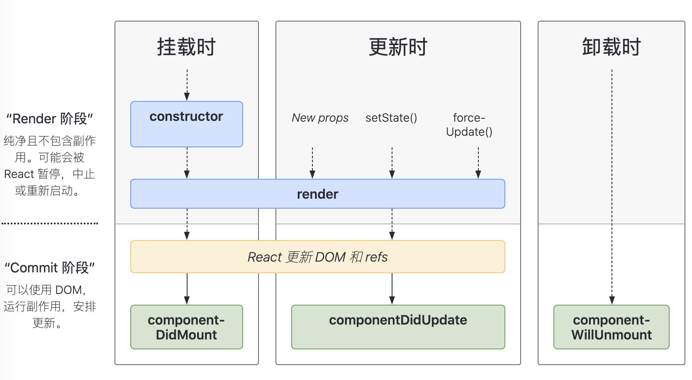

# React

## 一、受控组件 / 非受控组件 区别

```html
<!-- 受控组件 -->
<FInput value="{x}" onChange="{fn}" />
<!-- 非受控组件 -->
<FInput defaultValue="{x}" ref="{input}" />
```

- 受控组件的状态由开发者维护，可控 `value`、`onChange`

- 非受控组件的状态由组件自身维护，只给定了 `默认值`

## 二、React 生命周期函数？



### 挂载

挂载阶段，也可以理解为组件的初始化阶段，就是将我们的组件插入到 DOM 中，只会发生一次

- **constructor()**

  ```js
  constructor(props) {
    // 必须执行 super(),否则无法拿到构造函数里拿到this对象
    super(props);
    // 不要在这里调用 this.setState()
    this.state = { counter: 0 };
    this.handleClick = this.handleClick.bind(this);
  }
  ```

  - 初始化 `state` 对象

  - 给自定义方法绑定 `this`

- **render()**

  检查 `this.props` 和 `this.state` 的变化并返回以下几种类型：

  - 原生的 DOM，如 div
  - React 组件
  - Fragment（片段）
  - Portals（插槽）
  - 字符串和数字，被渲染成 text 节点
  - Boolean 和 null，不会渲染任何东西

- **componentDidMount()**

  - 在组件挂载后（插入 DOM 树中）立即调用，通过网络请求获取数据在此阶段

请求数据

### 更新

更新阶段，当组件的 props 改变了，或组件内部调用了 setState 或者 forceUpdate 发生，会发生多次

- **render()**
- **componentDidUpdate()**

  ```js
  /**
    snapshot 是 getSnapshotBeforeUpdate(preProps.preState) 返回的
    getSnapshotBeforeUpdate() 必须配合 componentDidUpdate() 使用
    如果没有定义 getSnapshotBeforeUpdate()，则 snapshot wei null
  */
  componentDidUpdate(prevProps, prevState, snapshot);
  ```

  - 在更新后会被立即调用，首次渲染不会执行此方法

### 卸载

- **componentWillUnmount()**

  - 在组件卸载及销毁之前直接调用

  - 我们可以在这个函数里去清除一些定时器，取消网络请求，清理无效的 DOM 元素等垃圾清理工作

## 三、React 如何实现组件间通信

### 1. 父传子

通过 `props` 拿到父向子的传值

父：

```js
class Parents extends Component {
  constructor() {
    super();
    this.state = {
      price: 0,
    };
  }

  clickGoods(e) {
    this.setState({
      price: e,
    });
  }

  render() {
    let { price } = this.state;
    return (
      <div>
        <button onClick={this.clickGoods.bind(this, 100)}>goods1</button>
        <button onClick={this.clickGoods.bind(this, 1000)}>goods2</button>
        <Child price={price} />
      </div>
    );
  }
}
```

子：

```js
class Child extends Component {
  render() {
    // 通过 props 拿到值
    let { price } = this.props;
    return <div>{price}</div>;
  }
}
```

### 2. 子传父

通过向子组件传递一个函数 `sendPrice` ，子元素通过这个函数传值

父：

```js
class Parent extends Component {
  constructor() {
    super();
    this.state = {
      price: 0,
    };
  }

  getpriceParent(e) {
    this.setState({ price: e });
  }

  render() {
    let { price } = this.state;
    return (
      <div>
        <p>{price}</p>
        <Child sendPrice={this.getpriceParent.bind(this)} />
      </div>
    );
  }
}
```

子：

```js
class Child extends Component {
  getPriceSon(e) {
    // 通过父元素传递的函数传值
    this.props.sendPrice(e);
  }

  render() {
    return (
      <div>
        <button onClick={this.getPriceSon.bind(this, 100)}>100</button>
        <button onClick={this.getPriceSon.bind(this, 1000)}>1000</button>
      </div>
    );
  }
}
```

### 3. 发布者与订阅者模式（context）

（1）创建 **Context** 对象

在组件链的根组件上创建 `Context`，在组件链上都能使用发布的数据

```js
const StudentContext = React.createContext("test");
```

（2）创建 **Provider** 发布数据

通过 `value` 传递数据

```js
<StudentContext.Provider value={[name, age]}></StudentContext.Provider>
```

（3）创建 **Consumer** 接收数据

通过 `函数返回值` 接收数据

```js
<StudentContext.Consumer>
  {([name, age]) => (
    <div>
      <p>{name}</p>
      <p>{age}</p>
    </div>
  )}
</StudentContext.Consumer>
```

### 4. Redux

## 四、Redux 是什么

Redux 是 JavaScript **状态容器**，提供可预测化的**状态管理**。

### 核心概念

#### 1、Action

Action 是把数据从应用传到 store 的有效载荷，它是 store 数据的唯一来源。（ 一个描述“发生了什么”的普通对象 ），例如：

```js
{ type: 'LIKE_ARTICLE', articleId: 42 }
{ type: 'FETCH_USER_SUCCESS', response: { id: 3, name: 'Mary' } }
{ type: 'ADD_TODO', text: 'Read the Redux docs.' }
```

一般来说会通过 `store.dispatch()` 将 action 传到 store

#### 2、Reducer

Reducers 指定了应用状态的变化如何响应 actions 并发送到 store 的，**描述应用如何更新 state**（ 纯函数 ）

Reducer 一定要保持纯净。只要传入参数相同，返回计算得到的下一个 state 就一定相同。没有特殊情况、没有副作用，没有 API 请求、没有变量修改，**单纯执行计算**

#### 3、Store

Store 就是把 `action` 、 `reducer` 联系到一起的对象。Store 有以下职责：

- 维持应用的 state；
- 提供 `getState()` 方法获取 state；
- 提供 `dispatch(action)` 方法更新 state；
- 通过 `subscribe(listener)` 注册监听器;
- 通过 `subscribe(listener)` 返回的函数注销监听器。

#### 4、数据流

严格的单向数据流是 Redux 架构的设计核心，所有的数据都遵循相同的生命周期

## 五、shouldComponentUpdate 作用

```js
shouldComponentUpdate(nextProps, nextState);
```

判断 React 组件的输出是否受当前 state 或 props 更改的影响

- 默认返回 true ，更新 UI

- 返回 false，不更新 UI ，以**提高渲染性能**

## 六、虚拟 DOM （ virtual DOM ）

### 1、定义

虚拟 DOM 就是用 Javascript 来模拟 DOM 的一个对象

### 2、虚拟 DOM / 原生 DOM

当一个大型列表中，只有一行数据发生变化时，重置整个 innerHTML，浪费资源，不如用虚拟 DOM 渲染。

**:art: 重绘过程：**

**原生 DOM**： render html string + 重新创建所有 DOM

**虚拟 DOM**： render Virtual DOM + diff + 必要的 DOM 更新

### 3、虚拟 DOM / MVVM

MVVM 的变化检查是数据层面的，而 React 的检查是 DOM 结构层面的

## 七、React diff 原理

https://www.jianshu.com/p/3ba0822018cf'

https://zhuanlan.zhihu.com/p/20346379

## 八、什么是高阶组件

高阶组件是参数为组件，返回值为新组件的函数

`React-Redux` 里 `connect` 就是一个高阶组件

`connect(mapState)` 就是高阶组件，传入 `myComponent` 为参数，返回新的组件：

```js
connect(mapState)(MyComponent);

// 分解为：

let fn = connect(mapState);
let com2 = fn(myComponent);
```

## 九、connect 原理

`React-Redux`提供一个 `connect` 方法使你可以从 `Redux store` 中读取数据，`connect` 方法接收两个参数，都是可选参数：

- **mapStateToProps**：每当 store state 发生变化时，就被调用。接收整个 store state，并且返回一个该组件所需要的数据对象

- **mapDispatchToProps**：这个参数可以是一个函数或对象

  - 如果是一个函数，一旦该组件被创建，就会被调用。接收 dispatch 作为一个参数，并且返回一个能够使用 dispatch 来分发 actions 的若干函数组成的对象
  - 如果是一个 action creators 构成的对象，每一个 action creator 将会转化为一个 prop function 并会在调用时自动分发 actions。（ **建议使用这种形式** ）
