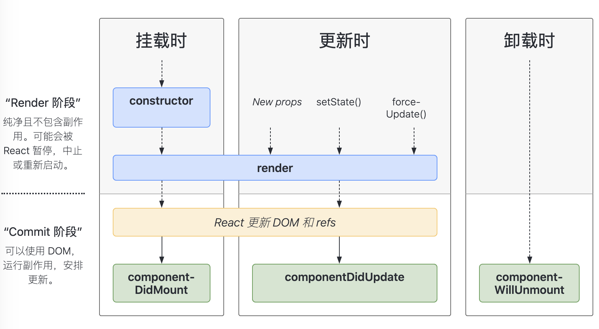

# HTML

## 一. 你是如何理解 HTML 语义化的？

- 举例法

  HTML 语义化就是使用正确的标签（总结）段落就写 p 标签，标题就写 h1 标签，文章就写 article 标签，视频就写 video 标签，等等。

- 阐述法

  以前的后台开发人员使用 table 布局，后来美工人员使用 div+css 布局，现在专业的前端会使用正确的标签进行页面开发。

## 二. meta viewport 是做什么用的，怎么写？

**viewport** 是用户网页的可视区域(视区)

```html
<meta
  name="viewport"
  content="width=device-width, initial-scale=1, maximum-scale=1, minimum-scale=1"
/>
```

- width：控制 `viewport` 的大小，可以指定的一个值，如 600，或设备宽度 `device-width`
- height：和 `width` 相对应，指定高度
- initial-scale：初始缩放比例
- maximum-scale：允许用户缩放到的最大比例
- minimum-scale：允许用户缩放到的最小比例
- user-scalable：用户是否可以手动缩放

## 三. 你用过哪些 HTML 5 标签？

- 绘图 **canvas**
- 媒体 **video 、 radio 、 source**
- 结构 **article 、footer 、 header 、 nav 、 section 、 main**
- 表单 **datalist 、 progress 、 meter 、 output**

### canvas

代表位图区域

```html
<canvas id="canvas" width="300" height="300">
  抱歉，您的浏览器不支持canvas元素
</canvas>
```

画一个矩形：

```js
var canvas = document.getElementById("canvas");
var ctx = canvas.getContext("2d");
ctx.fillStyle = "green";
ctx.fillRect(10, 10, 100, 100);
```

### source

为 **< video >** 或 **< audio >** 这类媒体元素指定媒体源，允许规定可替换的视频/音频文件供浏览器根据它对媒体类型或者编解码器的支持进行选择

```html
<audio controls>
  <source src="/i/horse.ogg" type="audio/ogg" />
  <source src="/i/horse.mp3" type="audio/mpeg" />
  Your browser does not support the audio element.
</audio>
```

### video

代表一段视频 及其视频文件和字幕，并提供了播放视频的用户界面

```html
<video
  controls="controls"
  width="400"
  autoplay="autoplay"
  height="300"
  loop="loop"
>
  <source src="./test.mp4" type="video/mp4" />
  Sorry, your browser doesn't support embedded videos.
</video>
```

### audio

代表一段声音 ，或音频流

```html
<audio controls src="./test.mp3">
  Your browser does not support the
  <code>audio</code> element.
</audio>
```

### datalist

下拉菜单选项。`input` 的 `list` 和 `datalist` 的 `id` 对应。

```html
<input id="myCar" list="cars" />
<datalist id="cars">
  <option value="BMW"></option>
  <option value="Ford"></option>
  <option value="Volvo"></option>
</datalist>
```

### meter

显示已知范围的标量值或者分数值。 **low、high** 定义后，超过数值会变色。

```html
<meter value="60" min="0" max="100" low="20" high="80"></meter>
```

### progress

显示一项任务的完成进度。

```html
<progress id="file" max="100" value="70"></progress>
```

### output

表示计算或用户操作的结果。

```html
<form oninput="result.value=parseInt(a.value)+parseInt(b.value)">
  <input type="range" name="b" value="50" /> +
  <input type="number" name="a" value="10" /> =
  <output name="result"></output>
</form>
```

## 四. H5 是什么? 和 HTML5 区别？

H5 广义上理解为 **移动端营销页面**。

HTML5 是一种规范，一种标准。

# CSS

## 一. 两种盒模型?

- W3C 盒子模型

  width : content_width

  height : content_height

  ```css
  box-sizing: content-box;
  ```

- IE 盒子模型

  width : content_width + padding_width + border_width

  height : content_height + padding_height + border_height

  ```css
  box-sizing: border-box;
  ```

## 二. 如何垂直居中?

**HTML:**

```html
<div class="parent">
  <div class="child">
    Lorem ipsum dolor sit amet consectetur adipisicing elit. Temporibus harum
    optio perferendis, quo eveniet tenetur aspernatur blanditiis deleniti
    tempora maiores recusandae doloremque, ipsa autem cumque non voluptate quod
    rem possimus!
  </div>
</div>
```

### (1) parent 不定高：

上下加一个 padding 就可以把父元素撑起来

```css
.parent {
  border: 3px solid red;
  padding: 10px 0;
}
.child {
  border: 3px solid green;
}
```

### (2) parent 定高：

:star: 推荐程度递减

#### 1. flex;

align-items:center; 垂直居中
justify-content:center; 水平居中

```css
.parent {
  height: 600px;
  border: 3px solid red;
  display: flex;
  justify-content: center;
  align-items: center;
}
.child {
  border: 3px solid green;
  width: 300px;
}
```

#### 2. transform: translate(-50%,-50%)

child 不定宽高

```css
.parent {
  height: 600px;
  border: 1px solid red;
  position: relative;
}
.child {
  border: 1px solid green;
  position: absolute;
  top: 50%;
  left: 50%;
  transform: translate(-50%, -50%);
}
```

#### 3. margin-top: -（50% child_height）px;

child 定高(垂直居中)，定宽(水平居中)

```css
.parent {
  height: 600px;
  border: 1px solid red;
  position: relative;
}
.child {
  border: 1px solid green;
  position: absolute;
  top: 50%;
  left: 50%;
  width: 300px;
  margin-left: -150px;
  height: 100px;
  margin-top: -50px;
}
```

#### 4. margin:auto;

child 定高(垂直居中)，定宽(水平居中)

```css
.parent {
  height: 600px;
  border: 1px solid red;
  position: relative;
}
.child {
  border: 1px solid green;
  position: absolute;
  width: 300px;
  height: 200px;
  margin: auto;
  top: 0;
  bottom: 0;
  left: 0;
  right: 0;
}
```

## 三. flex 怎么用，常用属性有哪些?

### (1) 父元素属性

- #### :star: justify-content : 子元素在主轴的对齐方式

  - `flex-start` ： 左对齐
  - `flex-end` ： 右对齐
  - `center` ： 居中对齐
  - `space-between` ： 两端对齐，项目之间间隔相同
  - `space-around` ： 项目两侧间隔相同，为两端距离的两倍

- #### :star: align-items : 子元素在交叉轴的对齐方式

  - `flex-start` ： 上对齐
  - `flex-end` ： 下对齐
  - `center` ： 居中对齐
  - `baseline` ： 第一行文字基线对齐
  - `stretch` ： 子元素未设置高度或 auto 时，元素占满整个容器

- #### align-content : 多根轴线（多行）的对齐方式

  :warning: 一般当 `flow-wrap : wrap` 时有效。

  - `stretch` ： 上对齐，换行时,中间留有间隙
  - `flex-start` ： 多行上对齐
  - `flex-end` ： 多行下对齐
  - `center` ： 多行居中
  - `space-between` ： 上下对齐，换行时，中间间隔相同
  - `space-around` ： 换行时，中间间隔相同，是上下间距的两倍

- #### flex-direction : 主轴的方向（子元素的排列方向）

  - `row` ： 横，左对齐
  - `row-reverse` ：横，右对齐
  - `column` ： 竖，上对齐
  - `column-reverse` ： 竖，下对齐

- #### :star: flex-wrap : 如果一条轴线排不下，如何换行

  - `wrap` ： 换行，第一行在上
  - `nowrap` ：不换行
  - `wrap-reserve` ： 换行，第一行在下

- #### :star: flex-flow : `< flex-directio >` || `< flex-wrap >`

  默认值为 `row nowrap`

### (2) 子元素属性

- #### order : 子元素排列顺序

  数值越小，排列越靠前，默认为 0

- #### align-self : 单个元素对齐方式

  有单个元素与其他元素不一样的对齐方式，可覆盖父元素的 `align-items` ，属性值与 `align-items` 一样

## 四. BFC 是什么?

> 块格式化上下文（Block Formatting Context，BFC） 是 Web 页面的可视 CSS 渲染的一部分，是块盒子的布局过程发生的区域，也是浮动元素与其他元素交互的区域。

通俗的说，可以把 BFC 理解为一个封闭的大箱子，箱子内部的元素不会在布局上影响到外部元素。

### 触发 BFC 条件 ：

- 浮动元素：float 除 none 以外的值
- 绝对定位元素：position ( absolute、fixed )
- 行内块元素：display ( inline-block、table-cells、flex )
- overflow 除了 visible 以外的值 ( hidden、auto、scroll )
- 弹性元素：display ( flex 或 inline-flex 元素的直接子元素 )

### 解决外边距合并

将两个外边距重合的元素放在不同的 BFC 容器中

- 兄弟元素

  **html:**

  ```html
  <div class="up">我在上面</div>
  <div class="down">我在下面</div>
  ```

  **css:**

  ```css
  .up {
    width: 100px;
    height: 100px;
    border: 1px solid blue;
    margin: 100px;
  }
  .down {
    width: 100px;
    height: 100px;
    border: 1px solid red;
    margin: 100px;
    display: inline-block; /* 行内块元素，触发BFC */
  }
  ```

- 父子元素

  **html:**

  ```html
  <div class="parent">
    <div class="child">我是儿子</div>
  </div>
  ```

  **css:**

  ```css
  .parent {
    width: 100px;
    height: 200px;
    background: red;
    margin-top: 50px;
    overflow: hidden; /* 触发父元素BFC,取消上边距合并 */
  }
  .child {
    width: 50px;
    height: 50px;
    margin-top: 100px;
    border: 1px solid blue;
  }
  ```

## 五. CSS 选择器优先级?

- 选择器都有一个权值（内联: 1000，id:100，class:10，html 标签: 1），权值越大越优先

- 当权值相等时，写在后面的覆盖前面的

- !important 优先级最高，但是要少用

## 六. 如何清除浮动?

- 兄弟元素前有浮动元素

  兄弟元素后元素添加样式

  ```css
  .son2 {
    clear: both;
  ```

- 父元素内有浮动元素

  父元素添加样式

  ```css
  .parent:after {
    display: block;
    content: "";
    clear: both;
  }
  ```

**html:**

```html
<div class="parent">
  <div id="a">a</div>
  <div id="b">b</div>
  <div id="c">c</div>
</div>
```

**css:**

```css
#a {
  height: 100px;
  width: 100px;
  border: 1px solid red;
  float: left;
}

#b {
  height: 100px;
  width: 100px;
  border: 1px solid red;
  float: right;
}

#c {
  height: 50px;
  border: 1px solid green;
  clear: both; /* 兄弟元素 clear:both; */
}
.parent {
  border: 1px solid blue;
}
/* 父元素 :after */
.parent:after {
  display: block;
  content: "";
  clear: both;
}
```

# JS

## 一. ES 6 语法知道哪些，分别怎么用?

- ### let

  `let` 不会声明提前，在变量初始化前访问该变量会导致 `ReferenceError`。该变量处在一个自块顶部到初始化处理的“暂存死区”中

  ```js
  function do_something() {
    console.log(bar); // undefined
    console.log(foo); // ReferenceError
    var bar = 1;
    let foo = 2;
  }
  ```

  `let` 不会在全局声明时（在最顶部的范围）创建 window 对象的属性

  ```js
  var a = "global";
  let a = "global";
  console.log(this.x); // "global"
  console.log(this.y); // undefined
  ```

  用在块级作用域中时, `let` 将变量的作用域限制在块内, 而 `var` 声明的变量的作用域是在函数内

  ```js
  var a = 1;
  var b = 2;

  if (a === 1) {
    var a = 11; // the scope is global
    let b = 22; // the scope is inside the if-block

    console.log(a); // 11
    console.log(b); // 22
  }

  console.log(a); // 11
  console.log(b); // 2
  ```

- ### const

  `const` 不仅拥有 `let` 的特性，还拥有其他特性。

  `const` 声明创建一个值的只读引用。不能和它所在作用域内的其他变量或函数拥有相同的名称。

  ```js
  const MY_NUM = 7;
  MY_NUM = 10; // 报错， 不能重新赋值常量

  const MY_OBJ = { key: "val" };
  const MY_OBJ = { key: "val2" }; // 报错，不能重写对象
  MY_OBJ.key = "val3"; // 可以修改，对象属性并不在保护的范围内

  const MY_ARR = [1, 2];
  const MY_ARR = [1, 2, 3]; // 报错，不能重写数组
  MY_ARR.push(3); // 可以向数组填充数据
  ```

- ### 箭头函数

  箭头函数表达式的语法比函数表达式更简洁，并且没有自己的 `this`，`arguments`，`super` 或 `new.target`

  箭头函数表达式更适用于那些本来需要 **匿名函数** 的地方，并且它 **不能用作构造函数**

  ### 语法

  ```js
  (param1, param2, …, paramN) => expression
  // 相当于：(param1, param2, …, paramN) =>{ return expression; }

  // 当只有一个参数时，圆括号是可选的：
  (singleParam) => { statements }
  singleParam => { statements }

  // 没有参数的函数应该写成一对圆括号。
  () => { statements }

  // 加括号的函数体返回对象字面量表达式：
  params => ({foo: bar})

  //箭头函数在参数和箭头之间不能换行。
  var func = ()
            => 1;

  // 空的箭头函数返回 undefined
  let empty = () => {};

  ```

  ### 更简洁的写法

  ```js
  var elements = ["Hydrogen", "Helium", "Lithium", "Beryllium"];
  // 普通写法
  elements.map(function (element) {
    return element.length;
  });
  // 箭头函数写法
  elements.map((element) => element.length);
  ```

  ### 没有单独的 this

  箭头函数不会创建自己的 this,它只会从自己的 **作用域链的上一层继承** this。

  ```js
  function Person() {
    this.age = 0;

    setInterval(() => {
      this.age++; // |this| 正确地指向 p 实例
    }, 1000);
  }
  var p = new Person();
  ```

  ### 不绑定 arguments

  箭头函数不绑定 Arguments 对象

  ```js
  var foo = function () {
    console.log(arguments[0]);
  };
  foo(1); // 1

  var arr = () => {
    console.log(arguments[0]);
  };
  arr(1); // ReferenceError: arguments is not defined
  ```

  在大多数情况下，使用剩余参数是相较使用 arguments 对象的更好选择。

  ```js
  function foo(arg1, arg2) {
    var f = (...args) => args[1];
    return f(arg1, arg2);
  }
  foo(1, 2); //2
  ```

  ### 使用 new 操作符

  箭头函数不能用作构造器，和 new 一起用会抛出错误。

  ```js
  var Foo = () => {};
  var foo = new Foo(); // TypeError: Foo is not a constructor
  ```

  ### 箭头函数的闭包

  ```js
  // 标准闭包
  function A() {
    var a = 1;
    return function () {
      return ++a;
    };
  }
  var v = A();
  v();
  v();
  ```

- ### Promise

  Promise 对象用于表示一个异步操作的最终完成 (或失败), 及其结果值

  ```js
  const promise1 = new Promise((resolve, reject) => {
    setTimeout(() => {
      resolve("foo");
    }, 3000);
  });

  promise1.then((value) => {
    console.log(value);
  });

  // 3秒后打印 foo
  ```

- ### 展开操作符

  在函数调用/数组构造时, 将数组表达式或者 `string` 在语法层面展开;

  在构造字面量对象时, 将对象表达式按 `key-value` 的方式展开

  ### 等价于 apply 的方式

  ```js
  function sum(x, y, z) {
    return x + y + z;
  }

  const numbers = [1, 2, 3];

  console.log(sum(...numbers)); // 6

  console.log(sum.apply(null, numbers)); // 6
  ```

  ### 数组拷贝(copy)

  ```js
  var arr = [1, 2, 3];
  var arr2 = [...arr]; // like arr.slice()
  arr2.push(4);

  // arr2 此时变成 [1, 2, 3, 4]
  // arr 不受影响
  ```

  :warning: 展开语法和 `Object.assign()` 行为一致, 执行的都是 **浅拷贝** (只遍历一层)

  ### 连接多个数组

  ```js
  var arr1 = [0, 1, 2];
  var arr2 = [3, 4, 5];
  var arr3 = [...arr1, ...arr2];
  ```

  ### 构造字面量对象时使用展开语法

  **浅拷贝** 和 **对象合并** , 可以使用更简短的展开语法。而不必再使用 `Object.assign()` 方式

  ```js
  var obj1 = { foo: "bar", x: 42 };
  var obj2 = { foo: "baz", y: 13 };

  var clonedObj = { ...obj1 };
  // 克隆后的对象: { foo: "bar", x: 42 }

  var mergedObj = { ...obj1, ...obj2 };
  // 合并后的对象: { foo: "baz", x: 42, y: 13 }
  ```

- ### 默认参数

  JavaScript 中函数的参数默认是 `undefined`。然而，在某些情况下可能需要设置一个不同的默认值。这是默认参数可以帮助的地方。

  ```js
  function multiply(a, b = 1) {
    return a * b;
  }

  console.log(multiply(5, 2)); // 10

  console.log(multiply(5)); // 5
  ```

- 解构赋值

  解构赋值语法是一种 `Javascript 表达式`可以将**属性 / 值**从 **对象 / 数组** 中取出,赋值给其他变量

  ### 解构数组

  ```js
  let a, b, rest;

  [a, b, ...rest] = [10, 20, 30, 40, 50];

  console.log(a, b, rest); // 10 20 [30,40,50]
  ```

  ### 解构对象

  ```js
  var o = { p: 42, q: true };
  var { p, q } = o;

  console.log(p); // 42
  console.log(q); // true
  ```

  ### 交换变量

  ```js
  var a = 1;
  var b = 3;

  [a, b] = [b, a];
  console.log(a); // 3
  console.log(b); // 1
  ```

## 二. Promise、Promise.all、Promise.race 分别怎么用?

- ### Promise :

  ```js
  function fn() {
    return new Promise((resolve, reject) => {
      // 成功时调用
      resolve("data");
      // 失败时调用
      reject("error");
    });
  }
  fn().then(success, fail).then(success2, fail2);
  ```

- ### Promise.all :

  ```js
  Promise.all([promise1, promise2]).then(success1, fail1);
  ```

  :point_right: **promise1** 和 **promise2** 都成功才会调用 **success1**

- ### Promise.race :

  ```js
  Promise.race([promise1, promise2]).then(success1, fail1);
  ```

  :point_right: **promise1** , **promise2** 中第一个成功或失败，就认为结果成功或失败。

## 三. 手写函数节流和函数防抖

- ### 函数节流 （控制频率）

  连续触发事件但是在 n 秒中只执行一次函数

  ```js
  function throttle(fn, delay) {
    let canuse = true;
    return function () {
      if (!canuse) {
        // 为了方便理解，这里打印，实际不需要，可以直接 return;
        console.log("正在节流，不执行");
        return;
      }
      // 为了在 delay 秒内点击时，确保不执行
      canuse = false;
      setTimeout(() => {
        fn.apply(this, arguments);
        canuse = true;
      }, delay);
    };
  }

  const throttled = throttle(() => console.log("hi"), 2000);
  throttled(); // 2s后打印 'hi'
  throttled(); // 直接打印 '正在节流，不执行'
  ```

- ### 函数防抖 （控制次数）

  触发事件后在 n 秒内函数只能执行一次，如果在 n 秒内又触发了事件，则会重新计算函数执行时间

  - 延迟执行

  ```js
  function debounce(fn, delay) {
    let timerId = null;
    return function () {
      if (timerId) clearTimeout(timerId);

      timerId = setTimeout(() => {
        fn.apply(this, arguments);
        timerId = null;
      }, delay);
    };
  }

  const debounced = debounce(() => console.log("hi"), 1000);
  debounced(); // 不打印
  debounced(); // 1秒后打印 hi
  ```

  - 立即执行

  ```js
  function debounce(fn, delay) {
    let timerId = null;
    return function () {
      if (timerId) clearTimeout(timerId);

      let callNow = !timerId;

      timerId = setTimeout(() => {
        timerId = null;
      }, delay);

      if (callNow) fn.apply(this, arguments);
    };
  }

  const debounced = debounce(() => console.log("hi"), 1000);
  debounced(); // 立即打印 hi
  debounced(); // 不打印（ 需要在 1s后执行才打印 ）
  ```

## 四. 手写 AJAX

```js
const request = new XMLHttpRequest();
request.open("GET", "a/b/c?id=1", true);
request.onreadystatechange = function () {
  if (request.readyState === 4 && request.status === 200) {
    console.log(request.responseText);
  }
};
// post 方法需要在 send() 中传参
request.send();
```

## 五. this

- fn()
  this => **window / global**

- obj.fn()
  this => **obj**

- fn.call(xx) / fn.apply(xx) / fn.bind(xx)
  this => **xx**

- new Fn()
  this => **新的对象**

- fn = () => {}
  this => **外面的 this**

## 六. 闭包/立即执行函数是什么?

- ### 闭包

  当函数可以 **记住并访问所在的词法作用域时**，就产生了闭包，即使函数是在 **当前词法作用域之外执行**

  ```js
  function foo() {
    var a = 2;
    function bar() {
      console.log(a);
    }
    return bar;
  }
  var baz = foo();
  baz(); //2
  ```

  - `bar( )` 在自己定义的 **词法作用域以外的地方执行**

  - 由于 `bar( )` 所声明的位置，它拥有涵盖 `foo( )` 内部作用域的闭包，使得该作用域能够一直存活，以供 `bar( )` 在之后任何时间进行引用

  - `bar( )` 依然持有对该作用域的引用，而这个引用就叫作闭包

  ### 经典问题

  希望每秒输出一次,分别为 1~5，实际每秒输出一次,都是 6

  ```js
  for (var i = 1; i <= 5; i++) {
    setTimeout(function timer() {
      console.log(i);
    }, i * 1000);
  }
  ```

  :point_right: **延迟函数的回调会在循环结束时才执行** ，尽管循环中的五个函数是在各个迭代中分别定义的，但是它们都被 **封闭在一个共享的全局作用域中** ，因此实际上只有一个 i。我们需要更多的闭包作用域，特别是在循环的过程中**每个迭代都需要一个闭包作用域**

  改进 1：

  ```js
  for (var i = 1; i <= 5; i++) {
    (function () {
      var j = i; // 需要有自己的变量，用来在每个迭代中储存i的值
      setTimeout(function timer() {
        console.log(j);
      }, j * 1000);
    })();
  }
  ```

  改进 2：

  :point_right: for 循环头部的 **let** 声明 , 变量在循环过程中不止被声明一次，每次迭代都会声明。随后的每个迭代都会使用上一个迭代结束时的值来初始化这个变量

  ```js
  for (let i = 1; i <= 5; i++) {
    setTimeout(function timer() {
      console.log(i);
    }, i * 1000);
  }
  ```

- ### 立刻执行函数

  概念：声明一个匿名函数，马上调用这个匿名函数

  作用：创建一个独立的作用域，避免「变量污染」

## 七. 什么是 JSONP，什么是 CORS，什么是跨域？

- ### JSONP ( JSON with padding )

  ### 原理

  利用 < script > 标签 **没有跨域限制** , 达到与第三方通讯。

  ### 实现

  1.本站脚本创建一个 < script > 元素，地址指向第三方的 API 网址，API **提供一个回调函数 ( 给前端接收数据 )**

  2.浏览器调动 **callback 函数** ，并传递解析后 **json 对象** 作为参数。本站脚本可在 callback 函数里处理所传入的数据

  ### 简单封装 JSONP

  ```js
  function jsonp(setting) {
    setting.data = setting.data || {};
    setting.key = setting.key || "callback";
    setting.callback = setting.callback || function () {};
    setting.data[setting.key] = "__onGetData__";

    window.__onGetData__ = function (data) {
      setting.callback(data);
    };

    var script = document.createElement("script");
    var query = [];
    for (var key in setting.data) {
      query.push(key + "=" + encodeURIComponent(setting.data[key]));
    }
    script.src = setting.url + "?" + query.join("&");
    document.head.appendChild(script);
    document.head.removeChild(script);
  }

  jsonp({
    url: "http://photo.sina.cn/aj/index",
    key: "jsoncallback",
    data: {
      page: 1,
      cate: "recommend",
    },
    callback: function (ret) {
      console.log(ret);
    },
  });
  ```

- ### CORS

  跨源资源共享 (CORS) 是一种机制，该机制使用附加的 HTTP 头来告诉浏览器，准许运行在一个源上的 Web 应用访问位于另一不同源选定的资源。

## 八. async/await 怎么用，如何捕获异常？

> 一个异步函数由 `async` 关键字定义，`async` 和 `await` 关键字可以使得对有等待时间的（异步），以 Promise 为基础的函数的定义更加简洁优雅，减少特意配置对于 promise 的链式调用。

`async 函数` 返回的是 **Promise 对象** , `async / await` 是 Promise 的语法糖。用 `try/catch` 捕获异常，**try** 对应 **resolve** ，**catch** 对应 **reject**

### 定义一个返回 Promise 的 foo

```js
function foo() {
  return new Promise((resolve, reject) => {
    setTimeout(() => {
      let n = parseInt(Math.random() * 5 + 1, 10);
      if (n <= 3) {
        resolve("小：" + n);
      } else {
        reject("大：" + n);
      }
    }, 2000);
  });
}
```

### Promise 链式处理

```js
foo().then(
  (data) => {
    console.log("success " + data);
  },
  (error) => {
    console.log("fail " + error);
  }
);
```

### async / await 函数处理

```js
async function bar() {
  let result = await foo();
  try {
    console.log("success " + result);
  } catch (error) {
    console.log("fail " + error);
  }
}
bar();
```

## 九. 如何实现深拷贝？

:books: https://juejin.im/post/6844903929705136141 + video

### 要点

- 递归
- 判断类型
- 检查环（ 循环引用 ） 对象引用自己，可能死循环
- 需要忽略原型，不考虑 `__proto__` ,浪费内存

## 十. 如何用正则实现 trim()？

:books: https://www.bilibili.com/video/BV1ef4y1U7V4?from=search&seid=3176001865319661104

```js
function trim(string) {
  return string.replace(/^\s+|\s+$/g, "");
}
```

## 十一. 不用 class 如何实现继承？用 class 又如何实现？

### 不用 class

```js
// 父类 Animal
function Animal(name, color) {
  this.name = name;
  this.color = color;
}

Animal.prototype.say = function () {
  console.log("hi");
};

// 子类
function Cat(name, color, age) {
  // 若不指定，this 会指向 windows
  Animal.call(this, arguments);
  this.age = age;
}

// 让子类 Cat 的显式原型成为父类 Animal 的实例对象, 同时将构造器(校正)指向子类构造函数本身
/**
 * let fn = function(){}
 * fn.prototype = Animal.prototype
 * Cat.prototype = new fn();
 * 为什么不能直接 Cat.prototype = new Animal()?
 */
Cat.prototype = new Animal();
Cat.prototype.constructor = Cat;
let tom = new Cat("tom", "yellow", "18");

tom.say(); // hi
```

### class 实现继承

```js
class Animal {
  constructor(name) {
    this.name = name;
  }
  shout() {
    console.log("miao");
  }
}

class Cat extends Animal {
  constructor(name, color) {
    super(name);
    this.color = color;
  }
  move() {
    console.log("run");
  }
}

let tom = new Cat("tom", "yellow");
tom.shout(); // miao
```

## 十二. 如何实现数组去重？

假设有数组：

```js
let arr = [1, 2, 3, 3, 5, 7, 9, 2, 6, 5, 4, 6, 8, 1, 5, 7, 9, 5];
```

### hash

```js
function arrcheck(array) {
  let result = [];
  let arrHash = {};
  let index = 0;
  array.forEach((element) => {
    if (arrHash[element] === void 0) {
      arrHash[element] = index;
      result.push(element);
      index += 1;
    }
  });
  return result;
}
console.log(arrcheck(arr));
```

### set

```js
let arr1 = [...new Set(array)];
```

### Lodash / \_.uniq

```js
_.uniq(array);
```

## 十三. 手写一个 Promise

:books: https://juejin.im/post/6844903577828196365

## 十四、遍历

### 数组

```js
for (let i = 0; i < arr.length; i++) {
  console.log(arr[i]);
}

for (let i in arr) {
  console.log(arr[i]);
}

for (let v of arr) {
  console.log(v);
}

arr.forEach((v, i) => {});

arr.map((v, i) => {});
```

耗时对比结论 ： **for 循环** < **for (..of..)** < **forEach** < **map** < **for (.. in ..)**

### 对象

```js
for (let i in obj) {
  console.log(i, obj[i]);
}

Object.keys(obj).forEach((i) => {
  console.log(i, obj[i]);
});

Object.values(obj).forEach((v) => {
  console.log(v);
});

Object.getOwnPropertyNames(obj).forEach((i) => {
  console.log(i, obj[i]);
});
```

# DOM

## 一.事件委托

定义：事件委托就是利用事件冒泡机制，指定一个事件处理程序，来管理某一类型的所有事件

优势：减少 dom 操作来优化页面的运行性能，节约内存

### 例题

如果需要给 `li` 都绑定一个点击事件，打印出元素内容，dom 结构如下：

```html
<ul id="list">
  <li>item 1</li>
  <li>item 2</li>
  <li>item 3</li>
  <li>item 4</li>
</ul>
```

JS:

```js
document.getElementById("list").onclick = function (e) {
  if (e.target.nodeName.toLocaleLowerCase() === "li") {
    console.log(e.target.innerHTML);
  }
};
```

封装：

```js
function delegate(element, selector, eventType, fn) {
  element.addEventListener(eventType, (e) => {
    let el = e.target;
    if (el.matches(selector)) {
      fn();
    }
  });
}
```

但是如果 dom 结构中 li 内有其他标签，则会出现问题，dom 结构如下：

```html
<ul id="list">
  <li><span>item 1</span></li>
  <li><span>item 2</span></li>
  <li><span>item 3</span></li>
  <li><span>item 4</span></li>
</ul>
```

则需要判断点击 span 后，遍历 span 的**祖先元素看其中有没有 ul 里面的 li**：

封装：

```js
function delegate(element, selector, eventType, fn) {
  element.addEventListener(eventType, (e) => {
    let el = e.target;
    while (!el.matches(selector)) {
      if (el === selector) {
        el = null;
        break;
      }
      el = el.parentNode;
    }
    el && fn.call(el, e);
  });
}
```

## 二.用 mouse 事件写一个可拖拽的 div

```js
// 控制是否可以移动
let isMove = false;
// 记录点击位置和拖拽物体的边距
let dis = [];

document.getElementById("moveDiv").addEventListener("mousedown", (e) => {
  isMove = true;
  dis = [e.clientX - e.target.offsetLeft, e.clientY - e.target.offsetTop];
});

document.addEventListener("mouseup", () => {
  isMove = false;
});

// 绑定在 document 上，防止快速移动，导致物体跟丢
document.addEventListener("mousemove", (e) => {
  if (isMove) {
    let el = document.getElementById("moveDiv");

    let x = e.clientX;
    let y = e.clientY;

    el.style.left = x - dis[0] + "px";
    el.style.top = y - dis[0] + "px";
  }
});
```

# http

## 一、HTTP 状态码知道哪些？分别什么意思？

### 1xx 继续

100 继续

### 2xx 成功

200 请求成功
201 已创建
204 无内容

### 3xx 重定向，需要进一步操作

301 永久重定向
302 临时重定向
304 没有修改

### 4xx 客户端出错

400 请求语法错误
401 权限出错，需要登录
403 不允许访问
404 没有找到网页
405 方法不被允许
414 请求过长

### 5xx 服务端出错

500 服务器内部错误
502 网关，代理服务器错误

## 二、HTTP 缓存有哪几种？

- **ETag**：通过对比浏览器和服务器资源的特征值（如 MD5）来决定是否要发送文件内容，如果一样就只发送 304（not modified）

- **Expires**：是设置过期时间（绝对时间），但是如果用户的本地时间错乱了，可能会有问题

- **CacheControl**：max-age=3600 是设置过期时长（相对时间），跟本地时间无关。

## 三、GET 和 POST 的区别

- GET 一般用于获取资源，POST 用于提交资源
- GET 参数通过 Url 传递，POST 放在 Request body 中，相对安全
- GET 参数数据类型只接受 ASCII 字符，而 POST 没有限制
- GET 请求在 URL 中传送的参数是有长度限制的，而 POST 没有
- GET 请求参数会被完整保留在浏览器历史记录里，而 POST 中的参数不会被保留
- GET 在浏览器回退时是无害的，而 POST 会再次提交请求

## 四、Cookie / LocalStorage / SessionStorage / Session

- ### Cookie / LocalStorage

  - Cookie 会被发送到服务器，LocalStorage 不会

  - Cookie 一般最大 4k，LocalStorage 可以用 5Mb 甚至 10Mb

- ### LocalStorage / SessionStorage

  - LocalStorage 一般不会自动过期（除非用户手动清除），SessionStorage 在回话结束时过期（如关闭浏览器）

- ### Cookie / Session

  - Cookie 存在浏览器的文件里，Session 存在服务器的文件里

  - Session 是基于 Cookie 实现的，具体做法就是把 SessionID 存在 Cookie 里

# Vue

## 一、watch / computed / methods 区别

- computed 有缓存，页面重新渲染，如果数值不变化，不需要再次执行函数 ； watch / methods 没有缓存，会重新执行函数

- computed ：计算值，淡出计算值 ；watch ：观察动作，还可以执行别的操作，如上报数据

## 二、Vue 有哪些生命周期钩子函数？分别有什么用？

### 1. beforeCreate

创建前。此阶段为实例初始化之后，this 指向创建的实例，此时的数据观察事件机制都未形成，不能获得 DOM 节点

`data` ，`computed` ，`watch` ，`methods` 上的方法和数据均不能访问

可以在这加个 `loading` 事件

### 2. created

创建后。此阶段为实例已经创建，完成数据（data、props、computed）的初始化导入依赖项

可访问 `data` ，`computed` ，`watch` ，`methods` 上的方法和数据

初始化完成时的事件写在这里，异步请求也适宜在这里调用（请求不宜过多，避免白屏时间太长）

可以在这里结束 `loading` 事件，还做一些初始化，实现函数自执行

未挂载 DOM，若在此阶段进行 DOM 操作一定要放在 Vue.nextTick()的回调函数中

### 3. beforeMount

挂载前。虽然得不到具体的 DOM 元素，但 vue 挂载的根节点已经创建，下面 vue 对 DOM 的操作将围绕这个根元素继续进行

beforeMount 这个阶段是过渡性的，一般一个项目只能用到一两次

### 4. mounted

挂载完成。创建 `vm.$el`，和双向绑定

完成挂载 DOM 和渲染，可在 mounted 钩子函数中对挂载的 DOM 进行操作

可在这发起后端请求，拿回数据，配合路由钩子做一些事情

### 5. beforeUpdate

数据更新前。数据驱动 DOM。

在数据更新后虽然没有立即更新数据，但是 DOM 中的数据会改变，这是 vue 双向数据绑定的作用。

### 6. updated

数据更新后。完成虚拟 DOM 的重新渲染和打补丁。

组件 DOM 已完成更新，可执行依赖的 DOM 操作。

注意：不要在此函数中操作数据（修改属性），会陷入死循环。

### 7. beforeDestroy

销毁前。可做一些删除提示，如：您确定删除 xx 吗？

### 8. destroyed

销毁后，当前组件已被删除，销毁监听事件，组件、事件、子实例也被销毁。

## 三、Vue 如何实现组件间通信

### 1. 父子组件 （ 父传子：props / 子传父：this.$emit & this.$on ）

- **父传子**
  父：

  ```html
  <mycomponent :dataname="fatherdata" />
  ```

  ```js
  import mycomponent from "son.vue";

  export default {
    name: "App",
    components: { mycomponent },
    data() {
      return {
        fatherdata: "123",
      };
    },
  };
  ```

  子：

  ```html
  <p>{{ dataname }}</p>
  ```

  ```js
  export default {
    name: "mycomponent",
    props: { dataname: String },
  };
  ```

- **子传父**

  子：

  ```js
  export default {
    mounted() {
      this.$emit("handleSon", this.sondata);
    },
    data() {
      return {
        sondata: "123",
      };
    },
  };
  ```

  父：

  ```html
  <mycomponent @handleSon="fatherfn" />
  ```

  ```js
  export default {
    methods: {
      fatherfn(data) {
        console.log(data);
      },
    },
  };
  ```

### 2. 任意组件 （ Eventbus / this.bus.$emit & this.bus.$on ）

利用 `eventbus`，创建一个全局 **Vue 的实例**，让各个组件共用同一个事件机制

main.js：

```js
Vue.prototype.bus = new Vue();
```

接收数据组件：

```js
export default {
  created() {
    this.bus.$on("handlebro", (data) => {
      console.log(data); // 123
    });
  },
};
```

传数据组件：

```js
export default {
  data(){
    return{
      bromsg:'123'
    }
  }
  mounted() {
    this.bus.$emit("handlebro", this.bromsg);
  },
};
```

### 3. :star: Vuex

Vuex 是一个专为 Vue.js 应用程序开发的 **状态管理模式**，通过 `store.js` 统一管理状态

- 1.**state**（存储数据，computed : \$store.state.xx 调用）

- 2.**getter**（计算属性，computed : \$store.getters.xx 调用）

- 3.**mutation**（同步方法，methods : \$store.commit('xx') 调用）

- 4.**action**（可以包含异步方法，methods : \$store.dispatch('xx') 调用）

## 四、Vuex 你怎么用的？

Vuex 是一个专为 Vue.js 应用程序开发的 **状态管理模式**

通过 `store.js` 统一管理状态:

**vuex/store.js：**

```js
import Vue from "vue";
import Vuex from "vuex";
Vue.use(Vuex);

// 1.state（存储数据，computed : $store.state.xx 调用）

// 2.getter（计算属性，computed : $store.getters.xx 调用）

// 3.mutation（同步方法，methods : $store.commit('xx') 调用）

// 4.action（可以包含异步方法，methods : $store.dispatch('xx') 调用）

export default new Vuex.Store({
  state,
  mutations,
  getters,
  actions,
});
```

### 1. State （store 的 存储数据）

通过 `$store.state.xx` 调用：

**vuex/store.js：**

```js
const state = {
  count: 1,
  age: 15,
};
```

**component.vue：**

```vue
<template>
  <div>
    <p>{{ $store.state.count }}</p>
  </div>
</template>

<script>
import store from "@/vuex/store";
export default {
  name: "component1",
  store,
};
</script>
```

当一个组件需要获取多个状态时候，使用 **mapState** 辅助函数，使用 **computed** 获取数据：

```vue
<template>
  <div>
    <p>{{ count }}</p>
    <p>{{ age }}</p>
  </div>
</template>

<script>
import store from "@/vuex/store";
// 引入 mapState
import { mapState } from "vuex";
export default {
  computed(){
    // 获取 store.state
    ...mapState(["count","age"])
  }
  store,
};
</script>
```

### 2. Getter （store 的计算属性）

通过 `$store.state.xx` 调用：

**vuex/store.js：**

```js
const state = {
  count: 1,
  age: 15,
};

const getters = {
  countMoney: (state) => `¥: ${state.count}`,
  ageSui: (state) => `${state.age}岁`,
};
```

**component.vue：**

```vue
<template>
  <div>
    <p>{{ countGetter }}</p>
    <p>{{ ageGetter }}</p>
  </div>
</template>

<script>
import store from "@/vuex/store";
export default {
  name: "component1",
  computed(){
    countGetter(){
      return this.$store.getters.countMoney;
    },
    ageGetter(){
      return this.$store.getters.ageSui;
    }
  }
  store,
};
</script>
```

**mapGetters** 辅助函数将 store 中的 getter 映射到局部计算属性：

```vue
<template>
  <div>
    <p>{{ countGetter }}</p>
    <p>{{ ageGetter }}</p>
  </div>
</template>

<script>
import store from "@/vuex/store";
// 引入 mapGetters
import { mapGetters } from "vuex";
export default {
  computed(){
    // 获取 store.getter
    ...mapGetters({ countGetter: "countMoney", ageGetter: "ageSui" }),
  }
  store,
};
</script>
```

### 3. Mutation （store 的方法（同步））

更改 Vuex 的 store 中的状态的 **唯一方法** 是提交 `mutation`，使用 `$store.commit（xx）` 调用

:warning: Mutation **必须是同步函数**

**vuex/store.js：**

```js
const state = {
  count: 1,
  age: 15,
};

const mutations = {
  add(state) {
    state.count++;
  },
  reduce(state, n) {
    state.count -= n;
  },
};
```

**component.vue：**

```vue
<template>
  <div>
    <p>{{ $store.state.count }}</p>
    <button @click="$store.commit('add')">add</button>
  </div>
</template>

<script>
import store from "@/vuex/store";
export default {
  name: "component1",
  store,
};
</script>
```

**mapMutations** 辅助函数将组件中的 `methods` 映射为 `store.commit`:

```vue
<template>
  <div>
    <p>{{ count }}</p>
    <button @click="reduce(10)">add</button>
  </div>
</template>

<script>
import store from "@/vuex/store";
import { mapState , mapGetters } from "vuex";
export default {
  computed(){
    ...mapState(["count"]),
  }
  methods:{
    ...mapMutations(["reduce"])
  }
  store,
};
</script>
```

### 4. Action（类似 Mutation，可以包含异步操作）

Action 通过 `$store.dispatch(xx)` 方法触发：

**vuex/store.js：**

```js
const mutations = {
  add(state) {
    state.count++;
  },
};

const actions = {
  actionAdd({ commit }) {
    return new Promise((resolve, reject) => {
      setTimeout(() => {
        commit("add");
        resolve();
      }, 1000);
    });
  },

  actionHandle(context, n) {
    context.commit("add");
    setTimeout(() => {
      context.commit("reduce", n.amount);
    }, 3000);
  },
};
```

**component.vue：**

```vue
<template>
  <div>
    <p>{{ $store.state.count }}</p>
    <button @click="asyncAdd()">actionAdd</button>
  </div>
</template>

<script>
import store from "@/vuex/store";
export default {
  name: "component1",
  methods:{
    asyncAdd(){
      this.$store.dispatch("actionAdd").then(() => {
        console.log("等待1s，count + 1");
      });
    }
  }
  store,
};
</script>
```

**mapMutations** 辅助函数将组件的 `methods` 映射为 `store.dispatch` 调用：

```vue
<template>
  <div>
    <p>{{ count }}</p>
    <button @click="actionHandle({ amount: 5 })">add</button>
  </div>
</template>

<script>
import store from "@/vuex/store";
import { mapState , mapActions } from "vuex";
export default {
  computed(){
    ...mapState(["count"]),
  }
  methods:{
    ...mapMutations(["actionHandle"])
  }
  store,
};
</script>
```

## 五、Vue 数据响应式怎么做到的？

当你把一个普通的 JavaScript 对象传入 Vue 实例作为 data 选项，Vue 将遍历此对象所有的 property，使用 `Object.defineProperty` 把这些 property 全部转为 `getter/setter`。

### 数组和对象的变化

由于 JavaScript 的限制，Vue 不能检测数组和对象的变化，因此需要使用 `Vue.set`

- 对象

  ```js
  Vue.set(vm.someObject, "b", 2);
  this.$set(this.someObject, "b", 2);
  ```

- 数组

  ```js
  Vue.set(vm.items, indexOfItem, newValue);
  this.$set(this.items, indexOfItem, newValue);
  ```

## 六、VueRouter 你怎么用的？

Vue Router 是 Vue.js 官方的路由管理器。

### 基础 api

- < router-link to='/foo' >Go to Foo< /router-link > ：路由跳转标签

- < router-view >< router-view > ：路由匹配的组件渲染出口

- this.\$router.push({ name: 'user', params: { userId: '123' }})：编程式路由跳转

- this.\$router.replace({ name: 'user', params: { userId: '123' }})：和 `router.push` 相似，不向 `history` 添加新纪录

- this.\$router.go(1) / this.\$router.go(-1)：前进 / 后退

### History 模式

`vue-router` 默认 `hash` 模式 —— 使用 URL 的 hash 来模拟一个完整的 URL，于是当 URL 改变时，页面不会重新加载

当你使用 `history` 模式时，URL 就像正常的 url

:warning: 服务器需要配置 index.html ，服务器就不会在返回 404 错误页面 ，因为对所有路径都会返回 **index.html** ，路由需要设置：

```js
const router = new VueRouter({
  mode: "history",
  routes: [{ path: "*", component: NotFoundComponent }],
});
```

### 导航守卫

`vue-router` 提供的导航守卫主要用来通过 **跳转** 或 **取消** 的方式守卫导航。有多种机会植入路由导航过程中：全局的, 单个路由独享的, 或者组件级的。

:warning: 参数或查询的改变并不会触发进入/离开的导航守卫!

- #### 全局前置守卫

```js
const router = new VueRouter({ ... })

router.beforeEach((to, from, next) => {
    // ...
})
```

**to: Route**: 即将要进入的目标 路由对象

**from: Route**: 当前导航正要离开的路由

**next: Function**: **一定要调用该方法** 来 resolve 这个钩子。执行效果依赖 next 方法的调用参数

- #### 全局后置钩子

和守卫不同的是，这些钩子不会接受 next 函数也不会改变导航本身

```js
router.afterEach((to, from) => {
  // ...
});
```

- #### 路由独享的守卫

```js
const router = new VueRouter({
  routes: [
    {
      path: "/foo",
      component: Foo,
      beforeEnter: (to, from, next) => {
        // ...
      },
    },
  ],
});
```

- #### 组件内的守卫

```js
const Foo = {
  template: `...`,
  beforeRouteEnter(to, from, next) {
    // 在渲染该组件的对应路由被 confirm 前调用
    // 不！能！获取组件实例 `this`
    // 因为当守卫执行前，组件实例还没被创建
  },
  beforeRouteUpdate(to, from, next) {
    // 在当前路由改变，但是该组件被复用时调用
    // 举例来说，对于一个带有动态参数的路径 /foo/:id，在 /foo/1 和 /foo/2 之间跳转的时候，
    // 由于会渲染同样的 Foo 组件，因此组件实例会被复用。而这个钩子就会在这个情况下被调用。
    // 可以访问组件实例 `this`
  },
  beforeRouteLeave(to, from, next) {
    // 导航离开该组件的对应路由时调用
    // 可以访问组件实例 `this`
  },
};
```

- #### 完整的导航解析流程

1、 失活的组件 `beforeRouteLeave` 守卫

2、 全局前置 `beforeEach` 守卫

3、 重用的组件 `beforeRouteUpdate` 守卫

4、 路由 `beforeEnter`

5、 解析异步路由组件

6、 激活的组件 `beforeRouteEnter` 守卫

7、 全局 `beforeResolve` 守卫

8、 全局后置 `afterEach` 钩子

9、 DOM 更新

### 路由懒加载

当打包构建应用时，JavaScript 包会变得非常大，影响页面加载。如果我们能把不同路由对应的组件分割成不同的代码块，然后当路由被访问的时候才加载对应组件，这样就更加高效了。

结合 Vue 的异步组件和 Webpack 的代码分割功能，轻松实现路由组件的懒加载：

```js
const Foo = () => import("./Foo.vue");

// 路由配置不需要改变
const router = new VueRouter({
  routes: [{ path: "/foo", component: Foo }],
});
```

- #### 组件按组分块

将某个路由下的所有组件都打包在同个异步块 (chunk) 中。只需要使用 `命名 chunk`

```js
const Foo = () => import(/* webpackChunkName: "group-foo" */ "./Foo.vue");
const Bar = () => import(/* webpackChunkName: "group-foo" */ "./Bar.vue");
const Baz = () => import(/* webpackChunkName: "group-foo" */ "./Baz.vue");
```

# React

## 一、受控组件 / 非受控组件 区别

```html
<!-- 受控组件 -->
<FInput value="{x}" onChange="{fn}" />
<!-- 非受控组件 -->
<FInput defaultValue="{x}" ref="{input}" />
```

- 受控组件的状态由开发者维护，可控 `value`、`onChange`

- 非受控组件的状态由组件自身维护，只给定了 `默认值`

## 二、React 生命周期函数？



### 挂载

挂载阶段，也可以理解为组件的初始化阶段，就是将我们的组件插入到 DOM 中，只会发生一次

- **constructor()**

  ```js
  constructor(props) {
    // 必须执行 super(),否则无法拿到构造函数里拿到this对象
    super(props);
    // 不要在这里调用 this.setState()
    this.state = { counter: 0 };
    this.handleClick = this.handleClick.bind(this);
  }
  ```

  - 初始化 `state` 对象

  - 给自定义方法绑定 `this`

- **render()**

  检查 `this.props` 和 `this.state` 的变化并返回以下几种类型：

  - 原生的 DOM，如 div
  - React 组件
  - Fragment（片段）
  - Portals（插槽）
  - 字符串和数字，被渲染成 text 节点
  - Boolean 和 null，不会渲染任何东西

- **componentDidMount()**

  - 在组件挂载后（插入 DOM 树中）立即调用，通过网络请求获取数据在此阶段

请求数据

### 更新

更新阶段，当组件的 props 改变了，或组件内部调用了 setState 或者 forceUpdate 发生，会发生多次

- **render()**
- **componentDidUpdate()**

  ```js
  /**
    snapshot 是 getSnapshotBeforeUpdate(preProps.preState) 返回的
    getSnapshotBeforeUpdate() 必须配合 componentDidUpdate() 使用
    如果没有定义 getSnapshotBeforeUpdate()，则 snapshot wei null
  */
  componentDidUpdate(prevProps, prevState, snapshot);
  ```

  - 在更新后会被立即调用，首次渲染不会执行此方法

### 卸载

- **componentWillUnmount()**

  - 在组件卸载及销毁之前直接调用

  - 我们可以在这个函数里去清除一些定时器，取消网络请求，清理无效的 DOM 元素等垃圾清理工作

## 三、React 如何实现组件间通信

### 1. 父传子

通过 `props` 拿到父向子的传值

父：

```js
class Parents extends Component {
  constructor() {
    super();
    this.state = {
      price: 0,
    };
  }

  clickGoods(e) {
    this.setState({
      price: e,
    });
  }

  render() {
    let { price } = this.state;
    return (
      <div>
        <button onClick={this.clickGoods.bind(this, 100)}>goods1</button>
        <button onClick={this.clickGoods.bind(this, 1000)}>goods2</button>
        <Child price={price} />
      </div>
    );
  }
}
```

子：

```js
class Child extends Component {
  render() {
    // 通过 props 拿到值
    let { price } = this.props;
    return <div>{price}</div>;
  }
}
```

### 2. 子传父

通过向子组件传递一个函数 `sendPrice` ，子元素通过这个函数传值

父：

```js
class Parent extends Component {
  constructor() {
    super();
    this.state = {
      price: 0,
    };
  }

  getpriceParent(e) {
    this.setState({ price: e });
  }

  render() {
    let { price } = this.state;
    return (
      <div>
        <p>{price}</p>
        <Child sendPrice={this.getpriceParent.bind(this)} />
      </div>
    );
  }
}
```

子：

```js
class Child extends Component {
  getPriceSon(e) {
    // 通过父元素传递的函数传值
    this.props.sendPrice(e);
  }

  render() {
    return (
      <div>
        <button onClick={this.getPriceSon.bind(this, 100)}>100</button>
        <button onClick={this.getPriceSon.bind(this, 1000)}>1000</button>
      </div>
    );
  }
}
```

### 3. 发布者与订阅者模式（context）

（1）创建 **Context** 对象

在组件链的根组件上创建 `Context`，在组件链上都能使用发布的数据

```js
const StudentContext = React.createContext("test");
```

（2）创建 **Provider** 发布数据

通过 `value` 传递数据

```js
<StudentContext.Provider value={[name, age]}></StudentContext.Provider>
```

（3）创建 **Consumer** 接收数据

通过 `函数返回值` 接收数据

```js
<StudentContext.Consumer>
  {([name, age]) => (
    <div>
      <p>{name}</p>
      <p>{age}</p>
    </div>
  )}
</StudentContext.Consumer>
```

### 4. Redux

## 四、Redux 是什么

Redux 是 JavaScript **状态容器**，提供可预测化的**状态管理**。

### 核心概念

#### 1、Action

Action 是把数据从应用传到 store 的有效载荷，它是 store 数据的唯一来源。（ 一个描述“发生了什么”的普通对象 ），例如：

```js
{ type: 'LIKE_ARTICLE', articleId: 42 }
{ type: 'FETCH_USER_SUCCESS', response: { id: 3, name: 'Mary' } }
{ type: 'ADD_TODO', text: 'Read the Redux docs.' }
```

一般来说会通过 `store.dispatch()` 将 action 传到 store

#### 2、Reducer

Reducers 指定了应用状态的变化如何响应 actions 并发送到 store 的，**描述应用如何更新 state**（ 纯函数 ）

Reducer 一定要保持纯净。只要传入参数相同，返回计算得到的下一个 state 就一定相同。没有特殊情况、没有副作用，没有 API 请求、没有变量修改，**单纯执行计算**

#### 3、Store

Store 就是把 `action` 、 `reducer` 联系到一起的对象。Store 有以下职责：

- 维持应用的 state；
- 提供 `getState()` 方法获取 state；
- 提供 `dispatch(action)` 方法更新 state；
- 通过 `subscribe(listener)` 注册监听器;
- 通过 `subscribe(listener)` 返回的函数注销监听器。

#### 4、数据流

严格的单向数据流是 Redux 架构的设计核心，所有的数据都遵循相同的生命周期

## 五、shouldComponentUpdate 作用

```js
shouldComponentUpdate(nextProps, nextState);
```

判断 React 组件的输出是否受当前 state 或 props 更改的影响

- 默认返回 true ，更新 UI

- 返回 false，不更新 UI ，以**提高渲染性能**

## 六、虚拟 DOM （ virtual DOM ）

### 1、定义

虚拟 DOM 就是用 Javascript 来模拟 DOM 的一个对象

### 2、虚拟 DOM / 原生 DOM

当一个大型列表中，只有一行数据发生变化时，重置整个 innerHTML，浪费资源，不如用虚拟 DOM 渲染。

**:art: 重绘过程：**

**原生 DOM**： render html string + 重新创建所有 DOM

**虚拟 DOM**： render Virtual DOM + diff + 必要的 DOM 更新

### 3、虚拟 DOM / MVVM

MVVM 的变化检查是数据层面的，而 React 的检查是 DOM 结构层面的

## 七、React diff 原理

React diff 能计算出 Virtual DOM 中真正变化的部分，并只针对该部分进行实际 DOM 操作，而非重新渲染整个页面，从而保证了每次操作更新后页面的高效渲染。

### diff 策略

### 1、tree diff

由于 **Web UI 中 DOM 节点跨层级的移动操作特别少** ，所以 React 对树进行分层比较，两棵树只会对 **同一层次的节点** 进行比较。当发现节点已经不存在，则该节点及其子节点会被完全删除掉，不会用于进一步的比较。这样只需要对树进行一次遍历，便能完成整个 DOM 树的比较。


### 2、component diff

- 如果是同一类型的组件，按照原策略继续比较 virtual DOM tree，如果不是，则替换整个组件下的所有子节点。


- 对于同一类型的组件，有可能其 Virtual DOM 没有任何变化，如果能够确切的知道这点那可以节省大量的 diff 运算时间，因此 React 允许用户通过 shouldComponentUpdate() 来判断该组件是否需要进行 diff

### 3、element diff

对于同一层级的一组子节点，它们可以通过唯一 id 进行区分，这样在 diff 时，涉及到只是位置变化的，可以只移动元素，避免删除创建等重复的操作。

## 八、什么是高阶组件

高阶组件是参数为组件，返回值为新组件的函数

`React-Redux` 里 `connect` 就是一个高阶组件

`connect(mapState)` 就是高阶组件，传入 `myComponent` 为参数，返回新的组件：

```js
connect(mapState)(MyComponent);

// 分解为：

let fn = connect(mapState);
let com2 = fn(myComponent);
```

## 九、connect 原理

`React-Redux`提供一个 `connect` 方法使你可以从 `Redux store` 中读取数据，`connect` 方法接收两个参数，都是可选参数：

- **mapStateToProps**：每当 store state 发生变化时，就被调用。接收整个 store state，并且返回一个该组件所需要的数据对象

- **mapDispatchToProps**：这个参数可以是一个函数或对象

  - 如果是一个函数，一旦该组件被创建，就会被调用。接收 dispatch 作为一个参数，并且返回一个能够使用 dispatch 来分发 actions 的若干函数组成的对象
  - 如果是一个 action creators 构成的对象，每一个 action creator 将会转化为一个 prop function 并会在调用时自动分发 actions。（ **建议使用这种形式** ）

# TypeScript

## 一、TS 类型检查

**TypeScript 只会在编译时对类型进行静态检查，如果发现有错误，编译的时候就会报错**。而在运行时，与普通的 `JavaScript` 文件一样，不会对类型进行检查。

## 二、数据类型

- ### 原始数据类型

  :books: 原始数据类型包括：**布尔值、数值、字符串、null、undefined** 以及 ES6 中的新类型 **Symbol**

  :question: **void** 和 **null、undefined**区别：

  `undefined` 和 `null` 是所有类型的子类型。也就是说 `undefined` 类型的变量，可以赋值给 `number` 类型的变量，而 `void` 类型的变量不能赋值给 `number` 类型的变量

  ```ts
  // 不报错
  let u: undefined;
  let num: number = u;
  // 报错
  let u: void;
  let num: number = u;
  ```

  :question: **never** 类型的作用：

  ```ts
  interface Foo {
    type: "foo";
  }

  interface Bar {
    type: "bar";
  }

  type All = Foo | Bar;

  function handleValue(val: All) {
    switch (val.type) {
      case "foo":
        // 这里 val 被收窄为 Foo
        break;
      case "bar":
        // val 在这里是 Bar
        break;
      default:
        // val 在这里是 never
        const exhaustiveCheck: never = val;
        break;
    }
  }
  ```

  逻辑正确时，不会编译通过，但是如果有一天，更改了 `All` 的类型：

  ```ts
  type All = Foo | Bar | Baz;
  ```

  然而他忘记了在 handleValue 里面加上针对 Baz 的处理逻辑，这个时候在 default branch 里面 val 会被收窄为 Baz，导致无法赋值给 never，产生一个编译错误。

- ### 任意类型

  :books: 一个普通类型，在赋值过程中是不允许改变类型的,但是 **any** 类型可以

  ```ts
  let myFavoriteNumber: string = "seven";
  myFavoriteNumber = 7; // 报错

  let myFavoriteNumber: any = "seven";
  myFavoriteNumber = 7; // 允许
  ```

  :warning: 变量如果在声明的时候，未指定其类型，且**未赋值**，那么它会被识别为 **any** 类型，如果声明时**赋值**，TS 会进行类型推断：

  ```ts
  // 1. 未指定类型，未赋值
  let something;
  // 等价于 let something: any
  something = "seven";
  something = 7;

  // 2. 未指定类型，已赋值
  let something = "seven";
  // 等价于 let something: string = 'seven'
  something = 7; // 报错，因为类型推断为 string
  ```

- ### 联合类型

  :books: 联合类型（Union Types）表示取值可以为多种类型中的一种

  :warning: 当 TypeScript 不确定一个联合类型的变量到底是哪个类型的时候，我们只能访问此联合类型的所有类型里**共有的属性或方法**

  ```ts
  let myNumber: string | number;
  function getLength(something: string | number): number {
    return something.length; // 报错，number 没有 length
  }
  function getString(something: string | number): string {
    return something.toString(); // √
  }
  ```

- ### 对象类型 - interface 接口

  :books: interface 用来定义 **对象** 的类型，除了可用于对类的一部分行为进行抽象以外，也常用于对「**对象的形状（Shape）**」进行描述。

  :warning: 变量的属性与必须接口一致（ **chris** 的 **形状** 必须和 **Student** 一致 ），**多 / 少** 属性都会报错。

  ```ts
  interface Student {
    name: string;
    age: number;
  }

  let chris = {
    name: "chris",
    age: 18,
  };
  ```

  - #### 可选属性

  ```ts
  interface Student {
    name: string;
    age?: number;
  }

  let chris = {
    name: "chris",
  };
  ```

  - #### 任意属性

  :warning: 一旦定义了任意属性，那么 **确定属性** 和 **可选属性** 的类型都必须是它的类型的 **子集**，如果出现冲突，应对 **任意属性** 定义 **联合类型**。

  ```ts
  interface Student {
    name: string;
    age: number;
    [propname: string]: string; // 报错，age是number类型，不属于string的子集
    // 应该为 [propname: string]: string | number;
  }

  let chris = {
    name: "chris",
    age: "18",
    gender: "male",
  };
  ```

  - #### 只读属性

  ```ts
  interface Person {
    readonly id: number;
    name: string;
  }

  let chris = {
    id: 24,
    name: "chris",
  };
  chris.id = 5; // 报错，只读属性初始化后不能再赋值
  ```

- ### 数组类型

  - #### 「类型 + 方括号」表示法

  ```ts
  const stringArr: string[] = ["1", "2", "3"];
  const numberArr: (string | number)[] = [1, "2", 3];
  ```

  - #### 数组泛型

  ```ts
  let fibonacci: Array<number> = [1, 1, 2, 3, 5];
  ```

  - #### 类型别名

  ```ts
  interface Student {
    name: string;
    age: number;
  }

  const class1: Student[] = [
    { name: "chris", age: 18 },
    { name: "crystal", age: 20 },
  ];
  ```

  - #### 元组的使用和类的约束

  :books: 具体定义数组每个位置的类型

  :warning: 当添加越界的元素时，它的类型会被限制为元组中每个类型的 **联合类型**

  ```ts
  let student: [string, number, string] = ["chris", 18, "basketball"];

  student.push("crystal"); // 满足 string | number
  student.push(20); // 满足 string | number
  student.push(true); // 报错，不满足联合类型
  ```

- ### 函数类型

  - #### 函数声明 / 函数表达式

  :warning: TS 中的 `=>` 和 ES6 的 `=>` 不是一个意义，在 **TypeScript** 的类型定义中，`=>` 用来表示函数的定义，左边是 **输入类型** ，需要用括号括起来，右边是 **输出类型** 。

  ```ts
  // 函数声明
  function add(a: number, b: number): number {
    return a + b;
  }

  // 函数表达式
  let add: (a: number, b: number) => number = (
    a: number,
    b: number
  ): number => {
    return a + b;
  };
  ```

  - #### 接口定义函数形状

  ```ts
  interface Student {
    (name: string, age: string): string;
  }

  let sayHello: Student = (name: string, age: string): string => {
    return `hello,I'm ${name},I'm ${age}.`;
  };
  ```

  - #### 对象参数

  :warning: 对象参数要单独类型定义，不能在对象内类型定义。

  ```ts
  function add({ a, b }: { a: number; b: number }): number {
    return a + b;
  }
  const resultAdd = add({ a: 1, b: 2 });
  ```

## 三、类型断言

:books: **类型断言**：用来手动指定一个值的类型

- ### 语法

```ts
值 as 类型；
```

:x: 不推荐 `<类型>值` 的用法，在 React 中表示一个 `ReactNode`，在 ts 中可以能表达一个泛型，有歧义。

- ### 使用场景

1. #### 将一个联合类型断言为其中一个类型

   :books: ts 只能访问联合类型的所有类型中**共有的属性或方法**,当我们不确定类型时，访问其中一个类型的属性或方法时，需要使用类型断言：

   ```ts
   interface Cat {
     name: string;
     run(): void;
   }
   interface Fish {
     name: string;
     swim(): void;
   }

   function getName(animal: Cat | Fish) {
     // type of animal.swim 会报错，swim 不属于 Cat,Fish 共有的方法
     if (typeof (animal as Fish).swim === "function") {
       return true;
     }
     return false;
   }
   ```

2. #### 将任何一个类型断言为 any

   :books: 我们可以将某对象临时断言为 any 类型，因为在 any 类型的变量上，访问任何属性都是允许的

   ```ts
   window.foo = 1; // 报错。window 上没有 foo
   (window as any).foo = 1;
   ```

- ### 类型断言比较

  - #### 类型断言 vs 类型转换

  类型断言只会影响 TypeScript 编译时的类型，**类型断言语句在编译结果中会被删除**,所以它不会真的影响到变量的类型，若要进行类型转换，需要直接调用类型转换的方法：

  ```ts
  function toBoolean(something: any): boolean {
    return something as boolean;
  }
  toBoolean(1); // 1

  function toBoolean(something: any): boolean {
    return Boolean(something);
  }

  toBoolean(1); // true
  ```

  - #### 类型断言 vs 类型声明

  类型断言 ( A as B ) 条件： `A` 兼容 `B`，或 `B` 兼容 `A`

  类型声明 ( A = B ) 条件： `B` 包含 `A`

  ```ts
  interface Animal {
    name: string;
  }
  interface Cat {
    name: string;
    run(): void;
  }

  const animal: Animal = {
    name: "tom",
  };

  let tom = animal as Cat; // Cat、Animal 互相兼容，可以使用 as
  let tom: Cat = animal; // 报错：animal 中没有 run(), Animal 不包含 Cat
  ```

## 四、类型别名 / 字符串字面量类型

:books: 类型别名用来给一个类型起个新名字，常用于联合类型

```ts
type Name = string | number;
let chris: Name = "chris";
```

:books:字符串字面量类型用来约束取值只能是某 **几个字符串中的一个**

```ts
type Fruit = "apple" | "banana" | "orange";
let fruit1: Fruit = "apple";
let fruit1: Fruit = "peach"; // 报错，不能将类型“"peach"”分配给类型“Fruit”
```

## 五、类

- ### 访问修饰符( `public` / `private` / `protected` )

  - **public** ：当类中的参数定义时，默认为 public 访问方式，public 可以在类的**内部、外部**调用，且**可以继承**。

  - **private** ：只能在类的**内部调用，不可以继承**。

  - **protected** ：只能在类的**内部调用，可以继承**。

  ```ts
  class Person {
    // 相当于 public name:string = "chris";
    name_public: string = "chris1";
    private name_private: string = "chris2";
    protected name_protected: string = "chris3";

    personPublic() {
      console.log("hello " + this.name_public);
    }
    personPrivate() {
      console.log("hello " + this.name_private);
    }
    personProtected() {
      console.log("hello " + this.name_protected);
    }
  }
  const chris = new Person();

  class Teacher extends Person {
    teacherPublic() {
      console.log("bye " + this.name_public);
    }
    teacherPrivate() {
      console.log("bye " + this.name_private);
    }
    teacherProtected() {
      console.log("bye " + this.name_protected);
    }
  }
  const crystal = new Teacher();

  console.log(chris.name_public); // chris
  console.log(chris.name_private); // 报错，不可以在类的外部调用
  console.log(chris.name_protected); // 报错，不可以在类的外部调用

  chris.personPublic(); // hello chris
  chris.personPrivate(); // hello chris
  chris.personProtected(); // hello chris

  crystal.teacherPublic(); // bye chris
  crystal.teacherPrivate(); // 报错，不可以继承
  crystal.teacherProtected(); // bye chris
  ```

- ### 参数属性

  :books: `修饰符` 和 `readonly` 还可以使用在构造函数参数中，等同于类中定义该属性同时给该属性赋值，使代码更简洁:

  ```ts
  class Person {
    name: string;
    constructor(name: string) {
      this.name = name;
    }
  }
  ```

  :point_right: 较为繁琐，可以简化：

  ```ts
  class Person {
    public constructor(public name: string) {}
  }
  ```

- ### readonly

  :books: 只读属性关键字，只允许出现在 **属性声明** 或 **索引签名** 或 **构造函数**

  :warning: 如果 `readonly` 和其他访问 **修饰符** 同时存在的话，需要写在其 **后面**

  ```ts
  class Animal {
    public constructor(readonly name) {}
  }

  let a = new Animal("Jack");
  console.log(a.name); // Jack
  a.name = "Tom"; // 报错，name 只读
  ```

- ### 抽象类

  :books: `abstract` 用于定义 **抽象类** 和其中的 **抽象方法** 。

  :warning: 抽象类是不允许被实例化
  :warning: 抽象类中的抽象方法 **不给出具体实现**，继承抽象类的 **子类** 必须 **实现抽象类中的抽象方法**

  ```ts
  abstract class Animal {
    public name;
    public constructor(name) {
      this.name = name;
    }
    // 1. 抽象方法不给出具体实现
    public abstract sayHi();
  }

  let a = new Animal("Jack"); // 报错，抽象类不允许实例化

  class Cat extends Animal {
    // 2. 继承子类必须实现抽象中的抽象方法
    public sayHi() {
      console.log(`Meow, My name is ${this.name}`);
    }
  }

  let cat = new Cat("Tom");
  ```

## 六. 类与接口

- ### 类实现接口

  :books: 接口除了可以用于对「**对象**的形状（Shape）」进行描述，还可以对类的一部分行为进行**抽象**。

  :books: **实现（implements）** 是面向对象中的一个重要概念。一般来讲，一个类只能继承自另一个类，有时候不同类之间可以有一些共有的特性，这时候就可以把特性提取成接口 **（interfaces）**，用 **implements** 关键字来实现。这个特性大大提高了面向对象的灵活性。

  :point_right: 举例：动物类中，猫有大叫的方法。人这个类也有大叫的方法，这时就可以把大叫这个方法提取出来，作为一个接口，猫和人都去实现它：

  ```ts
  interface Shout {
    shout();
  }
  class Cat extends Animal implements Shout {
    shout() {
      console.log("cat shout");
    }
  }
  class Person implements Shout {
    shout() {
      console.log("person shout");
    }
  }

  let cat: Cat = new Cat();
  let chris: Person = new Person();

  cat.shout(); // cat shout
  chris.shout(); // person shout
  ```

  :point_right: 一个类可以实现多个接口:

  ```ts
  interface Shout {
    shout();
  }

  interface Say {
    sayhi();
    saybye();
  }

  class Person implements Shout, Say {
    shout() {
      console.log("person shout");
    }
    sayhi() {
      console.log("person sayhi");
    }
    saybye() {
      console.log("person saybye");
    }
  }
  ```

- ### `class` , `type` , `interface` 用法区别

  :books: `type` , `interface` 在运行时是被消除的，但是 `class` 经过编译后仍然存在
  :books: `interface` 只能声明对象类型、函数类型，`type` 可以声明基本类型，联合类型，元组等类型

  ```ts
  // 基本
  type Name = string;

  // 对象
  type PartialPointX = { x: number };
  type PartialPointY = { y: number };

  // 联合
  type PartialPoint = PartialPointX | PartialPointY;

  // 元组
  type Data = [number, string];
  ```

  :books: `interface` 可以声明合并，`type` 不行

  ```ts
  interface Point {
    x: number;
  }
  interface Point {
    y: number;
  }

  const point: Point = { x: 1, y: 2 };
  ```

  :books: `interface` ，`type` 可以互相继承，且都可以继承 `class`

  ```ts
  // interface 继承 type
  type PointX = { x: number };
  interface Point2d extends PointX {
    y: number;
  }

  // type 继承 interface
  interface PointX {
    x: number;
  }
  type Point2d = PointX & { y: number };

  // type / interface 继承 class
  class PointX {
    x: number;
  }
  type Point2d = PointX & { y: number };
  interface Point3d extends PointX {
    y: number;
    z: number;
  }
  ```

## 七. 泛型

:books: 泛型：在定义函数、接口或类的时候，不预先指定具体的类型，而在使用的时候再指定类型的一种特性

- ### 格式

  :point_right: 函数名后添加了 `<T>` ，其中 `T` 用来指代任意输入的类型，在后面的输入 `value: T` 和输出 `Array<T>`：

  ```ts
  function createArray<T>(length: number, val: T): Array<T> {
    let array: T[] = [];
    for (i = 0; i < length; i++) {
      array[i] = val;
    }
    return array;
  }

  createArray<string>(3, "x"); // ['x','x','x']
  createArray(4, "y"); // ['y','y','y','y']
  ```

  :warning: 在调用的时候，可以指定它具体的类型为 string。也可以不手动指定，而让类型推论自动推算出来。

- ### 多个类型参数

  :point_right: 交换输入的元组：

  ```ts
  function swag<T, U>(tuple: [T, U]): [U, T] {
    return [tuple[1], tuple[0]];
  }

  swag<number, string>([1, "2"]); // ["2" , 1]
  ```

- ### 泛型约束

  :books: 在函数内部使用泛型变量的时候，由于事先不知道它是哪种类型，所以不能随意的操作它的属性或方法，需要对泛型进行约束：

  ```ts
  interface Lengthwise {
    length: number;
  }

  function loggingIdentity<T extends Lengthwise>(arg: T): T {
    console.log(arg.length);
    return arg;
  }

  loggingIdentity(7); // 报错，7 不符合 Lengthwise 形状
  ```

  :warning: 使用 `extends` 约束了泛型 `T` 必须符合接口 `Lengthwise` 的形状，也就是必须包含 `length` 属性。如果传入的 `arg` 不包含 `length`，那么在编译阶段就会报错。

- ### 泛型接口

  :warning: 在使用泛型接口的时候，需要定义泛型的类型

  ```ts
  interface CreateArrayFunc<T> {
    (length: number, value: T): Array<T>;
  }

  // 在使用泛型接口的时候，需要定义泛型的类型
  let createArray: CreateArrayFunc<any> = function <T>(
    length: number,
    value: T
  ): Array<T> {
    let result: T[] = [];
    for (let i = 0; i < length; i++) {
      result[i] = value;
    }
    return result;
  };

  createArray(3, "x"); // ['x', 'x', 'x']
  ```

- ### 泛型类

  :books: 与泛型接口类似，泛型也可以用于类的类型定义中：

  ```ts
  class GenericNumber<T> {
    zeroValue: T;
    add: (x: T, y: T) => T;
  }

  let myGenericNumber = new GenericNumber<number>();
  myGenericNumber.zeroValue = 0;
  myGenericNumber.add = function (x, y) {
    return x + y;
  };
  ```

- ### 泛型参数的默认类型

  :books: 在 TypeScript 2.3 以后，我们可以为泛型中的类型参数指定默认类型。当使用泛型时没有在代码中直接指定类型参数，从实际值参数中也无法推测出时，这个默认类型就会起作用：

  ```ts
  function createArray<T = string>(length: number, value: T): Array<T> {
    let result: T[] = [];
    for (let i = 0; i < length; i++) {
      result[i] = value;
    }
    return result;
  }
  ```

## 八. 声明合并

:books: 如果定义了两个相同名字的函数、接口或类，那么它们会合并成一个类型

- ### 函数合并

  :point_right: **重载** 定义多个函数类型：

  ```ts
  function reverse(x: number): number;
  function reverse(x: string): string;
  function reverse(x: number | string): number | string {
    if (typeof x === "number") {
      return Number(x.toString().split("").reverse().join(""));
    } else if (typeof x === "string") {
      return x.split("").reverse().join("");
    }
  }
  ```

- ### 接口合并

  :point_right: 接口中的属性在合并时会简单的合并到一个接口中：

  ```ts
  interface Alarm {
    price: number;
  }
  interface Alarm {
    weight: number;
  }
  ```

  :point_right: 合并成:

  ```ts
  interface Alarm {
    price: number;
    weight: number;
  }
  ```

  :warning: 合并的 **属性的类型必须是唯一** 的

  ```ts
  interface Alarm {
    price: number;
  }
  interface Alarm {
    price: string; // 类型不一致，会报错
    weight: number;
  }
  ```

  :books: 接口中方法的合并，与函数的合并一样

  ```ts
  interface Alarm {
    price: number;
    alert(s: string): string;
  }
  interface Alarm {
    weight: number;
    alert(s: string, n: number): string;
  }
  ```

  :point_right: 合并成:

  ```ts
  interface Alarm {
    price: number;
    weight: number;
    alert(s: string): string;
    alert(s: string, n: number): string;
  }
  ```

- ### 类的合并

  :books: 类的合并与接口的合并规则一致

# Webpack

## 一、有哪些常见 loader 和 plugin ？

### loader

- file-loader：把文件输出到一个文件夹中，在代码中通过相对 URL 去引用输出的文件
- style-loader ：将 css 添加到 DOM 的内联样式标签 style 里
- css-loader ：加载 CSS，支持模块化、压缩、文件导入等特性
- postcss-loader ：用 postcss 处理 css
- sass-loader ：除了 sass
- less-loader ：处理 less
- bable-loader ：用 bable 来转换 ES6 到 ES5
- image-loader：加载并且压缩图片文件

### plugin

- define-plugin：定义环境变量
- commons-chunk-plugin：提取公共代码
- uglifyjs-webpack-plugin：通过 UglifyES 压缩 ES6 代码

## 二、loader 和 plugin 的区别是什么？

### loader

- loader 是加载器，让 webpack 拥有了加载和解析非 JavaScript 文件的能力
- Loader 在 `module.rules` 中配置，类型为数组，每一项都是一个 对象，里面描述了对于什么类型的文件（test），使用什么加载（loader）和使用的参数（options）

### plugin

- plugin 是插件，扩展 webpack 的功能，让 webpack 具有更多的灵活性。在合适的时机通过 Webpack 提供的 API 改变输出结果
- Plugin 在 `plugins` 中单独配置。 类型为数组，每一项是一个 plugin 的实例，参数都通过构造函数传入

## 三、如何按需加载代码？

通过 `import( ).then( )` 语句来控制加载时机，import() 返回一个 Promise 对象

## 四、如何利用 webpack 来优化前端性能？

1、压缩代码。使用 `UglifyJSPlugin` 压缩 JS，`cssnano` 压缩 css

2、CDN 加速。构建过程中，将引用的静态资源路径修改为 CDN 上的对应路径。利用 webpack 对于 `output` 参数和各 loader 的 `publicPath `参数来修改资源路径

3、提供公共代码。使用 `CommonsChunkPlugin` 提取

## 五、如何提高 webpack 的构建速度？

- `CommonsChunkPlugin` ：提取公共代码
- `DllPlugin`：第三方库预编译，只打包第一次，以后每次只打包自己的代码，`DllReferencePlugin`：将预编译的模块加载进来
- `happypack`：多线程加速编译

## 六、webpack 的构建流程是什么?

1、初始化参数

2、开始编译：初始化 Compiler 对象，加载所有配置的插件，执行对象的 run 方法开始执行编译

3、确定入口：根据配置中的 entry 找出所有的入口文件

4、编译模块：从入口文件出发，调用所有配置的 Loader 对模块进行翻译，再找出该模块依赖的模块，递归执行

5、完成模块编译

6、输出资源：根据入口和模块之间的依赖关系，组装成一个个包含多个模块的 Chunk，再把每个 Chunk 转换成一个单独的文件加入到输出列表

7、输出完成：在确定好输出内容后，根据配置确定输出的路径和文件名，把文件内容写入到文件系统

# 安全

## 一、XSS

### 什么是 XSS

Cross-Site Scripting - 跨站脚本攻击

### 举例

用户提交恶意内容，显示在另一个用户的网页上，对用户的网页随意篡改。

用户 A 提交评论「 `< script >console.log(document.cookie)< /script >` 」，用户 B 来访问网站，这段脚本在 B 的浏览器直接执行，用户 A 的脚本就可以任意操作 B 的 cookie。

### 造成 XSS 的要点

1、用户可以提交恶意内容

2、提交的内容可以显示在另一个用户的页面上

3、这些内容**未经过滤**，直接运行在另一个用户的页面上

### 如何预防

通过过滤，将可疑的符号 `<` 符号变成 `&lt;` （HTML 实体）

## 二、什么是 CSRF

Cross Site Request Forgery - 跨站请求伪造

### 原理

一种劫持受信任用户向服务器发送非预期请求的攻击方式。

通常情况下，CSRF 攻击是攻击者 **借助受害者的 Cookie** 骗取服务器的信任，在受害者毫不知情的情况下以受害者名义伪造请求发送给受攻击服务器，从而在并未授权的情况下执行在权限保护之下的操作。

### 解决方案

#### 添加 Token 验证

在 HTTP 请求中以参数的形式加入一个随机产生的 Token，并在服务器端建立一个拦截器来验证这个 Token，如果请求中没有 Token 或者 Token 内容不正确，则认为可能是 CSRF 攻击而拒绝该请求。

#### 步骤

**1、服务器将 Token 返回到前端**

用户打开页面时，前端发起请求，服务器会返回一个 Token，该 Token 通过加密算法对数据进行加密，一般 Token 会存在 Session 中。

**2、前端发请求时携带这个 Token**

对于 `GET` 请求，Token 将附在请求地址之后，所以尽量少用 `GET` 请求。

对于 **form** 标签发起的 `POST` 请求来说，要在 **form** 的最后加上：

```html
<input type="hidden" name="token" value="tokenvalue" />
```

总之，就是前端发请求时把 Token 以参数的形式加入请求中。

**3、服务器验证 Token 是否正确**

服务器需要判断 Token 的有效性。解密 Token，如果和加密字符串一致且时间未过期，那么这个 Token 就是有效的。

# 开放问题

## 一、你遇到最难的问题是怎样解决的？

`eventLoop` 举例

### 1、遇到问题 ，网上搜索，解决基本

分为 **node** ，**浏览器** 两种方式

### 2、发现之前的解决方案存在 bug，继续查询资料（ 官方文档，github issue ）

发现同一种代码，运行结果不同，发现 Eventloop 启动需要时间，应放在 setTimeout 中执行，保证 Eventloop 已经成功启动

### 3、解决并 github 分享

:link: [EventLoop 总结](https://github.com/liucrystal24/Notebook/blob/master/%E9%9D%A2%E8%AF%95%E8%80%83%E7%82%B9/Eventloop.md)

## 二、你在团队的突出贡献是什么？

每周组织前端分享，了解最新前端技术

## 三、最近在关注什么新技术？

react hook，并做了一个 Demo :link: [macos-desk](https://github.com/liucrystal24/macos-desk)

## 四、有没有看什么源码，有什么记忆深刻的地方或收获？

**underscore.js** 是一个 JavaScript 工具库，它提供了一整套函数式编程的实用功能，比如数组有 `map` 方法，但是对象没有,使用如下：

```js
let arr1 = [1, 4, 9];
arr1.map(Math.sqrt); // [1,2,3]

// 用 undersore 来实现：
_.map({ a: 1, b: 2, c: 3 }, (v, k) => k + "=" + v); // ['a=1', 'b=2', 'c=3']
```

### 源码分析

https://github.com/webproblem/Blog/issues/13

# 刁钻题

## 一、map

```js
[1, 2, 3].map(parseInt); // [1,NaN,NaN]
```

相当于执行：

```js
parseInt("1", 0); // 1：  0 相当于没传值
parseInt("2", 1); // NaN：1 相当于1进制的 2，没有
parseInt("3", 2); // NaN：2 相当于2进制的 3，没有
```

## 二、对象地址改变

```js
var a = { name: "a" };
a.x = a = {};
console.log(a.x); // undefined
```

`var a = { name : "a" }` 中假设 `a` 的地址是 A

`a = {}` 中，改变 `a` 的地址为 B

`a.x = ...` 中， `a` 的地址为 A

`console.log(a.x)` 中打印 `a` 的地址为 B，因为赋值时，赋值的是 A 位置的 `a`, B 位置的 `a` 没有 x，所有结果为 `undefined`

## 三、(a ==1 && a== 2 && a==3) 可能为 true 吗？

### 利用 == 会调用 valueOf() 的特性

```js
var a = {
  value: 1,
  valueOf() {
    return this.value++;
  },
};
a == 1 && a == 2 && a == 3; // true
```

### 利用 a 会读取 window.a 的特性

```js
var value = 1;
Object.defineProperty(window, "a", {
  get() {
    return value++;
  },
});
a == 1 && a == 2 && a == 3; // true
// 或者
a === 1 && a === 2 && a === 3; // true
```

# 拓展题

## 一、Event loop

> Event Loop 即事件循环，是指 **浏览器** 或 **Node** 的一种解决 javaScript 单线程运行时不会阻塞的一种机制，也就是我们经常使用异步的原理。

## 1、node.js

### 事件循环过程

1. :star: **timers** ( 处理 **setTimeout** 等 )

2. I/O callback

3. idle , prepare

4. :star: **poll** ( 停留事件，准备处理 )

5. :star: **check** ( 处理 **setImmediate** 等 )

6. close callback

7. （再回到 **timers** ）

### 循环规则

- 我们主要需要专注 **`timers、poll、check`** 三个阶段，且一般解决问题都是 **从 `poll` 阶段开始等待处理**

- `poll` （ 起始 ）阶段有 `process.nextTick()`，依次放入 `check` 前的队列，执行完进入 `check`，其他阶段有 `process.nextTick()`，放入 **当前任务（ `fn` ）后** ，即在进入下一个任务 （ `fn` ）前执行

- 在执行某阶段时（`timers` 或 `check`），向当前阶段或者另一阶段队列添加任务时，都 **不在当下执行**，而 **在下个循环执行**

- :books: 如果在 `node` 环境下出现 `Promise.then（fn）`，如果 `fn` 内是同步任务，放在 **当前任务后**，有`process.nextTick()`，放在 `process.nextTick()` 后，如果是异步任务，则正常处理

### node 中 Eventloop 三个 API

- setTimeout -> timer

- setImmediate -> check

- proce.nextTick() -> 当前阶段( 某一任务 fn )最后

### 例题

```js
setTimeout(() => {
  console.log("f1");
  process.nextTick(() => {
    console.log("f2");
  });
}, 0);

setTimeout(() => {
  console.log("f11");
  process.nextTick(() => {
    console.log("f22");
  });
}, 0);

setImmediate(() => {
  console.log("f3");
});

process.nextTick(() => {
  console.log("f4");
});
```

#### 画图


#### 执行顺序

**一、poll 阶段：**

1、 将 `f1` 放入 `timers` 队列，不执行

2、 将 `f3` 放入 `check` 队列，不执行

3、 将 `f4` 放入 `poll` 队列最后，不执行（ 因为此时还未准备离开 `poll` 阶段 ）

4、 发现 `check` 队列有任务需要执行，准备进入 `check` 阶段，离开之前执行 `f4` ，**打印 `"f4"`**

`timers` 队列 : [ `f1` ]
`poll` 队列 : [ ~~`f4`~~ ]
`check` 队列 : [ `f3` ]

**二、check 阶段：**

1、 执行 `f3`，**打印 `"f3"`**

`timers` 队列 : [ `f1` ]
`poll` 队列 : [ ~~`f4`~~ ]
`check` 队列 : [ ~~`f3`~~ ]

**三、timers 阶段：**

1、 执行 `f1`，**打印 `"f1"`**

2、 将 `f2` 放入 `timers` 队列中 **`f1`任务的后面** ，不执行（ 因为此时还未准备离开 `timers` 阶段 ）

3、 准备离开 `timers` 阶段，离开之前执行 `f2` ，**打印 `"f2"`**

`timers` 队列 : [ ~~`f1`~~ , ~~`f2`~~ ]
`poll` 队列 : [ ~~`f4`~~ ]
`check` 队列 : [ ~~`f3`~~ ]

#### 输出顺序

f4,f3,f1,f2

## 2、浏览器

### 事件循环过程

1. 执行同步代码，将异步代码放入 **宏任务队列** 和 **微任务队列**

2. 执行微任务队列任务，**所有微任务执行完成后**，执行宏任务队列任务

### 循环规则

- :star: 如果在执行微任务过程中，又产生微任务，则放至队列尾部，**在当前周期执行**

- :star: 如果在执行 **一个宏任务** 过程中，产生微任务，则将 **本个宏任务** 执行完后，去执行微任务队列中的任务

- :star: 一次只从 **宏任务队列** 中取 **一个任务** 执行

- :star: **promise().then( `fn1` ).then( `fn2` )**，先将 `fn1` 放入微队列，后面的 **同级函数** 如果有微任务则先将一级微任务放入队列，再将 `fn2` （ 此处算是 **下一级微任务，优先级不如上一级** ）

### 浏览器中 宏任务 和 微任务

- setTimeout -> 宏任务（ 一会儿 ）

- Promise.then( ) -> 微任务（ 马上 ）

  new Promise(fn).then(f1) -> fn 是立马执行的，不放入队列，f1 放入微任务队列

- await fn( ) 是 Promise 的语法糖 -> 微任务，转换成 fn( ).then( ) 然后考虑

- await fn( ) 下方的代码 `fn2`，都属于 **fn( ).then(fn2)**，**放入微任务队列**

### 例题

```js
console.log(1);

setTimeout(() => {
  console.log(2);
  Promise.resolve().then(() => {
    console.log(3);
  });
});

new Promise((resolve, reject) => {
  console.log(4);
  resolve(5);
}).then((data) => {
  console.log(data);

  Promise.resolve()
    .then(() => {
      console.log(6);
    })
    .then(() => {
      console.log(7);

      setTimeout(() => {
        console.log(8);
      }, 0);
    });
});

setTimeout(() => {
  console.log(9);
});

console.log(10);
```

#### 画图


#### 执行顺序

**一、同步代码**

1、打印 **`1`**

2、将 `fn1` 放入宏任务队列

宏队列：[ `fn1` ]
微队列：[ ]

3、打印 **`4`**

4、将 `fn2` 放入微任务队列

宏队列：[ `fn1` ]
微队列：[ `fn2` ]

5、将 `fn3` 放入宏任务队列

宏队列：[ `fn1` ，`fn3` ]
微队列：[ `fn2` ]
6、打印 **`10`**

**二、异步代码**

7、执行微任务 `fn2`，打印 data **`5`**

8、将 `fn4` 放入微任务队列，执行 `fn4` ，打印 **`6`**，**`7`**

宏队列：[ `fn1` ， `fn3` ]
微队列：[ `fn2` ， `fn4` ]

9、将 `fn5` 放入宏任务队列

宏队列：[ `fn1` ，`fn3` ， `fn5`]
微队列：[ ~~`fn2`~~ ]

10、执行宏任务队列中 `fn1`，打印 **`2`**，将 `fn6` 放入微任务队列

宏队列：[ ~~`fn1`~~ ， `fn3` ， `fn5`]
微队列：[ ~~`fn2`~~ ， `fn6` ]

11、执行微任务队列中 `fn6`，打印 **`3`**

宏队列：[ ~~`fn1`~~ ， `fn3` ， `fn5`]
微队列：[ ~~`fn2`~~ ， ~~`fn6`~~ ]

12、执行宏任务队列中 `fn3`，打印 **`9`**

宏队列：[ ~~`fn1`~~ ， ~~`fn3`~~ ， `fn5`]
微队列：[ ~~`fn2`~~ ， ~~`fn6`~~ ]

13、执行宏任务队列中 `fn5`，打印 **`8`**

宏队列：[ ~~`fn1`~~ ， ~~`fn3`~~ ， ~~`fn5`~~ ]
微队列：[ ~~`fn2`~~ ， ~~`fn6`~~ ]

#### 输出

1 4 10 5 6 7 2 3 9 8

## 二、垃圾回收机制

### 1、怎样认定为垃圾

没有被引用的就是垃圾；有引用的，如果只是几个对象之间的环引用，也是垃圾（没有被 **全局变量** 引用连接）

### 2、垃圾算法

**标记-清除算法**：从 全局变量 开始标记，逐层向下找引用，标记保留，其他删除

**计数-清除算法**：创建引用就加 1，不引用就减 1，减到 0 时就垃圾回收

### 3、DOM-线程特例

```js
var div1 = document.getElementById("div1");
div1.onclick = function () {
  console.log(1);
};
```

1、div 虽然在页面上没有，但是还在内存里，所以 onclick 方法 没有被回收

```js
div1.remove();
console.log(div1.onclick); // function(){}
```

2、div 变量虽然等于 null，但是 DOM 上仍然未被删除，还有可能其他变量引用它，仍可以查到 onclick 方法

```js
div1 = null;
var div2 = document.getElementById("div1");
console.log(div2.onclick); // function(){}
```

3、div 彻底删除，垃圾回收，ie 里有 bug，需要添加 `div1.onclick = null`;

```js
div1.remove();
div1 = null;
```
